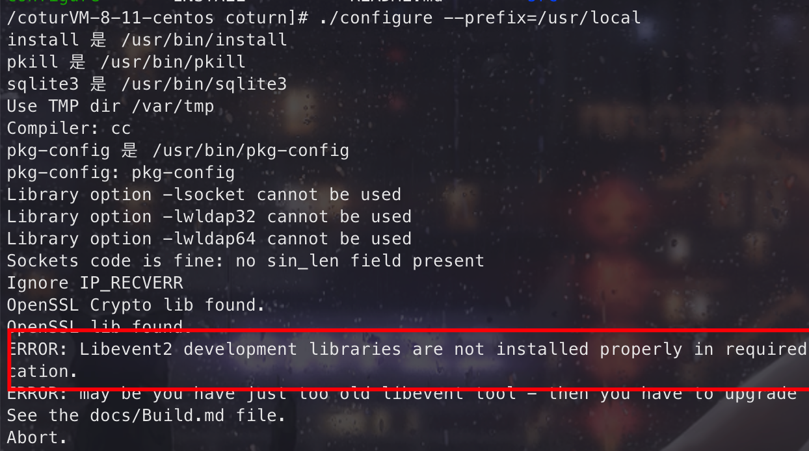

## 什么是 WebRTC

WebRTC（Web Real-Time Communications）是一项实时通讯技术，它允许网络应用或者站点，在不借助中间媒介的情况下，建立浏览器之间点对点（Peer-to-Peer）的连接，实现视频流和（或）音频流或者其他任意数据的传输。WebRTC 包含的这些标准使用户在无需安装任何插件或者第三方的软件的情况下，创建点对点（Peer-to-Peer）的数据分享和电话会议成为可能。

[WebRTC](https://developer.mozilla.org/zh-CN/docs/Web/API/WebRTC_API)

## WebRTC 发展史

2011 年开始， Google 先后收购 GIPS 和 On2，组成 GIPS 音视频引擎 + VPx 系列视频编解码器，并将其代码开源，WebRTC 项目应运而生。
2012 年，Google 将 WebRTC 集成到 Chrome 浏览器中。可以在浏览器之间快速地实现音视频通信。


## WebRTC 通信过程

如果想实现一对一音视频通信，需要以下 4 部分：

- WebRTC 终端（两个）：负责音视频采集、编解码、NAT 穿越以及音视频数据传输等。

- Signal 信令服务器：负责信令处理，如加入房间、离开房间、媒体协商消息的传递等。

- STUN/TURN 服务器：负责获取 WebRTC 终端在公网的 IP 地址，以及 NAT 穿越失败后的数据中转服务。

通信过程如下：

1. 本地（WebRTC 终端）启动后，检测设备可用性，如果可用后开始音视频采集；
2. 本地就绪后，发送“加入”信令到 Signal 服务器；
3. Signal 服务器创建房间，等待加入；
4. 对端（WebRTC 终端）同样操作，加入房间，并通知另一端；
5. 双端创建媒体连接对象 [RTCPeerConnection](https://developer.mozilla.org/zh-CN/docs/Web/API/RTCPeerConnection)，开始媒体协商；
6. 双端进行连通性测试，最终建立连接；
7. 将采集到的音视频数据通过 RTCPeerConnection 对象进行编码，最终通过 P2P 传送给对端/本地，再进行解码、展示。

> 第 6 步在进行 P2P 穿越时很有可能失败。所以，当 P2P 穿越失败时，为了保障音视频数据仍然可以互通，则需要通过 TURN 服务器进行音视频数据中转。后面会讲到 TURN 服务是什么，以及如何搭建 TURN 服务。

接下来，我们按照通信过程，来一一讲解每一步要做的事情。

### 第一步：音视频采集

这一步，可以直接使用浏览器提供的 API 进行音视频采集：[getUserMedia](https://developer.mozilla.org/zh-CN/docs/Web/API/MediaDevices/getUserMedia)

语法

```js
const localStream = navigator.mediaDevices.getUserMedia(constraints)
```

传递参数[constraints](https://developer.mozilla.org/zh-CN/docs/Web/API/MediaDevices/getUserMedia#%E5%8F%82%E6%95%B0)用于指定 MediaStream 中包含哪些类型的媒体轨（音频轨、视频轨），并对媒体轨做设置。

返回一个 promise 对象，成功后会获得 MediaStream 对象（包含从音视频设备中获取的音视频数据）；如果用户拒绝或无权限时，则返回 error。

#### Demo

通过`getUserMedia`成功回调拿到媒体流之后，通过将媒体流挂载到`videoDOM.srcObject`即可显示在页面上。

效果如下：


在线预览地址：[codepen.io](https://codepen.io/wang1xiang/pen/jOQdZJz)

#### 其他相关 API

##### [MediaDeviceInfo](https://developer.mozilla.org/en-US/docs/Web/API/MediaDeviceInfo)

用于表示每个媒体输入/输出设备的信息，包含以下 4 个属性：

- deviceId: 设备的唯一标识；
- groupId: 如果两个设备属于同一物理设备，则它们具有相同的组标识符 - 例如同时具有内置摄像头和麦克风的显示器。
- label: 返回描述该设备的字符串，即设备名称（例如“外部 USB 网络摄像头”）；
- kind: 设备种类，可用于识别出是音频设备还是视频设备，是输入设备还是输出设备：audioinput/audiooutput/videoinput

通过`navigator.mediaDevices.enumerateDevices()`查看如下所示：


##### [MediaDevices](https://developer.mozilla.org/zh-CN/docs/Web/API/MediaDevices)

该接口提供访问连接媒体输入的设备（如摄像头、麦克风）以及获取屏幕共享等方法。而我们需要获取可用的音视频设备列表，就是通过该接口中的方法来实现的，如前面提到的`getUserMedia`方法。

方法：

- MediaDevices.enumerateDevices()

  获取可用的媒体输入和输出设备的列表，例如：麦克风、相机、耳机等

  ```js
  var enumeratorPromise = navigator.mediaDevices.enumerateDevices()
  ```

  返回的 promise 对象，成功回调时会拿到描述设备的 MediaDeviceInfo 列表，用来存放 WebRTC 获取到的每一个音视频设备信息。

- MediaDevices.getDisplayMedia()

  提示用户去选择和授权捕获展示的内容或部分内容（如一个窗口）在一个 MediaStream 里。然后，这个媒体流可以通过使用 MediaStream Recording API 被记录或者作为 WebRTC 会话的一部分被传输。用于共享屏幕时传递。

  ```js
  var promise = navigator.mediaDevices.getDisplayMedia(constraints)
  ```

  接受可选参数 constraints 同`getUserMedia`方法，不传时也会开启视频轨道。

  

- MediaDevices.getUserMedia()

**需要 Https 环境支持，因为在浏览器上通过 HTTP 请求下来的 JavaScript 脚本是不允话访问音视频设备的，只有通过 HTTPS 请求的脚本才能访问音视频设备。**

### 第二/三/四步：双方发送信令

#### 什么是信令服务器

信令可以简单理解为消息，在协调通讯的过程中，为了建立一个 webRTC 的通讯过程，**在通信双方彼此连接、传输媒体数据之前，它们要通过信令服务器交换一些信息，如加入房间、离开房间及媒体协商**等，而这个过程在 webRTC 里面是没有实现的，需要自己搭建信令服务。

#### 使用 Node 搭建信令服务器

可以使用 [Socket.io](https://socket.io/zh-CN/) 来实现 WebRTC 信令服务器，Socket.io 已经内置了房间的概念，所以非常适合用于信令服务器的创建。

Socket.io 发送消息和接受消息，有以下几种类型：

- 给本次连接发消息

  ```js
  socket.emit()
  // 如 发送message消息
  const username = 'xx'
  const message = 'hello'
  // 发送消息
  socket.emit('message', username, message)
  // 接受消息
  socket.on('message', (username, message) => {
    console.log(`${username}: ${message}`)
  })
  ```

- 给某个房间内所有人发消息(除本连接外)

  ```js
  socket.to(room).emit()
  ```

- 给所有人发消息(除本连接外)

  ```js
  socket.broadcast.emit()
  ```

搭建信令服务器过程如下：

1. Socket.io 分为服务端和客户端两部分。服务端由 Node.js 加载后侦听某个服务端口。

   ```js
   let app = express()
   let http_server = http.createServer(app)
   http_server.listen(80)

   let io = new IO(http_server, {
     path: '/',
     cors: {
       origin: '*',
     },
   })
   http_server.on('listening')
   ```

2. 客户端要想与服务端相连，首先要加载 Socket.io 的客户端库，然后调用 io.connect();

   ```js
   socket = io('http://localhost:80', {
     query: { username, room },
   }).connect()
   ```

3. 此时，服务端会接收到`connection`消息，在此消息中注册接受/发送消息的事件；

   ```js
   // 监听连接
   io.on(SOCKET_ON_SYS.CONNECTION, (socket) => {
   const { query } = socket.handshake
   // 获取socket连接参数 username和room
   const { username, room } = query
   ...
   })
   ```

4. 客户端同样注册接受/发送消息的事件，双方开始通信。

   ```js
   socket.on(SOCKET_EMIT.MESSAGE, (room, data) => {
     logger.debug(`收到消息: ${data}, 来自于房间: ${room}`)
     socket.to(room).emit(SOCKET_EMIT.MESSAGE, room, data)
   })

   socket.on(SOCKET_EMIT.LEAVE, (room, username) => {
     socket.leave(room)
     logger.debug(`离开房间: ${username}, 来自于房间: ${room}`)

     socket.emit(SOCKET_EMIT.LEAVE, room, socket.id)
   })
   ```

最后，看一下效果如下：


顺便看一下日志信息：


完成代码请参考：

### 第五步：创建 RTCPeerConnection 对象 媒体协商

[RTCPeerConnection](https://developer.mozilla.org/zh-CN/docs/Web/API/RTCPeerConnection)：代表一个由本地计算机到远端的 WebRTC 连接，该接口提供了创建，保持，监控，关闭连接的方法的实现。

通过`new RTCPeerConnection`即可创建一个 RTCPeerConnection 对象，此对象主要负责与**各端建立连接（NAT 穿越），接收、发送音视频数据**，并保障音视频的服务质量，接下来要说的端到端之间的媒体协商，也是基于 RTCPeerConnection 对象来实现的。

简单点来说：“RTCPeerConnection 就是功能强大的 socket。”

至于它是如何保障端与端之间的连通性，如何保证音视频的服务质量，又如何确定使用的是哪个编解码器等问题，作为应用者我们大可不必关心，因为所有的这些问题都已经在 RTCPeerConnection 对象的底层实现好了。

```js
const localPc = new RTCPeerConnection(rtcConfig)
// 将音视频流添加到 RTCPeerConnection 对象中
localStream.getTracks().forEach((track) => {
  localPc.addTrack(track, localStream)
})
```

我们在第一步获取音视频流后，需要将流添加到创建的 RTCPeerConnection 对象中，当 RTCPeerConnection 对象获得音视频流后，就可以开始与对端进行媒协体协商。

#### 什么是媒体协商

媒体协商的作用是找到双方共同支持的媒体能力，如双方各自支持的编解码器，音频的参数采样率，采样大小，声道数、视频的参数分辨率，帧率等等。类似于男女相亲的中间人，通过中间人男的知道了女的身高、颜值、身材，女的理解了男的家庭、财富、地位，你俩觉得“哇这么合适”，赶紧见面深入交流一下 💓。

上述说到的这些音频/视频的信息都会在 SDP（Session Description Protocal：即使用文本描述各端的“能力”）中进行描述。

> 一对一的媒体协商大致如下：首先自己在 SDP 中记录自己支持的音频/视频参数和传输协议，然后进行信令交互，交互的过程会同时传递 SDP 信息，另一方接收后与自己的 SDP 信息比对，并取出它们之间的交集，这个交集就是它们协商的结果，也就是它们最终使用的音视频参数及传输协议。

#### 媒体协商过程

一对一通信中，发起方发送的 SDP 称为提议(Offer)，接收方发送的 SDP 称为应答(Answer)。每端保持两个描述：描述本身的**本地描述 LocalDescription**和描述呼叫的远端的**远程描述 RemoteDescription**。当通信双方 RTCPeerConnection 对象创建完成后，就可以进行媒体协商了，大致过程如下：

1. 发起方创建 Offer 类型的 SDP，保存为本地描述后再通过信令服务器发送到对端；
2. 接收方接收到 Offer 类型的 SDP，将 Offer 保存为远程描述；
3. 接收方创建 Answer 类型的 SDP，保存为本地描述，再通过信令服务器发送到发起方，此时接收方已知道连接双方的配置；
4. 发起方接收到 Answer 类型的 SDP 后保存到远程描述，此时发起方也已知道连接双方的配置；
5. 整个媒体协商过程处理完毕。

更详细的步骤请参考 MDN 中对[会话描述](https://developer.mozilla.org/zh-CN/docs/Web/API/WebRTC_API/Connectivity#%E4%BC%9A%E8%AF%9D%E6%8F%8F%E8%BF%B0)讲解。

#### 代码实现媒体协商过程

通过 MDN 先了解下我们可能用到的 API：

- [createOffer](https://developer.mozilla.org/zh-CN/docs/Web/API/RTCPeerConnection/createOffer)用于创建 Offer；
- [createAnswer](https://developer.mozilla.org/en-US/docs/Web/API/RTCPeerConnection/createAnswer)用于创建 Answer；
- [setLocalDescription](https://developer.mozilla.org/en-US/docs/Web/API/RTCPeerConnection/setLocalDescription)用于设置本地 SDP 信息；
- [setRemoteDescription](https://developer.mozilla.org/zh-CN/docs/Web/API/RTCPeerConnection/setRemoteDescription)用于设置远端的 SDP 信息。

##### 发起方创建 RTCPeerConnection

```js
// 配置
export const rtcConfig = null
const localPc = new RTCPeerConnection(rtcConfig)
```

##### 发起方/接收方创建 Offer 保存为本地描述

发起方或接收方何时创建 Offer 呢？

当房间内有两个人时，发起方/接收方开始创建 offer，并通过之前的信令服务器发送 Offer，代码如下：

```js
let offer = await localPc.createOffer()
// 保存为本地描述
await localPc.setLocalDescription(offer)
// 通过信令服务器发送到对端
socket.emit('offer', offer)
```

##### 接受 Offer 后 创建 Answer 并发送

```js
socket.on('offer', offer) => {
  // 将 Offer 保存为远程描述；
  await remotePc.setRemoteDescription(remoteDesc);
  remotePc = new RTCPeerConnection(rtcConfig)
   await remotePc.setRemoteDescription(remoteDesc)
   let remoteAnswer = await remotePc.createAnswer()
   await remotePc.setLocalDescription(remoteAnswer)
   socket.emit('answer', remoteAnswer)
});
```

##### 接受 Answer 存储为远程描述

```js
// 4. 发起方接收到 Answer 类型的 SDP 后保存到远程描述，此时发起方也已知道连接双方的配置；
socket.on('answer', answer) => {
  // 将 Answer 保存为远程描述；
  await localPc.setRemoteDescription(answer);
});
```

至此，媒体协商结束，紧接着在 WebRTC 底层会收集 Candidate，并进行连通性检测，最终在通话双方之间建立起一条链路来。

### 第六步：端与端建立连接

媒体协商结束后，双端统一了传输协议、编解码器等，此时就需要建立连接开始音视频通信了。

但 WebRTC 既要保持音视频通信的**质量**，又要保证**联通**。所有，当同时存在多个有效连接时，它首先选择传输质量最好的线路，如能用内网连通就不用公网，优先 P2P 传输，如果 P2P 不通才会选择中继服务器（relay 服务器或 TURN 服务器），因为中继方式会增加双端传输的时长。

#### 什么是 Candidate

第五步最后，我们提到了媒体协商结束后，开始收集 Candidate，那么我们来了解下什么是 Candidate、以及它的作用是什么？

[ICE Candidate](https://developer.mozilla.org/zh-CN/docs/Web/API/RTCPeerConnection/icecandidate_event)（ICE 候选者）：表示 WebRTC 与远端通信时使用的协议、IP 地址和端口，结构如下：

```js
{
  address: xxx.xxx.xxx.xxx, // 本地IP地址
  port: number, // 本地端口号
  type: 'host/srflx/relay', // 候选者类型
  priority: number, // 优先级
  protocol: 'udp/tcp', // 传输协议
  usernameFragment: string // 访问服务的用户名
  ...
}
```


WebRTC 在进行连接测试后时，通信双端会提供众多候选者，然后按照优先级进行连通性测试，测试成功就会建立连接。

候选者 Candidate 类型，即 type 分为三种类型：

- host：本机候选者

  优先级最高，host 类型之间的连通性测试就是内网之间的连通性测试，P2P

- srflx：内网主机映射的外网地址和端口

  如果 host 无法建立连接，则选择 srflx 连接，即 P2P 连接

- relay：中继候选者

  优先级最低，只有上述两种不存在时，才会走中继服务器的模式，因为会增加传输时间，优先级最低

#### 如何收集 Candidate

我们已经了解了 Candidate 的三种类型以及各自的优先级，那么我们看下双端是如何收集 Candidate 的。

##### host 类型

host 类型的 Candidate 是最好收集的，就是本机的 ip 地址 和端口

##### srflx 和 relay 类型

srflx 类型的 Candidate 就是内网通过 NAT（Net Address Translation，作用是进行内外网的地址转换，位于内网的网关上）映射后的外网地址。如：访问百度时 NAT 会将主机内网地址转换为外网地址，发送请求到百度的服务器，服务器返回到公网地址和端口，在通过 NAT 转到内网的主机上。

WebRTC 会怎么处理 NAT 呢？

没错，就是我们之前提到的 **STUN** 和 **TURN**

##### STUN 协议

全称 Session Traversal Utilities for NAT（NAT 会话穿越应用程序），是一种网络协议，它允许位于 NAT 后的客户端找出自己的公网地址，也就是**遵守这个协议就可以拿到自己的公网 IP**。

STUN 服务器可以直接使用 google 提供的免费服务 `stun.l.google.com:19302`，或者自己搭建。

##### TURN 协议

全称 Traversal Using Relays around NAT（使用中继穿透 NAT），STUN 的中继扩展。简单的说，TURN 与 STUN 的共同点都是通过修改应用层中的私网地址达到 NAT 穿透的效果，异同点是 TURN 是通过两方通讯的“中间人”方式实现穿透。

> 上面提到的 relay 服务就是通过 TURN 协议实现的，所以 relay 服务器和 TURN 服务器是同一个意思，都是中继服务器。

relay 类型的 Candidate 获取是通过 TURN 协议完成，它的**连通率是所有候选者中连通率最高的**，优先级也是最低的。

WebRTC 首会先使用 STUN 服务器去找出自己的 NAT 环境，然后试图找出打“洞”的方式，最后试图创建点对点连接。
当它尝试过不同的穿透方式都失败之后，为保证通信成功率会启用 TURN 服务器进行中转，此时所有的流量都会通过 TURN 服务器。这时如果 TURN 服务器配置不好或带宽不够时，通信质量就会变差。

**STUN 服务器是用来获取外网地址进行 P2P；而 TURN 服务器是在 P2P 失败时进行转发的**

##### NAT 打洞/P2P 穿越

NAT 解决了 IPv4 地址不够用的情况，但因为有了 NAT，端与端之间的网络连接变得复杂，也就需要 NAT 穿越等技术。

收集完 Candidate 后，WebRTC 就按照优先级顺序进行连通性检测。如果双方位于同一个局域网，就会直接建立连接，如果不在同一个局域网内，WebRTC 就会尝试 NAT 打洞，即 P2P 穿越了。

##### ICE

全称 Interactive Connectivity Establishment（交互式连通建立方式），ICE 协议通过一系列的技术（如 STUN、TURN 服务器）帮助通信双方发现和协商可用的公共网络地址，从而实现 NAT 穿越，也就是上面说的获取所有候选者类型的过程，即：在本机收集所有的 host 类型的 Candidate，通过 STUN 协议收集 srflx 类型的 Candidate，使用 TURN 协议收集 relay 类型的 Candidate。

#### 代码实现收集 Candidate

当 Candidate 被收集之后，会触发`icecandidate`事件，所以需要在代码中监听此事件，以对收集到的 Candidate 做处理。

```js
localPc.onicecandidate = function (event) {
  console.log('localPc:', event.candidate, event)
  // 回调时，将自己candidate发给对方，对方可以直接addIceCandidate(candidate)添加可以获取流
  if (event.candidate) socket.emit('candidate', event.candidate)
}
```

打印出的 Candidate 如下所示：


与我们上面提到的 Candidate 结构一致，其中`type`字段为`host`，即本机候选者。

对端接收到发送的 candidate 后，再调用 RTCPeerConnection 对象的 addIceCandidate() 方法将收到的 Candidate 保存起
来，然后按照 Candidate 的优先级进行连通性检测。

```js
await remotePc.addIceCandidate(candidate)
```

如果 Candidate 连通性检测完成，那么端与端之间就建立了物理连接，这时媒体数据就可能通这个物理连接源源不断地传输了。

### 第七步：显示远端流

通信双方通过 RTCPeerConnection 建立连接后，本地的音视频数据源源不断的传输，要想在远端展示出来，就需要将 RTCPeerConnection 对象与`<video>`或`<audio>`进行绑定。

当远端创建好 RTCPeerConnection 对象后，会为 RTCPeerConnection 绑定`ontrack`事件，当有音视频数据流到来时，输入参数 event 中包含了远端的音视频流，即 MediaStream 对象，此时将此对象赋值给`<video>`或`<audio>`的`srcObject`字段，这样 RTCPeerConnection 对象就与`<video>`或`<audio>`进行了绑定，音频或视频就能展示出来。

```js
remotePc.ontrack = (e) => {
  video.srcObject = e.streams[0]
  video.oncanplay = () => video.play()
}
```

支持，一个完整的 WebRTC 通信过程就结束了 🎉🎉🎉。

## 搭建 1 对 1 音视频聊天

基于以上 WebRTC 通信过程的描述，我们来动手实践一对一音视频聊天。

## TURN 服务器的搭建

TURN 服务有两个作用：一是提供 STUN 服务，客户端通过 STUN 服务获取自己的公网地址；而是提供数据中继服务（当数据通信双方无法通过 P2P 传输时，就需要通过中继的方式让通信双方的数据可以互通）。

1. 下载源码

   目前最著名的 TURN 服务器是由 Google 发起的开源项目 [coturn](https://github.com/coturn/coturn),coturn 服务器完整的实现了 STUN/TURN/ICE 协议，支持 P2P 穿透防火墙。

   ```bash
   git clone https://github.com/coturn/coturn
   ```

2. 生成 Markfile

   ```bash
   cd coturn
   ./configure --prefix=/usr/local/coturn
   ```

   需要安装 libevent 库，不然会报错

   

3. 安装 libevent

   如果已经安装过，则忽略这一步

   首先安装运行 coturn 需要依赖的环境

   ```bash
   yum install openssl openssl-libs libevent2 libevent-devel
   ```

   如果 libevent2 安装失败，手动安装
   下载地址：http://libevent.org/

   ```bash
   # 解压
   tar -xf libevent-2.0.22-stable.tar.gz
   cd ibevent-2.0.22-stable
   # 生成Markfile
    ./configure --prefix=/usr
   # 执行make编译libevent
   make
   # 安装
   make install
   ```

   完成后，测试是否安装成功

   ```bash
   ls -a /usr/lib |grep libevent
   ```

   

4. 继续安装 coturn

   ```bash
   ./configure
   make
   make install
   ```

5. 验证 coturn 服务是否安装成功

   ```bash
   which turnserver
   # /usr/local/bin/turnserver
   ```

6. 生成签名

   ```bash
   cd /usr/local/etc/

   openssl req -x509 -newkey rsa:2048 -keyout /usr/local/etc/turn_server_pkey.pem -out /usr/local/etc/turn_server_cert.pem -days 99999 -nodes
   ```

   一路回车即可，完成后在/use/local/etc 目录下就有了`turn_server_pkey.pem`和`turn_server_cert.pem`两个文件。

7. 修改配置文件

   ```bash
   cp turnserver.conf.default turnserver.conf
   vim turnserver.conf
   ```

   ```bash
   # 网卡
   listening-device=eth0
   # 监听的端口
   listening-port=3478
   # 绑定的公网地址
   external-ip=43.140.xxx.xx
   # 用户名和密码
   user=admin:123456
   # 名称
   realm=admin
   ```

8. 启动 turnserver

   ```bash
   ./turnserver ../etc/turnserver.conf
   ```

   查看是否启动成功

   ```bash
   ps -ef|grep turnserver
   ```

9. 检测

   在线检测 ICE 穿透的地址：[https://webrtc.github.io...](https://webrtc.github.io/samples/src/content/peerconnection/trickle-ice/)

   上面这个地址用于检测 turn 服务是否可用，注意`查看服务器端口是否已开启`3478`

   

   如果你测试一个 STUN 服务器，你能收集到一个类型为“srflx”的候选者，它就可以工作。如果你测试一个 TURN 服务器，你能收集到一个类型为“relay”的候选人，它就会工作。

10.
