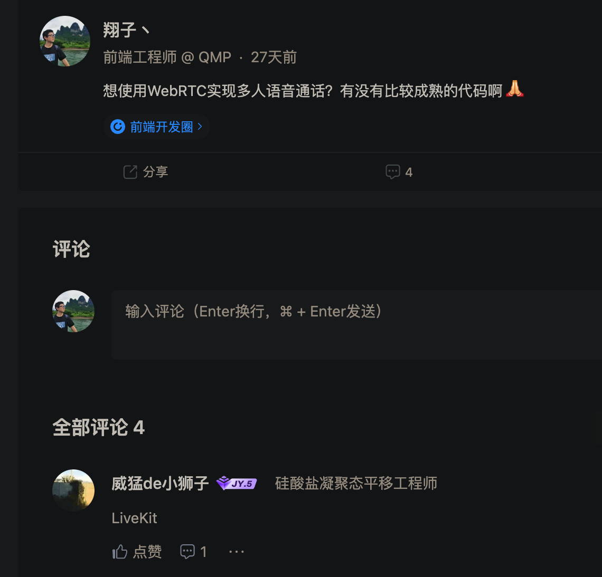
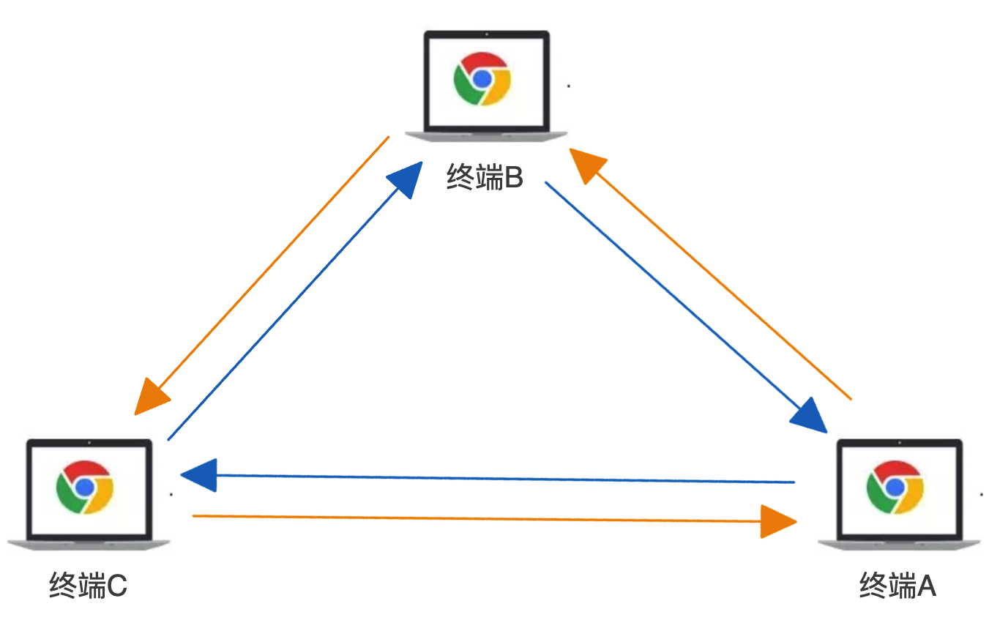
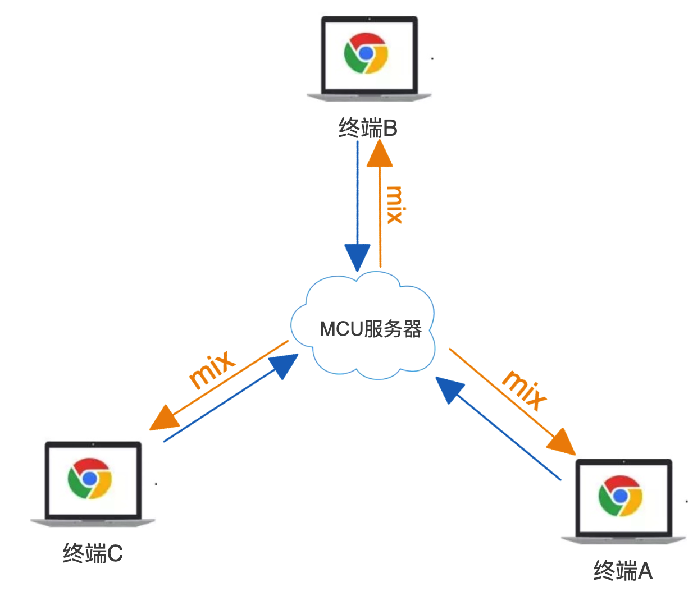
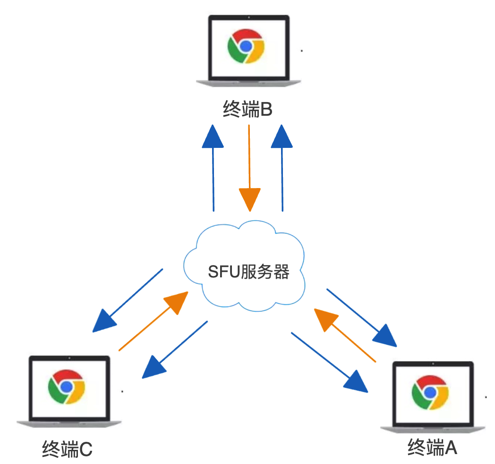
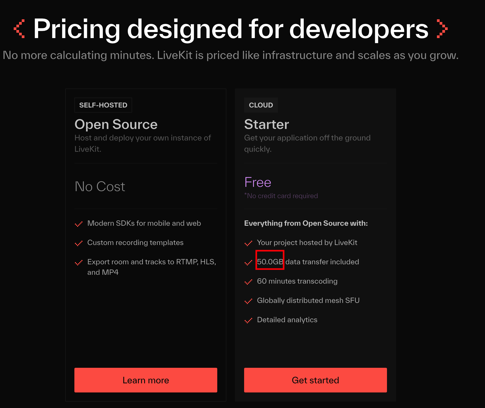
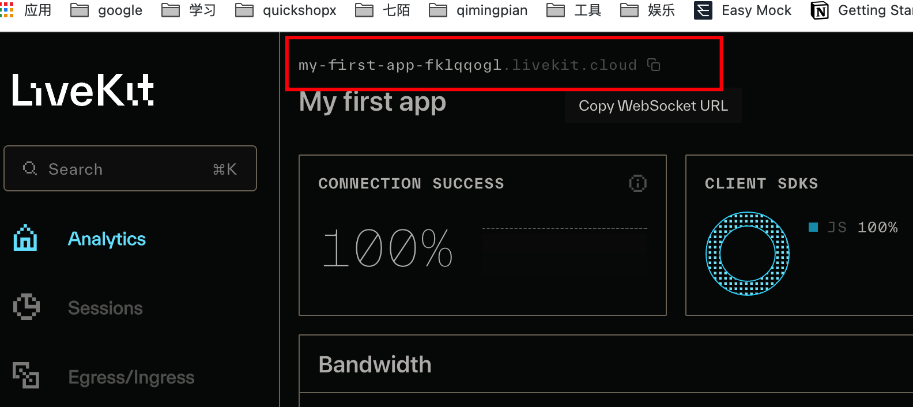
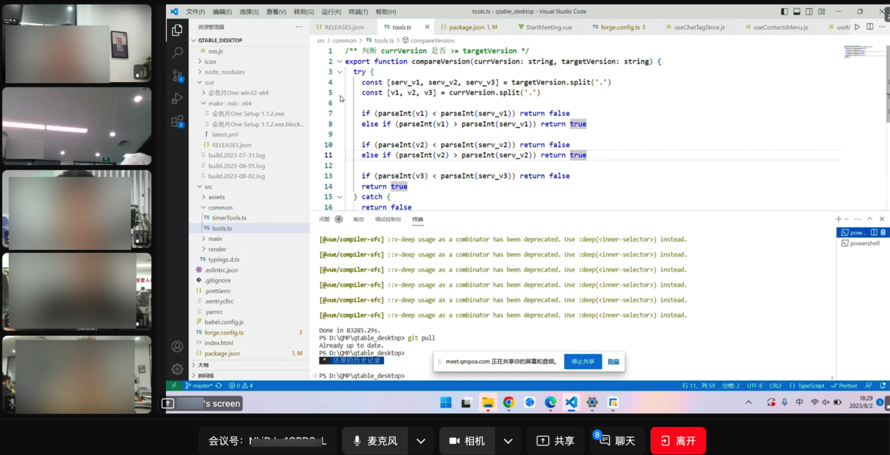

我们在第一篇主要学习了 WebRTC 的相关概念以及通信的过程，这是 WebRTC 的基础，读完第一篇那么你对 WebRTC 也有了一定的概念；于是第二篇我们立马来了一对一的实战，来巩固大家的学习成果，看评论也有人跟着实现了一遍 👍。

这是第三篇也是最后一篇关于 WebRTC 的介绍和使用，这节相对简单，即使用第三方 SDK 来搭建多人视频会议。这里我们用的是 [LiveKit](https://livekit.io/)。

这时候有人会问：用 LiveKit 是基于什么原因？

哈哈，我也不懂啊，也刚入门两周而已，我都不知道有哪些可以用的第三方框架。虽然一对一的音视频通讯顺利完成，也得到了 leader 的口头奖励。但领导又想最快看到多人视频会议，于是发个沸点，问问万能的掘友们...

很感谢这位 jy [@威猛 de 小狮子](https://juejin.cn/user/3693986004078334)。

> 另外，如果各位万能的 jy，有更好用的框架，麻烦在评论区吱一声。趁着现在还没用起来，早点给它换掉。

再了解 LiveKit 前，我们先来了解下多人音视频实时通讯的架构。

## 多人音视频三大架构

### Mesh

Mesh 架构是利用 Webrtc 对等连接，在参与会议的各方之间两两 P2P 连接，即 P2P2P2P，形成一个网状结构。

#### 优势 👆

1. 实现简单，只需要 ICE 服务器用于实现 P2P 穿越就行；
2. 不需要服务器中转数据，节省开发和成本；
3. 充分利用了客户端的带宽资源。

#### 缺陷 👇

每端都需要将自己的媒体流发送到其他各端，并从其他各端获取流，占用带宽较多，参与人越多，占用的带宽就越大，所以对带宽的要求极高，Mesh 架构在真实的应用场景中几乎没有人使用。

### MCU

MCU（Multipoint Conferencing Unit）架构由一个中心化的 MCU 服务器（对媒体流进行编码、转码、解码、混合处理）和多个终端组成一个星形结构。各终端将自己要共享的音视频流发送给服务器，服务端进行混合后再将复合流发到各端。

#### 优势 👆

1. 每个终端只需发送一份媒体流，再接收单个复合流，减少客户端带宽压力；
2. 接收的复合流，所有参与人看到的是相同的画面，客户体验非常好。

#### 缺陷 👇

需要一台强大的机器来解码、合成和重新编码这些大量运算的工作，对 CPU 资源的消耗很大。

### SFU

SFU（Selective Forwarding Unit）架构同 MCU， 也是由一个中心化的服务器和多个终端组成，但与 MCU 不同的是，SFU 服务器不对音视频进行编码、解码、混流等算力较高的工作，只负责转发媒体或者存储媒体，实际上就是一个音视频路由转发器。
SFU 是最近几年流行的新架构，目前 WebRTC 多方通信媒体服务器大多都是 SFU 架构。

#### 优势 👆

1. 服务端压力相对较小，由于是数据包直接转发，不需要编码、解码，对 CPU 资源消耗很小；
2. 直接转发也极大地降低了延迟，提高了实时性；
3. 对客户端的宽带要求适中：针对低延迟、高带宽媒体转发进行了优化。

#### 缺陷 👇

由于是数据包直接转发，参与人观看多路视频的时候可能会出现不同步；相同的视频流，不同的参与人看到的画面也可能不一致。

**综合来说：SFU 是三种架构方案中优势最明显而劣势相对较少，是目前最优的一种多方通信架构方案**

#### 开源实现

SFU 架构有一些比较流行的开源项目： [Licode](https://github.com/lynckia/licode)、[Janus-gateway](https://github.com/meetecho/janus-gateway)、[MediaSoup](https://github.com/versatica/mediasoup/)、[Medooze](https://github.com/medooze/media-server) 等，感兴趣的小伙伴可以去了解。

## LiveKit

LiveKit 是一个开源项目，提供基于 WebRTC 的可扩展的多用户会议。并且提供了开发构建实时视频音频功能时所需的一切。

**利用 LiveKit 我们可以快速实现一个基于 WebRTC 的多人视频会议，并且是在不了解 WebRTC 的前提下。**

正如我们前面说 SFU 架构是目前最优的 WebRTC 多人架构，LiveKit 的多人音视频通讯的架构也是 SFU：[livekit-sfu](https://docs.livekit.io/reference/internals/livekit-sfu/)。

[👉🏻 Livekit 在线体验地址](https://meet.livekit.io)

## 优势

### 容易部署

livekit 的后台组件&命令行工具全部打包为 docker 镜像，这个对于熟悉 docker 使用的开发者来说非常友好，好巧我不会 docker，让运维干就好了 😎。

### 可扩展

LiveKit 的 SFU 还包含服务器和客户端上的智能功能，会自动测量订阅者的下游带宽并相应地调整跟踪参数（例如分辨率或比特率），并且可以水平扩展 SFU 架构。

### Video Simulcast
Simulcast 使客户端能够发布同一视频轨道的多个版本，每个版本具有不同的比特率配置文件。此功能允许 LiveKit 根据每个接收者的可用带宽和首选分辨率动态转发最合适的流。

### Adaptive Stream自适应流
Adaptive Stream 自适应流允许开发人员构建动态视频应用程序，而不必担心界面设计或用户交互可能会影响视频质量。它使我们能够获取高质量渲染所需的最少位，并有助于扩展到非常大的会话。

### Dynamic broadcasting动态广播
LiveKit 采用端到端优化设计，可最大程度地减少带宽消耗。 动态广播 (Dynacast) 在订阅者未使用视频层时自动暂停视频层的发布。 此功能也扩展到联播视频：如果订阅者仅使用中低分辨率层，则高分辨率发布将暂停。
### sdk 完整

有完整的 sdk 程序接口供开发人员使用

[client-sdks](https://docs.livekit.io/references/client-sdks/)
[server-sdks](https://docs.livekit.io/references/server-sdks/)

### 大量 demo

官方有提供 web(js、react、unity) 跟 app(IOS、Android、RN、Flutter、Rust) 版的代码示例，在开发过程中可以很容易地参考使用方式。
[参考](https://docs.livekit.io/reference/)

## 快速上手

在 github 上拉取上面 Demo 的源代码：[livekit-examples/meet](https://github.com/livekit-examples/meet)，它是一个基于 LiveKit Components、LiveKit Cloud 和 Next.js 构建的开源视频会议应用程序。

也可以直接使用我的代码[05-livekit](https://github.com/wang1xiang/webrtc-tutorial/tree/master/05-livekit)

### LiveKit Components

[LiveKit Components](https://github.com/livekit/components-js) 是官方开源 React 组件，是一个 monorepo 项目，包含三个包：

- @livekit/components-core：是 client-sdk-js 包的包装，它将基于事件的逻辑转换为简单易用的可观察状态和组件级 API。是所有框架特定实现的核心。
- @livekit/components-react：基于 React 的 LiveKit 组件实现。
- @livekit/components-styles：LiveKit 组件的样式。

如果使用 React 来构建项目，那么将会非常简单，你完全可以不用去学习 WebRTC 的相关知识。

### Livekit Cloud

[Livekit Cloud](https://livekit.io/cloud) 是一个端到端的云原生 WebRTC 平台，由 LiveKit 开源背后的团队构建和运营，如果只是作为学习使用，强烈建议去 Livekit Cloud 创建一个项目，前端不需要去搭建服务端，每月有免费的 50g 流量，测试完全够用了。

按照官方的教程，我们可以注册 LiveKit Cloud 并创建一个项目：[using-livekit-cloud](https://docs.livekit.io/getting-started/server-setup/#using-livekit-cloud)

完成后，打开[livekit-projects](https://cloud.livekit.io/projects)，下面红框位置是 `wsURL`， 等下我们会用到：

打开项目[Settings](https://cloud.livekit.io/projects/p_4yxd8hm21co/settings) 可以生成 `LIVEKIT_API_SECRET` 和 `LIVEKIT_API_KEY`，也是在代码中要用到的数据。

### 运行代码步骤

1. 使用 `yarn install` 安装依赖；
2. 将 `.env.example` 重命名为 `.env.local`；
3. 修改 `.env.local` 的环境变量；

   `LIVEKIT_API_KEY` 、 `LIVEKIT_API_SECRET` 和 `LIVEKIT_URL` 我们上面已经讲过如何获取了，直接复制过来替换；
   `NEXT_PUBLIC_LK_TOKEN_ENDPOINT=/api/token` 是获取 token 的请求接口。

   **token 是唯一的，如果多个参与者使用相同的 token 连接，则较早的参与者将与房间断开连接。**

4. 运行 `yarn dev` 后，打开[http://localhost:3000](http://localhost:3000) 预览。

### 房间

房间是 LiveKit 中的主要构造。连接成功后，将获得一个 [Room](https://docs.livekit.io/client-sdk-js/classes/Room.html) 对象。

房间对象的两个关键属性是 `LocalParticipant` 对象（代表当前用户）和 `RemoteParticipants`对象（房间中其他用户的数组）。

连接到房间时需要两个参数：url 和 token。

### LiveKitRoom 组件

我们在代码中只需要用到 `LiveKitRoom` 这个组件，是从上面说到的 LiveKit Components 导出的组件，所以如果需要修改样式或其他时，只需要修改这个 react 组件，然后在项目中引入即可。

LiveKitRoom 组件为其所有子组件提供房间上下文。它通常是 LiveKit 应用程序的起点和 LiveKit 组件树的根。它向所有子组件提供房间状态作为 React 上下文。

包含以下 Props：

- serverURL

  LiveKit 服务器的 URL：即上面提到的 `url`，一般是 `wss://` 开头

- token

  用户特定的访问令牌，供客户端对房间进行身份验证。 该令牌是建立与房间的连接所必需的。[服务端生成 token](https://docs.livekit.io/cloud/project-management/keys-and-tokens/#generating-access-tokens)

- audio

  在 LiveKit 房间中启用音频功能。接受 boolean 或[AudioCaptureOptions](https://docs.livekit.io/client-sdk-js/interfaces/AudioCaptureOptions.html)

- video

  在 LiveKit 房间中启用视频功能。接受 boolean 或[ScreenShareCaptureOptions](https://docs.livekit.io/client-sdk-js/interfaces/ScreenShareCaptureOptions.html)

- screen

  在 LiveKit 房间中启用屏幕共享功能。接受 boolean 或[VideoCaptureOptions](https://docs.livekit.io/client-sdk-js/interfaces/VideoCaptureOptions.html)

- connect

如果设置为 true，则会启动与 LiveKit 房间的连接。默认为 true

- connectOptions

  连接到 LiveKit 服务器对的选项。[RoomConnectOptions](https://docs.livekit.io/client-sdk-js/interfaces/RoomConnectOptions.html)

- options

  创建新房间时的选项。[RoomOptions](https://docs.livekit.io/client-sdk-js/interfaces/RoomOptions.html)

  - adaptiveStream

  adaptiveStream：让 liveKit 自动管理订阅视频轨道的质量，以优化带宽和 CPU。会根据附加的最大视频元素的大小选择适当的分辨率。
  当所有视频元素都不可见时，将暂时停掉数据流。

  接受 pauseVideoInBackground 用于控制在切换到其他 tab 页面时，视频是否暂停。默认为 true
  接受 pixelDensity 用于设置自定义像素密度，默认为`2`，设置为`screen`以使用屏幕的实际像素密度，会显著增加高清屏幕上传输所消耗的带宽。

  - audioCaptureDefaults

  [AudioCaptureOptions](https://docs.livekit.io/client-sdk-js/interfaces/AudioCaptureOptions.html)
  捕获用户音频时使用的默认选项

  deviceId: 一个 ConstrainDOMString 对象，指定可接受和/或必需的设备 ID 或设备 ID 数组。

  - dynacast

  默认为 false，关闭。用于动态暂停任何订阅者未使用的视频层，显著减少发布 CPU 和带宽的使用。

  - publishDefaults

  发布 tracks 时采用的默认选项
  [TrackPublishDefaults](https://docs.livekit.io/client-sdk-js/interfaces/TrackPublishDefaults.html)
  音频轨：audioBitrate 比特率、audioPreset 音频预设、解编码器
  视频轨：videoCodec 解编码器、videoEncoding 相机轨迹编码、videoSimulcastLayers 除了原始轨道之外，最多还可以发布两个额外的联播层。留空时，默认为 h180、h360。

  - videoCaptureDefaults

  [VideoCaptureOptions](https://docs.livekit.io/client-sdk-js/interfaces/VideoCaptureOptions.html)
  捕获用户视频时使用的默认选项

  deviceId
  facingMode
  resolution：aspectRatio 长宽比、frameRate 帧率、height 和 width

下面是我们公司尝试的 Demo，带宽 5m，同时 6 个人在线

- 音视频质量调整
- 屏幕分享质量调整

  对音视频和屏幕分享的质量做了调整，LiveKit 提供了如下视频和屏幕分享的多种预设，我们根据房间人数变化来更新这个质量，三人以内时就可以用 720p30 帧，多人时使用 540p25 帧 或 480p20 帧，录屏统一用 720p15 帧，效果不错。

  

- TODO：增加带宽
- TODO：SFU 集群

  同时我们运维同事也在针对服务器做一些优化。

## 总结

本文主要讲解了 WebRTC 多人通讯的架构，以及如何使用 LiveKit 搭建多人视频会议，如果你们公司恰巧有 WebRTC 方面的需求，可从以下几个方面考虑是否需要接入 LiveKit 或其他第三方 sdk：

1. 音视频会议不是公司核心业务；
2. 投入人少，项目催得紧，并且要求不高；
3. 公司对音视频了解的人并不多。

通过这一两周的摸索，目前对 WebRTC 有了一定的认知，但仅仅只是冰山一角，只是会使用或者只是能搭起来而已，遇到问题还是得查资料或请教别人。

像最近有使用到 WebRTC 的调试工具：<chrome://webrtc-internals/>去查看每个通道（RTCPeerConnection）的信息、查看带宽占用情况；

有些同事反应画面静止不动播放时流畅且清晰，但是一旦有人经过或者背景剧烈运动，就会出现模糊的感觉，有个稍微懂 WebRTC 的同事让我去查下“呼吸效应”，然后就去了解了“呼吸效应”和“方块效应”等。

**呼吸效应：视频编码中的呼吸效应是指由于 I 帧的插入造成图像质量忽然变好，切换到 P 帧后又忽然变差。**

I 帧和 P 帧又是什么？参考[什么是 I 帧、P 帧和 B 帧？](https://zhuanlan.zhihu.com/p/489866125?utm_id=0#)

**方块效应：主要是由视频图像采用基于块的编码方式和量化造成相邻块之间存在明显差异的现象，在视频编码中人眼察觉到的小块边界处的不连续。简单说就是视频编码的最小单元不是帧是宏块，每个宏块可能编码细节处理不一样，这样解码出来会发现视频中出问题总是一小块一小块的，一帧画面出现马赛克的地方有些区域很严重有些则能好点。**

[视频编码中的块效应、振铃效应和呼吸效应分析](https://blog.csdn.net/u014470361/article/details/94641124?utm_medium=distribute.pc_relevant.none-task-blog-searchFromBaidu-3.control&depth_1-utm_source=distribute.pc_relevant.none-task-blog-searchFromBaidu-3.control)

“深水区”的东西只有在慢慢使用过程中才会碰到，然后想办法解决才会得到提高。

[👉🏻 本文代码地址](https://github.com/wang1xiang/webrtc-tutorial/tree/master/05-livekit)

以上就是本文的全部内容，希望这篇文章对你有所帮助，欢迎点赞和收藏 🙏，如果发现有什么错误或者更好的解决方案及建议，欢迎随时联系。
