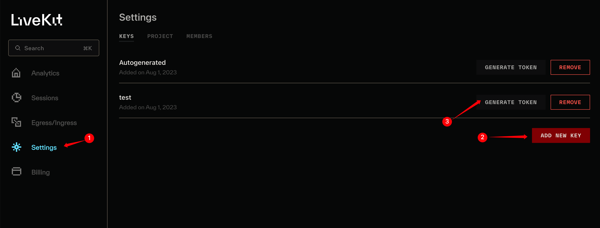

先说下我们公司使用 Livekit 的原因：

1. 音视频会议不是公司核心业务；
2. 投入人少，项目催得紧，并且要求不高；
3. 公司对音视频了解的人并不多，并且了解的都是浅水区。

## Livekit cloud

### 创建项目

[网址](https://cloud.livekit.io/projects)

打开项目[Settings](https://cloud.livekit.io/projects/p_4yxd8hm21co/settings) 生成 LIVEKIT_API_SECRET 和 LIVEKIT_API_KEY

通过 secret 和 key 可以生成 Token

获取 wsURL

## 房间

Room 是 LiveKit 中的主要构造。连接成功后，将获得一个 [Room](https://docs.livekit.io/client-sdk-js/classes/Room.html) 对象。

房间对象的两个关键属性是 LocalParticipant 对象（代表当前用户）和 RemoteParticipants（房间中其他用户的数组）。

### 连接房间

连接到房间需要两个参数：url 和 token。想要快速测试，可以直接用 [LiveKit cloud](https://cloud.livekit.io/) 的项目即可，前端不需要去搭建服务端，每月有免费的 50g 流量，测试完全够用了。

注册 LiveKit 并创建一个项目：[using-livekit-cloud](https://docs.livekit.io/getting-started/server-setup/#using-livekit-cloud)

完成后，下面红框位置就是 url：

接着，在 settings 中生成 token：

**token 是唯一的，如果多个参与者使用相同的 token 连接，则较早的参与者将与房间断开连接。**

在线体验地址：[meet.livekit](https://meet.livekit.io/)

## LiveKitRoom 组件

LiveKitRoom 组件为其所有子组件提供房间上下文。它通常是 LiveKit 应用程序的起点和 LiveKit 组件树的根。它向所有子组件提供房间状态作为 React 上下文，因此您不必自己传递它。

### serverURL

LiveKit 服务器的 URL。`wss://`

### token

用户特定的访问令牌，供客户端对房间进行身份验证。 该令牌是建立与房间的连接所必需的。[服务端生成 token](https://docs.livekit.io/cloud/project-management/keys-and-tokens/#generating-access-tokens)

### audio

在 LiveKit 房间中启用音频功能。接受 boolean 或[AudioCaptureOptions](https://docs.livekit.io/client-sdk-js/interfaces/AudioCaptureOptions.html)

### video

在 LiveKit 房间中启用视频功能。接受 boolean 或[ScreenShareCaptureOptions](https://docs.livekit.io/client-sdk-js/interfaces/ScreenShareCaptureOptions.html)

### screen

在 LiveKit 房间中启用屏幕共享功能。接受 boolean 或[VideoCaptureOptions](https://docs.livekit.io/client-sdk-js/interfaces/VideoCaptureOptions.html)

### connect

如果设置为 true，则会启动与 LiveKit 房间的连接。默认为 true

### connectOptions

连接到 LiveKit 服务器对的选项。[RoomConnectOptions](https://docs.livekit.io/client-sdk-js/interfaces/RoomConnectOptions.html)

### options

创建新房间时的选项。[RoomOptions](https://docs.livekit.io/client-sdk-js/interfaces/RoomOptions.html)

#### adaptiveStream

adaptiveStream：让 liveKit 自动管理订阅视频轨道的质量，以优化带宽和 CPU。会根据附加的最大视频元素的大小选择适当的分辨率。
当所有视频元素都不可见时，将暂时停掉数据流。

接受 pauseVideoInBackground 用于控制在切换到其他 tab 页面时，视频是否暂停。默认为 true
接受 pixelDensity 用于设置自定义像素密度，默认为`2`，设置为`screen`以使用屏幕的实际像素密度，会显著增加高清屏幕上传输所消耗的带宽。

#### audioCaptureDefaults

[AudioCaptureOptions](https://docs.livekit.io/client-sdk-js/interfaces/AudioCaptureOptions.html)
捕获用户音频时使用的默认选项

deviceId: 一个 ConstrainDOMString 对象，指定可接受和/或必需的设备 ID 或设备 ID 数组。

#### dynacast

默认为 false，关闭。用于动态暂停任何订阅者未使用的视频层，显著减少发布 CPU 和带宽的使用。

#### publishDefaults

发布 tracks 时采用的默认选项
[TrackPublishDefaults](https://docs.livekit.io/client-sdk-js/interfaces/TrackPublishDefaults.html)
音频轨：audioBitrate 比特率、audioPreset 音频预设、解编码器
视频轨：videoCodec 解编码器、videoEncoding 相机轨迹编码、videoSimulcastLayers 除了原始轨道之外，最多还可以发布两个额外的联播层。留空时，默认为 h180、h360。

#### videoCaptureDefaults

[VideoCaptureOptions](https://docs.livekit.io/client-sdk-js/interfaces/VideoCaptureOptions.html)
捕获用户视频时使用的默认选项

deviceId
facingMode
resolution：aspectRatio 长宽比、frameRate 帧率、height 和 width

### simulateParticipants

模拟多人会话

### onConnected

### onDisconnected

### onError

### onMediaDeviceFailure

下面是我们公司尝试的 Demo，带宽 5m，同时 6 个人在线

