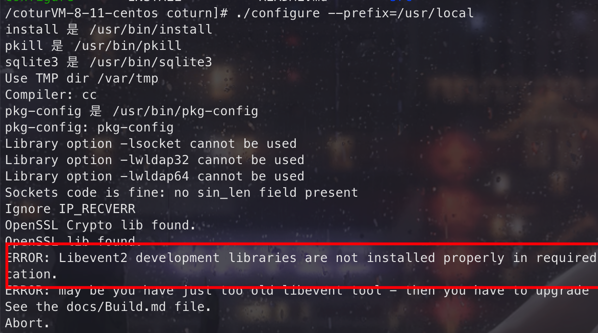
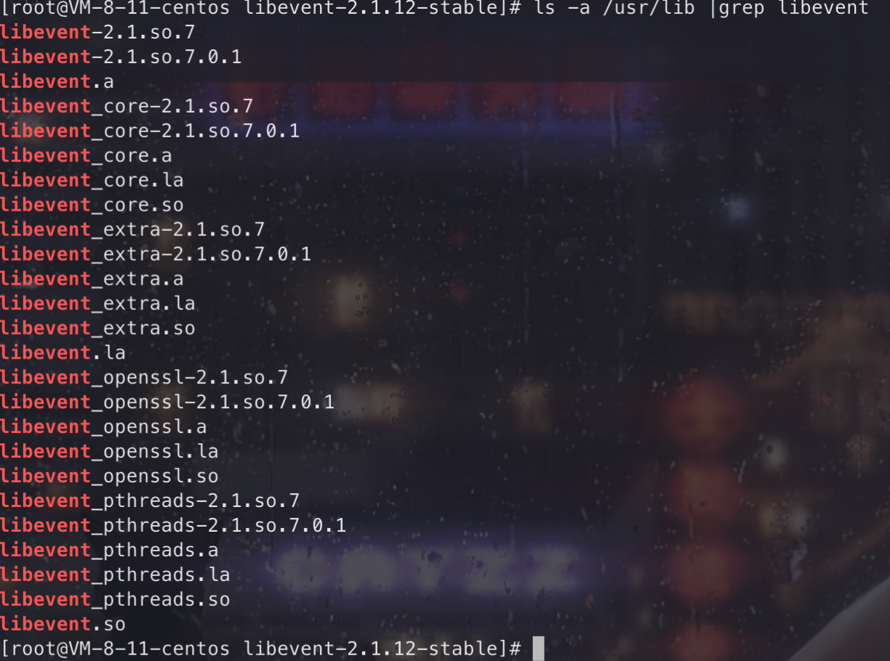
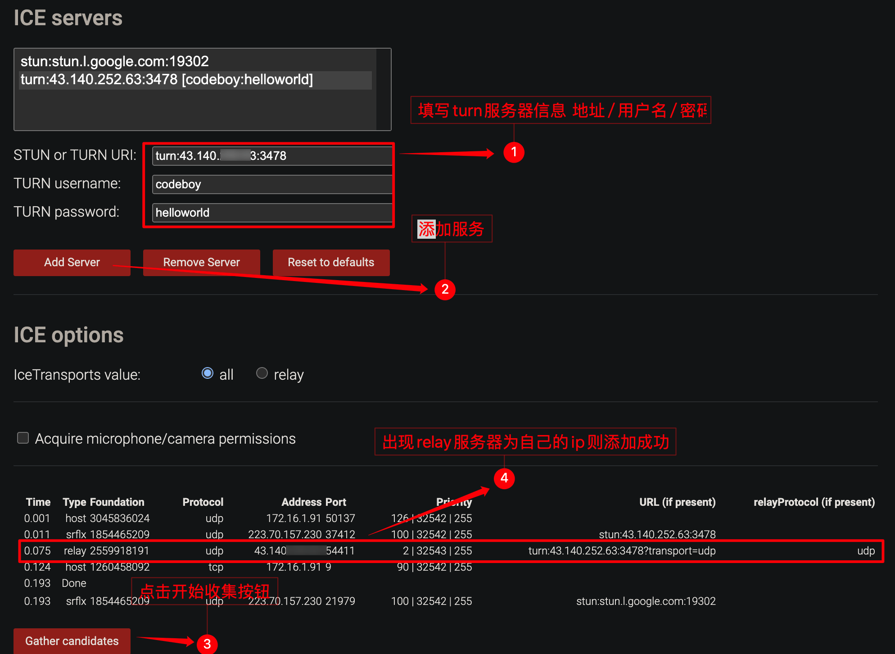
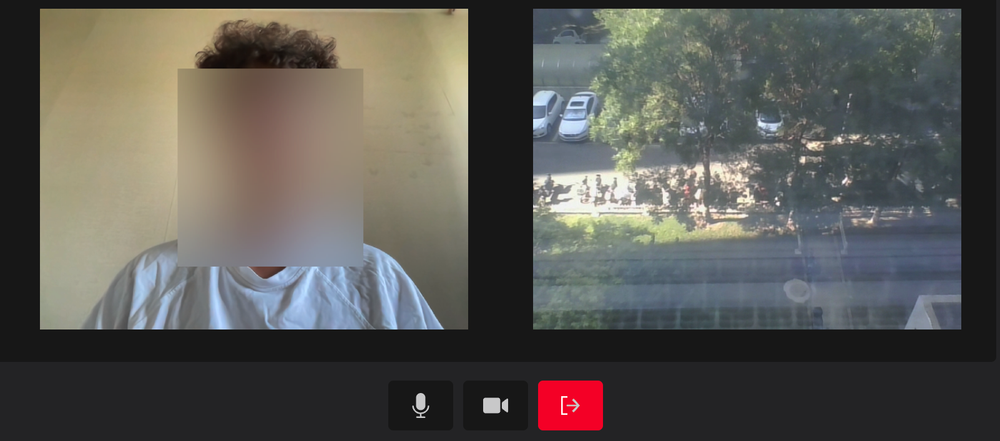

WebRTC 系列教程分为三篇进行介绍，本篇为第二篇，上一篇[WebRTC 这么火 🔥，前端靓仔，请收下这篇入门教程](https://juejin.cn/post/7266417942182608955)。

通过上一篇文章，各位小伙伴们应该都了解了 WebRTC 相关概念以及通信过程后，趁热打铁，我们来搭建一个 WebRTC 一对一音视频通话项目。


WebRTC 一对一通话分为服务端和客户端，服务端使用 node 实现信令服务，客户端使用 vue 实现逻辑。

## 服务端实现：使用 Socket.io 搭建信令服务器

信令服务器主要是处理通信双端进行媒体协商和 ICE 候选（NAT 穿越信息）

按照 Socket.IO 的[官网教程](https://socket.io/zh-CN/get-started/chat)很快便能搭建一个聊天应用程序。

1. 安装 socket.io 和 express

   ```bash
   yarn add socket.io express
   ```

2. 使用 express 初始化 socket 服务

   ```js
   let app = express()
   let http_server = http.createServer(app)
   http_server.listen(3333)
   let io = new Server(http_server, {
     // 允许跨域访问
     cors: {
       origin: '*',
     },
   })
   http_server.on('listening', () => {
     let addr = http_server.address()
     if (addr) {
       let port = typeof addr === 'string' ? addr : addr.port
     }
   })
   ```

   通过`new Server`初始化后，返回的`io`就是一个 socket 实例

3. 监听`connection`事件，获取客户端参数

   使用上一步的 socket 实例监听`connection`消息，Socket 会加入由其自己的 id 标识的房间，此 id 是一个随机的 20 个字符的标识符；

   `handshake` 对象是 Socket.IO 会话开始时发生的握手的一些详细信息，从这里可以拿到客户端传过来的`query`参数。

   ```js
   io.on('connection', (socket) => {
     const { query } = socket.handshake
     // 获取socket连接参数 username和room
     const { username, room } = query
     ...
   })
   ```

4. 加入房间

   当获取到客户端传递的`room`房间号后，我们就可以开始加入房间，通过`join`和`leave`可以加入和离开房间，即`socket.join(room)`

   ```js
   // 房间人数满了 不再加入
   if (members.length === 2) {
     return
   }
   // 连接管理
   let user = { userId: socket.id, username }
   members.push(user)
   // 房间管理
   socket.join(room)
   // 每次连接向房间发送用户列表
   io.to(room).emit('userList', members)
   ```

   向当前房间发送用户信息，房间存在两个人时就可以发起音视频通信了

5. 监听 WebRTC 信令服务所需要监听的事件

   ```js
   // 接收到《接收者》发送candidate连接成功消息，转发给《接收者》
   socket.on('candidate', (room, candidate) => {
     socket.to(room).emit('candidate', candidate)
   })
   // 接收到《发起者》发送offer，转发给《接收者》
   socket.on('offer', (room, offer) => {
     socket.to(room).emit('offer', offer)
   })
   // 接收到《接收者》发送answer，转发给《发起者》
   socket.on('answer', (room, answer) => {
     socket.to(room).emit('answer', answer)
   })
   ```

   注册以上三种事件，用于处理 WebRTC 双端进行媒体协商的过程

6. 离开房间/断开连接

   除了`disconnect`表示 socket 在断开连接时触发，还有`disconnecting`也有同样的作用，可以看下官网对这两个特殊事件的[说明](https://socket.io/zh-CN/docs/v4/server-socket-instance/#events)

   ```js
   socket.on('disconnect', () => {
     members = members.filter((m) => m.username !== user.username)
     // 断开连接发送用户列表
     io.to(room).emit('userList', members)
   })
   ```

   当客户端调用`socket.disconnect()`断开连接时，服务端向房间内推送当前用户信息，客户端做相应处理。

到这里，信令服务器服务端的代码已经完成

## 客户端实现：搭建 1 对 1 音视频聊天

客户端使用 vite + vue + antd 搭建，初始化 vue 项目后开始下列操作

### 采集媒体流

因为需要同时显示本地和远端视频，所以需要两个`<video>`标签

```vue
<template>
  <div class="video">
    <section class="local-video">
      <video ref="localVideoRef"></video>
    </section>
    <section class="remote-video">
      <video ref="remoteVideoRef"></video>
    </section>
  </div>
  ...
</template>

<script setup>
import Video from './Video.vue'
import { ref, onMounted } from 'vue'

const emits = defineEmits(['streamSuccess', 'leave'])

const remoteVideoRef = ref(null)
const localVideoRef = ref(null)

onMounted(() => initVideo(localVideoRef.value.$el))
// 初始化本地视频
const initVideo = async (video) => {
  if (!video) return
  try {
    let config = {
      video: true,
      audio: true,
    }
    let stream = await navigator.mediaDevices.getUserMedia(config)
    video.srcObject = stream
    emits('streamSuccess', { stream, remoteVideoRef })
    video.play()
  } catch (e) {
    console.log(`error: `, e)
  }
}
...
</script>
```

在挂载时，开始初始化本地视频：

使用`navigator.mediaDevices.getUserMedia(config)`获取到视频流后，通过`video.srcObject`可以将获取到的视频流在 video 元素上进行播放。

### 初始化 Socket.io 客户端

在采集媒体流完成后，回调`streamSuccess`方法，开始初始化 socket 服务

```js
// 等待本地视频初始化完成后发送信令服务
const streamSuccess = ({ stream, remoteVideoRef }) => {
  const info = { ...userInfo, localStream: stream, remoteVideoRef }
  socket = initSocket(info)
}
```

```js
// initSocket
const initSocket = ({ username, room, remoteVideoRef, localStream }) => {
  let localPc
  // 连接server 携带username和room
  const socket = io('http://localhost:3333', {
    path: '/',
    query: { username, room },
  }).connect()

  // 当有人加入房间时
  socket.on('userList', async (res) => {
    // 房间少于两人时 对方掉线 则关闭对方视频
    if (res.length < 2) {
      let video = remoteVideoRef.value.$el
      video.srcObject = null
      return
    }
    if (username === res[0]?.username) sendOffer()
  })
}
```

我这里的逻辑是：当有人加入房间时，服务端 Socket 发送房间人数列表，当房间存在两个人时，第一个加入的人作为呼叫方，第二个人作为被叫方，双方开始媒体协商

### 媒体协商

为了让 WebRTC 的相关 api 在各个浏览器中都能够正常的运行，强烈建议使用补充库，例如强大并且被广泛支持的 Adapter.js，引入它可以确保 WebRTC 在各个浏览器中的兼容性。

两种方法引入：

1. 直接引入

   在 html 中添加`https://webrtc.github.io/adapter/adapter-latest.js`

2. npm 方式

   ```bash
   yarn add webrtc-adapter
   ```

   在项目中引入即可

   ```js
   // 仅仅只需要引入 adapter 即可
   import adapter from 'webrtc-adapter'
   ```

上面我们在说到房间存在两人时，呼叫方开始发送 offer，即`sendOffer`方法，在此方法内部需要做以下事情：

#### 创建 RTCPeerConnection 对象

我们在[上篇文章](https://juejin.cn/post/7266417942182608955#heading-17)提到 RTCPeerConnection 对象的作用，还不太清楚的小伙伴可以回头再看一下。

这里的[rtcConfig](https://developer.mozilla.org/zh-CN/docs/Web/API/RTCPeerConnection/RTCPeerConnection#%E5%8F%82%E6%95%B0)用于设置新连接的选项

```js
export const rtcConfig = {
  iceServers: [
    {
      urls: ['stun:stun.l.google.com:19302'],
    },
    {
      urls: ['turn:wangxiang.website:3478'],
      username: 'admin',
      credential: 'admin',
    },
  ],
}
```

如上所示，我们配置了`iceServers`，数组内每个对象描述一个可能被 ICE 代理使用的服务器；通常是 STUN 或 TURN 服务器。如果未指定，则将在没有可用的 STUN 或 TURN 服务器的情况下进行连接尝试，就只能实现 host 类型的 candidate 尝试连接，即局域网内 P2P。

```js
const sendOffer = async () => {
  // 初始化RTCPeerConnection对象
  localPc = new RTCPeerConnection(rtcConfig)
  // 添加RTC流
  localStream.getTracks().forEach((track) => {
    localPc.addTrack(track, localStream)
  })
  // 创建offer

  // 收集candidate
}
```

#### 处理 offer

这里通过`createOffer`方法创建 offer，通过`setLocalDescription`存储为本地描述，接着通过信令服务将 offer 传递到被叫方。

```js
const sendOffer = async () => {
  // 初始化RTCPeerConnection对象
  // 添加RTC流
  // 处理offer
  let offer = await localPc.createOffer()
  await localPc.setLocalDescription(offer)
  socket.emit('offer', room, offer)
}
```

#### 处理 candidate

当通过`setLocalDescription`方法更改本地描述之后，RTCPeerConnection 对象会抛出`icecandidate`事件。通过监听此事件，可以获取到收集到的 candidate，接着通过信令服务器将 candidate 传递到被叫方。

```js
const sendOffer = async () => {
  // 初始化RTCPeerConnection对象
  // 添加RTC流
  // 创建offer
  // 处理 candidate
  localPc.onicecandidate = (event) => {
    console.log('localPc:', event.candidate, event)
    if (event.candidate)
      socket.emit(SOCKET_ON_RTC.CANDIDATE, room, {
        pc: 'local',
        candidate: event.candidate,
      })
  }
```

呼叫方 offer 发送完毕，等待被叫方传回 answer。


#### 被叫方处理

被叫方首先通过信令服务器获取到 offer：

```js
socket.on('offer', async (offer) => {
  console.log(`接收到offer`, offer)
  // 存储offer 发送answer
  sendAnswer(offer)
})
```

接着在`sendAnswer`方法中执行与呼叫方同样的操作，即创建 RTCPeerConnection 对象、处理 answer、处理 candidate 等

```js
const sendAnswer = offer => {
  localPc = new RTCPeerConnection(rtcConfig)
  // 添加RTC流
  localStream.getTracks().forEach((track) => {
    localPc.addTrack(track, localStream)
  })
  // 处理answer
  await localPc.setRemoteDescription(offer)
  const answer = await localPc.createAnswer()
  await localPc.setLocalDescription(answer)
  socket.emit('answer', room, answer)
  // 处理candidate
  localPc.onicecandidate = (event) => {
    console.log('localPc:', event.candidate, event)
    if (event.candidate)
      socket.emit('candidate', room, {
        pc: 'remote',
        candidate: event.candidate
      })
  }
}
```

#### 呼叫方接收 answer

```js
// 接收answer
socket.on('answer', async (answer) => {
  console.log(`接收到answer`, answer)
  // 完善本地remote描述
  await localPc.setRemoteDescription(answer)
})
```

媒体协商过程结束。

### 建立连接

`icecandidate` 收集后，通过信令服务器发送到对端，双端交换 candidate 信息，建立连接。

```js
localPc.addIceCandidate(candidate)
```

### 处理音视频数据

初始化 RTCPeerConnection 对象完成后，即`localPc`，我们调用了`addTrack()`方法可以将本地视频流`localStream`的每个轨道添加到`localPc`对象的一组轨道上。

当建立连接完成后，这些 tracks 会被传输给对端，也就是我们称的推流。

当对端收到 tracks 推送时，通过回调函数`localPc.ontrack`，就可以拿到远程推送的流媒体对象：

```js
let video = remoteVideoRef.value.$el
localPc.ontrack = (e) => {
  video.srcObject = e.streams[0]
  video.oncanplay = () => video.play()
}
```

当互相拿到对方的流媒体对象时，将流媒体通过`video.srcObject`赋给`<video />`标签，此时音视频数据就展现在当前页面上了。

## 后续工作

### 通过 RTCDataChannel 传输文本、文件等

RTCDataChannel 接口是 WebRTC API 的一个功能，可以让您在两个对等体之间打开一个通道，您可以通过该通道发送和接收任意数据。API 有意地类似于 WebSocket API (en-US)，因此可以为每个 API 使用相同的编程模型。

https://developer.mozilla.org/zh-CN/docs/Web/API/RTCDataChannel

RTCPeerConnection 提供了一个方法用来创建 RTCDataChannel：

```js
dataChannel = RTCPeerConnection.createDataChannel(label[, options]);
```

假设使用 Peer A 的 RTCPeerConnection 创建了 RTCDataChannel，那么 Peer B 也需要创建 RTCDataChannel 吗？
答案是：不用！
Peer B 只需要监听 RTCPeerConnection 的 ondatachannel 事件即可，当 Peer A 创建 RTCDataChannel 成功后，Peer B 的 RTCPeerConnection 会收到通知，并触发 ondatachannel 事件传入 Peer A 的 RTCDataChannel 对象。

### 中继方式：搭建 TURN 服务器

我们上面搭建的音视频通信只能在同一网络中进行，如果不同网络连接就会失败，这时候就需要 TURN 服务器来解决这个问题。

TURN 服务有两个作用：一是提供 STUN 服务，客户端通过 STUN 服务获取自己的公网地址；二是提供数据中继服务（当数据通信双方无法通过 P2P 传输时，就需要通过中继的方式让通信双方的数据可以互通）。

1. 下载源码

   目前最著名的 TURN 服务器是由 Google 发起的开源项目 [coturn](https://github.com/coturn/coturn)，coturn 服务器完整的实现了 STUN/TURN/ICE 协议，支持 P2P 穿透防火墙。

   ```bash
   git clone https://github.com/coturn/coturn
   ```

2. 生成 Markfile

   ```bash
   cd coturn
   ./configure --prefix=/usr/local/coturn
   ```

   需要安装 libevent 库，不然会报错

   

3. 安装 libevent

   如果已经安装过，则忽略这一步

   首先安装运行 coturn 需要依赖的环境

   ```bash
   yum install openssl openssl-libs libevent2 libevent-devel
   ```

   如果 libevent2 安装失败，手动安装
   下载地址：http://libevent.org/

   ```bash
   # 解压
   tar -xf libevent-2.0.22-stable.tar.gz
   cd ibevent-2.0.22-stable
   # 生成Markfile
    ./configure --prefix=/usr
   # 执行make编译libevent
   make
   # 安装
   make install
   ```

   完成后，测试是否安装成功

   ```bash
   ls -a /usr/lib |grep libevent
   ```

   

4. 继续安装 coturn

   ```bash
   ./configure
   make
   make install
   ```

5. 验证 coturn 服务是否安装成功

   ```bash
   which turnserver
   # /usr/local/bin/turnserver
   ```

6. 生成签名

   ```bash
   cd /usr/local/etc/

   openssl req -x509 -newkey rsa:2048 -keyout /usr/local/etc/turn_server_pkey.pem -out /usr/local/etc/turn_server_cert.pem -days 99999 -nodes
   ```

   一路回车即可，完成后在/use/local/etc 目录下就有了`turn_server_pkey.pem`和`turn_server_cert.pem`两个文件。

7. 修改配置文件

   ```bash
   cp turnserver.conf.default turnserver.conf
   vim turnserver.conf
   ```

   ```bash
   # 网卡
   listening-device=eth0
   # 监听的端口
   listening-port=3478
   # 绑定的公网地址
   external-ip=43.140.xxx.xx
   # 用户名和密码
   user=admin:123456
   # 名称
   realm=admin
   ```

8. 启动 turnserver

   ```bash
   ./turnserver ../etc/turnserver.conf
   ```

   查看是否启动成功

   ```bash
   ps -ef|grep turnserver
   ```

9. 检测

   在线检测 ICE 穿透的地址：[https://webrtc.github.io...](https://webrtc.github.io/samples/src/content/peerconnection/trickle-ice/)

   上面这个地址用于检测 turn 服务是否可用，注意`查看服务器端口是否已开启`3478`

   

   如果你测试一个 STUN 服务器，你能收集到一个类型为“srflx”的候选者，它就可以工作。如果你测试一个 TURN 服务器，你能收集到一个类型为“relay”的候选人，它就会工作。

10. 搭建完成后，将可以将此链接复制，作为 RTCPeerConnection 连接时的 iceServers 配置。完成后，在不同网络之间，也能实现音视频通话了。



## 总结

本篇文章是在之前原理的基础上，从 0 到 1 实现一对一的音视频通话，接下来还有 WebRTC 多人通信的架构，以及如何使用 LiveKit 快速搭建多人音视频通话。

[👉🏻 在线体验地址](https://wangxiang.website/)
[👉🏻 完整代码地址](https://github.com/wang1xiang/webrtc-demo/tree/master/04-one-to-one)

以上就是本文的全部内容，希望这篇文章对你有所帮助，欢迎点赞和收藏 🙏，如果发现有什么错误或者更好的解决方案及建议，欢迎随时联系。
