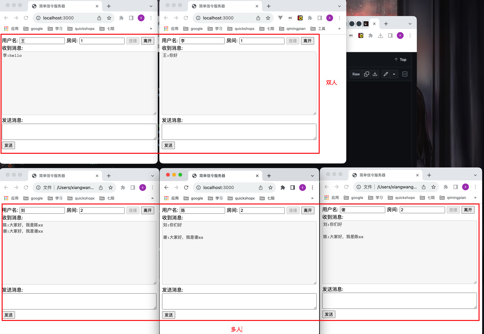
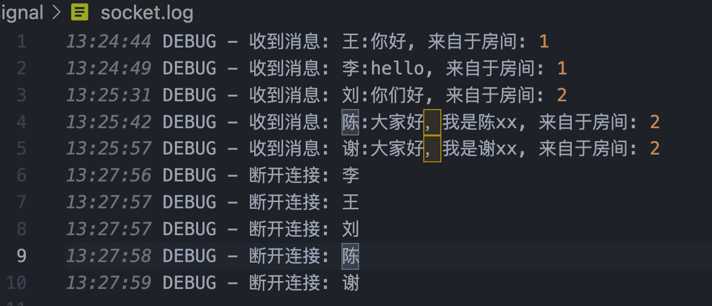

按照 Socket.IO 的[官网教程](https://socket.io/zh-CN/get-started/chat)很快便能搭建一个聊天应用程序。

```bash
yarn add socket.io express log4js
```

Socket.io 分为服务端和客户端两部分。服务端由 Node.js 加载后侦听某个服务端口，客户端要想与服务端相
连，首先要加载 Socket.io 的客户端库，然后调用 io.connect();



顺便看一下日志信息：

