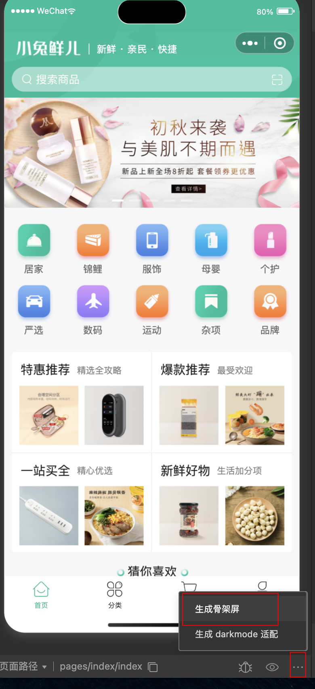
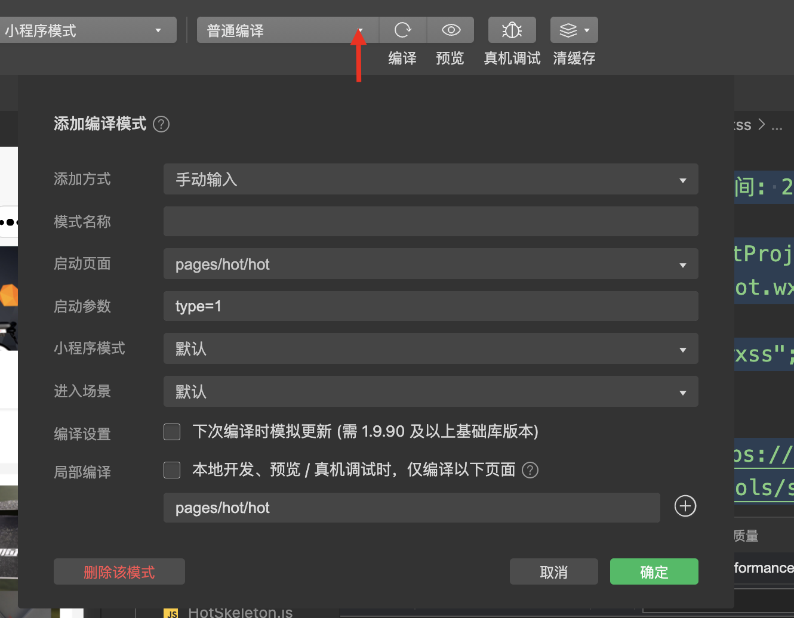

## 创建项目

### Hbuildx 创建

### 命令行创建

[quickstart](https://uniapp.dcloud.net.cn/quickstart-cli.html)

1. 创建项目

   ```bash
   npx degit dcloudio/uni-preset-vue#vite-ts uniapp-vue3-ts
   ```

2. 通过 vscode 打开

   ```bash
   pnpm i
   # 运行微信项目
   pnpm run dev:mp-weixin
   ```

   完成后，会生成 dist/dev/mp-weixin 目录

3. 微信开发者工具导入项目

## VSCode 开发

### 插件

- uni-helper
- uni-create-view
- uniapp 小程序扩展

### ts 类型校验

1. 安装类型声明文件
2. 配置 tsconfig.json

```bash
pnpm i @types/wechat-miniprogram @uni-helper/uni-app-types -D
```

```js
// tsconfig.json配置
{
  "extends": "@vue/tsconfig/tsconfig.json",
  "compilerOptions": {
    "allowJs": true,
    "sourceMap": true,
    "baseUrl": ".",
    "paths": {
      "@/*": ["./src/*"]
    },
    "lib": ["esnext", "dom"],
    "types": ["@dcloudio/types", "miniprogram-api-typings", "@uni-helper/uni-app-types"]
  },
  "vueCompilerOptions": {
    // experimentalRuntimeMode 已废弃，现调整为 nativeTags，请升级 Volar 插件至最新版本
    "nativeTags": ["block", "component", "template", "slot"]
  },
  "include": ["src/**/*.ts", "src/**/*.d.ts", "src/**/*.tsx", "src/**/*.vue"]
}
```

## 开发准备

### 组件库

[uni-ui](https://uniapp.dcloud.net.cn/component/uniui/quickstart.html)

#### 配置 easycom 自动导入

```json
// uni-app 3.0.0+ 版本支持，自动注册组件
// 详细配置参考：https://uniapp.dcloud.net.cn/uniCloud/uni-config-center?id=easycom
"easycom": {
  // 是否开启自动扫描
  "autoscan": true,
  // 以正则方式完成组件的自动导入
  "custom": {
    // uni-ui 规则如下配置 uni-badge会自动替换为@dcloudio/uni-ui/lib/uni-badge/uni-badge.vue
    "^uni-(.*)": "@dcloudio/uni-ui/lib/uni-$1/uni-$1.vue"
  }
},
```

#### uni-ui ts 类型说明

[uni-ui-types](https://www.npmjs.com/package/@uni-helper/uni-ui-types)

### pinia 持久化

[pinia-plugin-persistedstate](https://prazdevs.github.io/pinia-plugin-persistedstate/zh/guide/)

```js
// 小程序持久化
{
  persist: {
    storage: {
      getItem(key) {
        return uni.getStorageSync(key)
      },
      setItem(key, value) {
        uni.setStorageSync(key, value)
      },
    },
  },
},
```

[storage](https://prazdevs.github.io/pinia-plugin-persistedstate/zh/guide/config.html#storage)

### 请求工具

[uni.request](https://uniapp.dcloud.net.cn/api/request/request.html#request)

[addinterceptor 配置请求拦截器](https://uniapp.dcloud.net.cn/api/interceptor.html#addinterceptor)

```js
/**
 * 添加请求拦截器
 */

import { useMemberStore } from '@/stores'

const baseURL = 'https://pcapi-xiaotuxian-front-devtest.itheima.net/'

// 添加拦截器
const httpInterceptor = {
  // 拦截前触发
  invoke(options: UniApp.RequestOptions) {
    // 请求地址拼接
    if (!options.url.startsWith('http')) {
      options.url = baseURL + options.url
    }
    // 超时时间
    options.timeout = 20000
    // 添加小程序请求头
    options.header = {
      ...options.header,
      'source-client': 'miniapp',
    }
    // 添加token请求头
    const memberStore = useMemberStore()
    const token = memberStore.profile?.token
    if (token) {
      options.header.Authorization = token
    }
  },
}
uni.addInterceptor('request', httpInterceptor)
uni.addInterceptor('uploadFile', httpInterceptor)
```

#### 封装成 promise

```js
type Data<T> = {
  code: string
  msg: string
  data: T
}
enum StatusCodeEnum {
  SUCCESS = 200,
  REJECT = 300,
  UNAUTHORIZED = 401,
  INTERNAL_SERVER_ERROR = 500,
}
export const http = <T>(options: UniApp.RequestOptions) => {
  return new Promise<Data<T>>((resolve, reject) => {
    uni.request({
      ...options,
      success: (res) => {
        if (res.statusCode >= StatusCodeEnum.SUCCESS && res.statusCode < StatusCodeEnum.REJECT) {
          resolve(res.data as Data<T>)
        } else if (res.statusCode === StatusCodeEnum.UNAUTHORIZED) {
          // 清空用户信息 跳转登录页
          uni.clearStorageSync()
          uni.navigateTo({ url: '/pages/login/login' })
          reject(res)
        } else {
          uni.showToast({
            title: (res.data as Data<T>).msg || '请求错误',
          })
          reject(res)
        }
      },
      fail: (err) => {
        uni.showToast({
          title: '请求错误',
        })
        reject(err)
      },
    })
  })
}
```

## 首页

### 安全区域设置

```js
// 获取屏幕边界到安全区域距离
const { safeAreaInsets } = uni.getSystemInfoSync()
```

设置顶部安全距离

```vue
<template>
  <view class="navbar" :style="{ paddingTop: safeAreaInsets!.top + 10 + 'px' }">
</template>
```

### 自定义组件自动引入

同上 easycom 自动导入

```json
// 以 Xtx 开头的组件，在 components 文件夹中查找引入（需要重启服务器）
"^Xtx(.*)": "@/components/Xtx$1.vue"
```

修改后需要重启项目生效

#### 添加组件类型声明

自动导入的组件缺少类型声明，需要 types 下新建 components.d.ts

```ts
import XtxSwiper from '@/components/XtxSwiper.vue'
import XtxGuess from '@/components/XtxGuess.vue'

declare module 'vue' {
  export interface GlobalComponents {
    XtxSwiper: typeof XtxSwiper
    XtxGuess: typeof XtxGuess
  }
}

// 组件实例类型
export type XtxGuessInstance = InstanceType<typeof XtxGuess>
export type XtxSwiperInstance = InstanceType<typeof XtxSwiper>
```

这样其他组件引入就不会报错

### 开发

### 自定义 tabBar

```json
{
  "path": "pages/index/index",
  "style": {
    "navigationBarTitleText": "首页",
    "navigationStyle": "custom",
    "navigationBarTextStyle": "white"
  }
},
```

### 骨架屏

微信开发者工具 -> 信息 -> 生成骨架屏



复制代码到 vue 中稍作修改即可

### 页面参数

```js
// uniapp 获取页面参数
const query = defineProps<{
  type: string
}>()
```

获取页面参数，例如 路由传参

### 动态设置标题

```js
// 动态设置标题
uni.setNavigationBarTitle({ title: xxx })
```

### 添加编译模式



可以每次打开固定路由

## 小程序快捷登录

```js
wx.login()
```

获取微信登录信息

```js
<button class="button phone" open-type="getPhoneNumber" @getphonenumber="onGetphonenumber">
  <text class="icon icon-phone"></text>
  手机号快捷登录
</button>

// 获取用户手机号码
const onGetphonenumber: UniHelper.ButtonOnGetphonenumber = async (ev) => {
  const { encryptedData, iv } = ev.detail
  const res = await postLoginWxMinAPI({ code, encryptedData, iv })
  loginSuccess(res.result)
}
```

获取登录用户手机号（个人微信小程序账号无法获取）

## 页面分包和预加载

通过分包将不经常使用的页面进行拆分，以提高小程序的启动速度。

点击才开始加载，此时就需要对分包进行预加载
