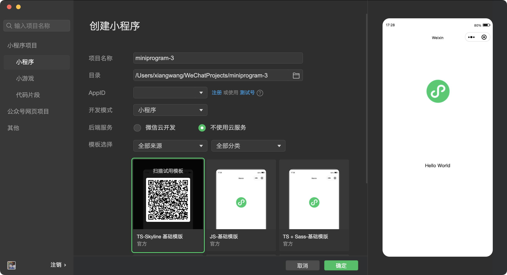

## 前言

最近帮同学做了个微信小程序，记录一下学习过程，希望能对大家有帮助。

## 注册微信小程序

如果想要开发微信小程序，前提是需要注册小程序账号，[小程序注册](https://mp.weixin.qq.com/wxopen/waregister?action=step1)，很容易注册，用邮箱即可

## 创建小程序



## 1 代码组成

```js
├── app.js               // 小程序项目入口文件
├── app.json             // 小程序全局配置文件
├── app.wxss             // 小程序全局样式文件
├── components           // 小程序组件
│   └── navigation-bar
│       ├── navigation-bar.js
│       ├── navigation-bar.json
│       ├── navigation-bar.wxml
│       └── navigation-bar.wxss
├── pages                // 所有的小程序页面
│   └── index
│       ├── index.js    // 当前页面逻辑
│       ├── index.json  // 当前页面配置
│       ├── index.wxml  // 当前页面模板结构
│       └── index.wxss  // 当前页面样式
├── project.config.json  // 项目配置文件
├── project.private.config.json
└── sitemap.json         // 配置小程序及其页面是否允许被微信索引
```

1. 页面需手动在`app.json`注册，否则不能访问
2. `pages`数组第一项代表小程序初始页面，减少需删除对应文件夹
3. 直接修改`this.data`无效，无法改变页面状态，需要使用`this.setData({})`
4. `tabBar`最多设置 5 个
5. 没有`a`标签，无法嵌套`iframe`，直接使用 `wx.navigateTo()`实现跳转
6. 没有`window`对象，提供`wx`全局[方法集](https://developers.weixin.qq.com/miniprogram/dev/api/base/wx.env.html)

### 1.1 主体

- app.js 注册全局变量或方法，可以被所有页面获取到
- app.json 小程序配置 pages 组成页面 window 设置状态栏、标题栏、导航条、窗口背景 - - - tabBar 配置 tab 栏样式和对应页面
- app.wxss 小程序公共样式表 可引入其他.wxss 文件

`app.json`示例：

```json
"pages": [ //设置页面的路径
  "pages/index/index", //不需要写index.wxml,index.js,index,wxss,框架会自动寻找并整合
  "pages/logs/logs"
],
"window": { //设置默认窗口的表现形式
  "navigationBarBackgroundColor": "#ffffff", //顶部导航栏背景色
  "navigationBarTextStyle": "black", //顶部导航文字的颜色 black/white
  "navigationBarTitleText": "微信接口功能演示", //顶部导航的显示文字
  "backgroundColor": "#eeeeee", //窗口的背景色
  "backgroundTextStyle": "light", //下拉背景字体、loading 图的样式，仅支持 dark/light
  "enablePullDownRefresh": "false", //是否支持下拉刷新 ，不支持的话就直接不写！
  "disableScroll": true, //  设置true不能上下滚动，true/false，注意！只能在 page.json 中有效，无法在 app.json 中设置该项。
},
"tabBar": { //底部tab或者顶部tab的表现，是个数组，最少配置2个，最多5个
  "list": [{ //设置tab的属性，最少2个，最多5个
    "pagePath": "pages/index/index", //点击底部 tab 跳转的路径
    "text": "首页", //tab 按钮上的文字
    "iconPath": "../img/a.png", //tab图片的路径
    "selectedIconPath": "../img/a.png" //tab 在当前页，也就是选中状态的路径
  }, {
    "pagePath": "pages/logs/logs",
    "text": "日志"
  }],
  "color": "red", //tab 的字体颜色
  "selectedColor": "#673ab7", //当前页 tab 的颜色，也就是选中页的
  "backgroundColor": "#2196f3", //tab 的背景色
  "borderStyle": "white", //边框的颜色 black/white
  "position": "bottom" //tab处于窗口的位置 top/bottom
  },
"networkTimeout": { //默认都是 60000 秒一分钟
    "request": 10000, //请求网络超时时间 10000 秒
    "downloadFile": 10000， //链接服务器超时时间 10000 秒
      "uploadFile": "10000", //上传图片 10000 秒
    "downloadFile": "10000" //下载图片超时时间 10000 秒
  },
"debug": true //项目上线后，建议关闭此项，或者不写此项
```

### 1.2 pages

小程序的各个页面，由`.wxml`、`.wxss`、`.js`、`.json`组成

- `.js`指定页面初始数据、生命周期、事件处理
- `.wxml`页面布局，只能使用微信定义的组件
- `.wxss`样式表，`rpx`可以根据屏幕宽度自适应、`@import`导入外部样式
- `.json`页面配置文件

### 1.3 utils

公共代码抽取的`js`文件，作为模块使用，通过`module.export`对外暴露，使用`const utils = require('../../utils/util.js')`阴用

#### 1.4 project.config.json

## 2 视图层 WXML

### wxml 对比 html

html：div、span、img、a
wxml：view、text、image、navigator

### 2.1 数据绑定

状态模式--单向数据流，即数据流向是单向的，视图变化不会影响对象状态

视图上的数据必须通过事件传递给对象，只有用户操作视图，才能获取到数据，并更新对象状态

`.wxml`动态数据绑定

```js
Page({
  data: {
    message: 'Hello',
    id: 0,
    status: true,
  },
})
```

```html
<view> {{message}} </view>
<view id="item-{{id}}"> </view>
<view wx:if="{{status}}"> </view>
<view hidden="{{status}}"> </checkbox>
```

还可以进行简单的运算

```xml
<view hidden="{{status ? true : false}}"> Hidden </view>
<view> {{a + b}} + c </view>
<view wx:if="{{num > 6}}"> </view>
<view>{{"hello" + word}}</view>
```

### 2.2 条件渲染

```html
<view wx:if="{{num > 5}}"> A </view>
<view wx:elif="{{num > 2}}"> B </view>
<view wx:else> C </view>
```

### 2.3 列表渲染

```js
<view wx:for="{{array}}" wx:key="index">
  {{index}}: {{item.message}} // 默认数组下标变量为index，当前项变量为item
</view>
```

### 2.4 模板 template

`name`定义组件模板名称，引用模板使用`is`属性指定，is 可以进行简单的三目运算

模板有自己作用域，只能通过`data`传入数据

```xml
<template name="msgItem">
 <view>
        <text> {{index}}: {{msg}} </text>
        <text> Time: {{time}} </text>
 </view>
</template>

<!-- 其他代码 -->
<template is="msgItem" data="{{...item}}"/>
```

### 2.5 公共模板引用

### 2.6 事件

名称以`bind`开头的事件不阻止冒泡，名称以`catch`开头事件阻止冒泡

在`wxml`中，使用`dataset`定义`data`数据，会通过事件传递

## 3. 事件周期

### 3.1 APP()应用生命周期

- 用户首次打开小程序，触发`onLaunch`
- 小程序初始化完成，触发`onShow`，监听小程序显示
- 小程序从前台进入后台，触发`onHide`方法
- 小程序从后台进入前台，触发`onShow`方法
- 小程序后台运行一定时间，或系统资源占用过高，会被销毁。
- 小程序出错，触发`onError`

```javascript
//app.js
App({
  onLaunch: function () {
    //小程序初始化(全局只触发一次)
  },
  onShow: function () {
    //小程序显示
  },
  onHide: function () {
    //小程序隐藏
  },
  onError: function (msg) {
    //小程序错误
  },
})
//其他 开发者可以添加任意的函数或数据到 Object 参数中，用 this 可以访问
```

### 3.2 Page 页面生命周期

每个页面有自己生命周期

- 注册完成后，加载页面，触发`onLoad`方法
- 页面载入后触发`onShow`方法，显示页面
- 首次显示页面，触发`onReady`方法，渲染页面元素和样式，一个页面之后调用一次
- 当后台运行或者跳转到其他页面，触发`onHide`方法
- 重新进入页面，触发`onShow`方法
- 当使用重定向方法`wx.redirectTo(OBJECT)`或关闭当前页返回上一页`wx.navigateBack()`，触发`onUnload`

```javascript
//index.js
Page({
  onLoad: function (options) {
    //页面加载-----(一个页面只会调用一次)
  },
  onReady: function () {
    //页面渲染-----(一个页面只会调用一次)
  },
  onShow: function () {
    //页面显示-----(每次打开页面都会调用一次)
  },
  onHide: function () {
    //页面隐藏-----(当navigateTo或底部tab切换时调用)
  },
  onUnload: function () {
    //页面卸载-----(当redirectTo或navigateBack的时候调用)
  },
})
//其他 开发者可以添加任意的函数或数据到 object 参数中，在页面的函数中用 this 可以访问
```

### 3.3 应用生命周期影响页面生命周期

- 小程序初始化完成后，页面首次加载触发`onLoad`，只会触发一次。
- 当小程序进入到后台，先执行页面`onHide`方法再执行应用`onHide`方法。
- 当小程序从后台进入到前台，先执行应用`onShow`方法再执行页面`onShow`方法

## 4 小程序限制

### 4.1 程序限制

- 样式不支持级联选择器
- 本地资源无法通过 `css` 获取 `background-image`可以使用网络图片，或者 `base64`，或者使用标签
- 不支持 `A` 标签，无法打开普通网页

### 4.2 数量限制

- 底部或顶部可以添加`tab`按钮区域 `tabBar` 是一个数组，只能配置最少 2 个、最多 5 个 `tab`，`tab`按数组的顺序排序
- 一个应用同时只能打开 5 个页面
- 小程序的`wx.request`请求最开始最大并发数是 10 个

### 4.3 大小限制

- `tabBar`上按钮`iconPath`图片路径、`selectedIconPath`选中图片路径，icon 大小限制为`40kb`
- `setData`页面数据传递单次设置数据不能超过`1024kb`
- `setStorage`本地缓存最大`10mb`
- 小程序源码打包后大小限制`2m`

## 5 路由

- 微信路由接口有三个，分别是`wx.redirectTo`、`wx.navigateTo`和`wx.switchTab`
  `wx.navigateTo`全局最多调用 5 次
- 如果某页面设置为`tab`页，则只支持`wx.switchTab`，不支持其他两种路由方式访问

### 5.1 触发页面跳转

- 小程序启动，初始化第一个页面
- 打开新页面，调用 API`wx.navigateTo` 或使用`<navigator />`组件
- 页面重定向，调用 API`wx.navigateTo` 或使用`<navigator />`组件
- 页面返回，调用 API `wx.navigateBack`或用户按左上角返回按钮
- `tarbar`切换

### 5.2 如何跳转页面

```javascript
wx.navigateTo({ // 原页面会保留
  //目的页面地址
  url: 'pages/logs/index',
  success: function(res){},
  ...
})

wx.redirectTo({ // 关闭原页面 不能返回
  //目的页面地址
  url: 'pages/logs/index',
  success: function(res){},
  ...
})
```

### 5.3 使用组件

```csharp
<navigator url="pages/logs/index" hover-class="navigator-hover">跳转</navigator>
```

添加`redirect`属性，等同于`wx.redirectTo`接口，默认`redirect`为`false`，等同于`wx.navigateTo`接口

```javascript
wx.navigateBack({
  delta: 1,
})
```

`delta`为 1 时返回上一页，为 2 时表示上上一页。如果`dalta`大于已打开的页面总数，则返回到首页

### 5.4 页面跳转传值

```csharp
url?key=value&key1=value1 传递的参数没有被URIEncode,传递中文没有乱码
```

### 5.5 如何正确使用页面跳转

- 对于可逆操作，使用`wx.navigateTo`,比如从首页跳转到二级页面，从二级页面返回是不需要重新渲染首页
- 对于不可逆操作，使用`wx.redirectTo`,比如用户登录成功后，关闭登录页面，不能返回到登录界面。
- 对于一些介绍性等不常用页面`wx.redirectTo`或`wx.navigatrBack`
- 不要在首页使用`wx.redirectTo`，这样会导致应用无法返回首页

### 5.6 页面栈

- 小程序提供了`getCurrentPages()`函数获取页面栈，第一个元素为首页，最后一个元素为当前页面
- 使用`wx.navigateTo`重复打开页面，会在页面栈顶部添加一个与二级页面初始状态一样的界面，两个页面状态独立，页面栈大小加 1
- 使用`wx.redirectTo`重定向，关闭当前页面，使用新页面替换当前页面，两个状态是独立的
- 使用`wx.navigateBack`返回，页面栈减 1

## 6 数据通信

### 6.1 页面之间通信

- 使用全局变量`app.globalData`
- 使用本地缓存`wx.setStorageSync`
- `url`传递

```javascript
// A页面-传递数据

// 需要注意的是，wx.switchTab 中的 url 不能传参数。
wx.navigateTo({
  url: '../pageD/pageD?name=raymond&gender=male',
})

// B页面-接收数据//

//通过onLoad的option...

Page({
  onLoad: function (option) {
    console.log(option.name + 'is' + option.gender) // raymond is male
    this.setData({ option: option })
  },
})
```

### 6.2 参数传递

#### 6.2.1 小程序传递参数方式

1. 通过在`App.js`中设置全局变量

   ```js
   // 通常把不会更改的数据放在app.js的Data中，在各个页面中都可以通过APP实例获取Data数据
   var app = getApp()
   var data = app.data
   ```

2. 通过拼接 URL 直接传递

   ```js
   // 1.通过wx.navigateTo携带参数
   wx.navigateTo({
     url: 'test?id=1'
   });
   // 获取
   onLoad (options) {
    const id = options.id
   }


   // 2.通过navigator跳转url传递参数
   <navigator url="../../pages/test/test?testId={{testData.testId}}"></navigator>
   // 如果传递为数组
   <navigator url="../../pages/test/test?albumList={{testData.albumList}}"></navigator>
   // 传递到js后从options中得到的是个字符串，每个图片的url通过','分隔，所以要对其进行处理
   Page({
       data: {
           albumList: [],
       },
       onLoad: function (options) {
           var that = this;
           that.setData({
               albumList: options.albumList.split(",")
           });
       }
   })

   ```

3. 在`wxml`中绑定事件后，通过`data-xx`=“xx”的方式传递

   ```xml
   <view bindtap="clickMe" data-testId={{testId}}">
       ...
   </view>
   ```

   在`js`页面自定义方法`clickMe`接收

   ```js
   Page({
     clickMe: function (event) {
       var testId = event.currentTarget.dataset.testid
       wx.navigateTo({
         url: '../../pages/test/test',
       })
     },
   })
   ```

   `wxml`中配置传递数组

   ```xml
   <view bindtap="clickMe" data-albumlist={{testData.albumList}}">

   </view>
   ```

   在`js`中自定义`clickMe`接收

   ```javascript
   在js页面中自定义方法clickMe中接收

   Page({
     clickMe: function (event) {
       var albumList = event.currentTarget.dataset.albumlist.split(',')
       wx.navigateTo({
         url: '../../pages/test/test',
       })
     },
   })
   ```

4. 通过数据缓存存储在读取

   ```js
   // wx.setStorageSync 存储数据
   try {
     wx.setStorageSync('key', 'value')
   } catch (e) {}
   // wx.getStorageSync(key) 读取数据
   try {
     const value = wx.getStorageSync('key')
     if (value) {
       console.log(value)
     } else {
     }
   } catch (e) {}
   // 或者
   wx.getStorage({
     key: 'key',
     success: function (res) {
       console.log(res.data)
     },
   })
   ```

## 7 疑难汇总

- 不能使用 window 等对象；`zepto/jquery`无法使用

```tex
页面逻辑执行在JsCore中，jsCore是一个没有窗口对象的环境
```

- 本地资源无法通过`css`获取

```tex
background-image：可以使用网络图片，或者 base64，或者使用<image/>标签
```

- 修改窗口背景色

```css
page {
  display: block;
  min-height: 100%;
  background-color: red;
}
```

[小程序组件](https://upload-images.jianshu.io/upload_images/1480597-62a5f00053f5f0d1.png)

## 使用遇到的问题

1. 使用[微信地图组件](https://developers.weixin.qq.com/miniprogram/dev/component/map.html)报错 `getLocation:fail the api need to be declared in the requiredPrivateInfos field in app.json/ext.json`

   使用地理位置相关接口时，需要声明该字段[requiredPrivateInfos](https://developers.weixin.qq.com/miniprogram/dev/reference/configuration/app.html#requiredPrivateInfos)

2. `https://xxx.com` 不在以下 request 合法域名列表中，请参考文档：[网络配置](https://developers.weixin.qq.com/miniprogram/dev/framework/ability/network.html)

   每个微信小程序需要事先设置通讯域名，小程序只可以跟指定的域名进行网络通信。

   - 开发环境需要配置
     
   - 生产环境配置
     

## 请求

wx.request

## 预览效果

代码包太大，影响预览

<!--  -->

预览真机调试区别

预览只能看，真机调试可改代码

## 审核

<!--  -->
