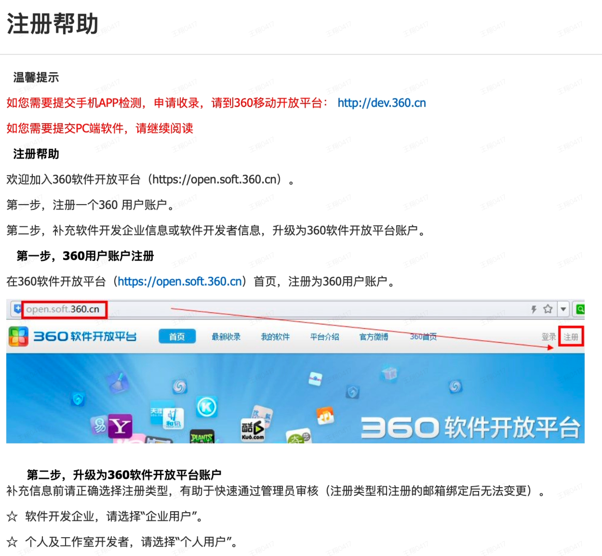
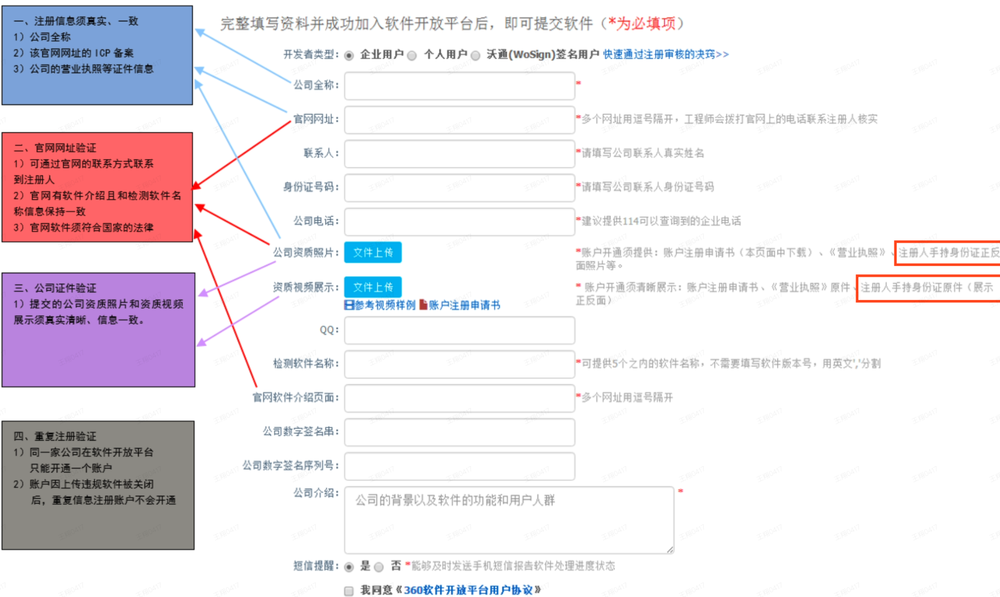
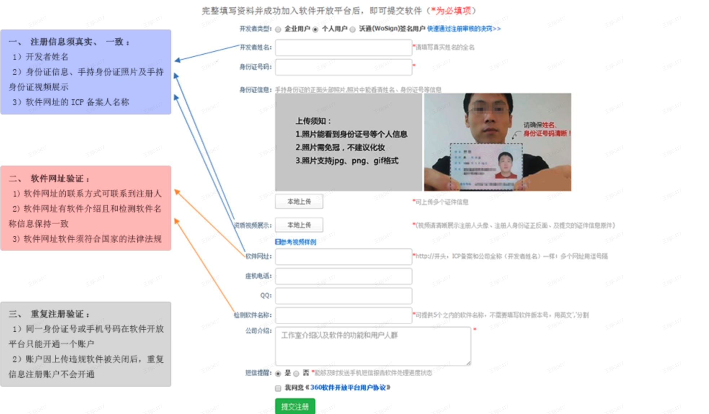

[360 软件开放平台](https://open.soft.360.cn/index.php)

## 企业账户注册标准

1. **公司全称** （如下注册信息须填写真实、一致）
   1）注册账户填写的公司全称和营业执照副本、增值电信业务许可证等资质证件名称都须一致。
   2）注册账户填写的公司全称和官网网址的 ICP 备案公司名称须一致；提交的多个网址 ICP 备案公司名称须一致。
   [ICP 备案信息查询](http://www.beian.miit.gov.cn/publish/query/indexFirst.action)
2. **官网地址**（提交多个网址用逗号隔开）
   1）提供的官网，需要有您提交软件的介绍。
   2）提供的官网，需要有官方联系方式，通过该联系方式可以联系到注册人（账户审核工程师会进行电话审核）。
   3）提供的官网首页，需要有 ICP 备案许可证号；官网网址的 ICP 备案公司名称和注册资质信息须一致。
3. **公司资质** (请提供：《营业执照副本》等资质证件)
   1）《账户注册申请书》：请认真阅读申请书信息后填写，并请公司负责人签字，加盖公司公章。
   2）《营业执照副本》：请提交加盖企业公章的营业执照副本复印件，证件信息须真实、有效，企业经营须符合国家的相关法律法规。
   3）经营性公司网站需要提交《增值电信业务经营许可证》；游戏娱乐类软件需要提交《网络文化经营许可证》；远程监控软件需要提交公安部颁发的《计算机信息系统安全专用产品销售许可证》； 从事互联网视听节目服务企业需要提交《信息网络传播视听节目许可证》。
   4）请在视频中清晰展示您提供的资质原件，有助于账户快速开通。
4. 重复注册验证
   1）同一家公司在软件开放平台只能开通一个账户。
   2）账户因上传违规软件被关闭后，重复信息注册账户不会开通。

## 个人账户注册标准

1. **注册信息** （须清晰、一致、真实、有效）
   1）开发者姓名 （请填写证件姓名的全名）。
   2）注册提交身份证证件信息（需要提交手持身份证的正面头部照片，照片中能看清姓名、身份证号等信息，证件信息须真实、一致，盗用、冒用或者使用假身份证信息注册账号将不予通过）。
   3）软件网址的 ICP 备案名称与开发者姓名一致（IP 地址、共享空间、淘宝网店、论坛、博客等不能通过账户审核）；经营性软件或网站须提供税务局出具的纳税证明。
   4）视频中展示的注册人头像和证件信息须清晰、一致、真实、有效。
   [ICP 备案信息查询](http://www.beian.miit.gov.cn/publish/query/indexFirst.action)

2. 软件网址
   1）提供的软件网址，需要有您提交软件的相关介绍 。
   2）提供的软件网址，需要有联系方式，通过该联系方式可以联系到注册人（管理员会进行电话审核）。
   3）提供的软件网址首页，需要有 ICP 备案许可证号；软件网址的 ICP 备案名称和注册人资质信息须一致。
3. 重复注册验证
   1）同一身份证或同一个手机号码只可以注册一个软件开放平台账户。
   2）账户因上传违规软件被关闭后，重复信息注册账户不会开通。

**ICP 备案问题帮助**

1）ICP 备案信息查询：http://www.beian.miit.gov.cn/publish/query/indexFirst.action。
2）ICP 备案流程：http://beian123.org.cn/index.php?id=116。
3）网站备案咨询电话：http://beian123.org.cn/index.php?id=133。
