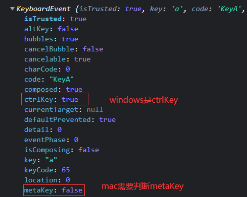

```ts
const handleKeyDown = (e) => {
  // 禁用全选
  if (e.keyCode === 65 && (e.ctrlKey || e.metaKey)) {
    e.preventDefault();
  }
}
window.addEventListener('keydown', handleKeyDown)
```


mac上的全选和windows上的全选不同，mac上需要判断`e.metaKey`
