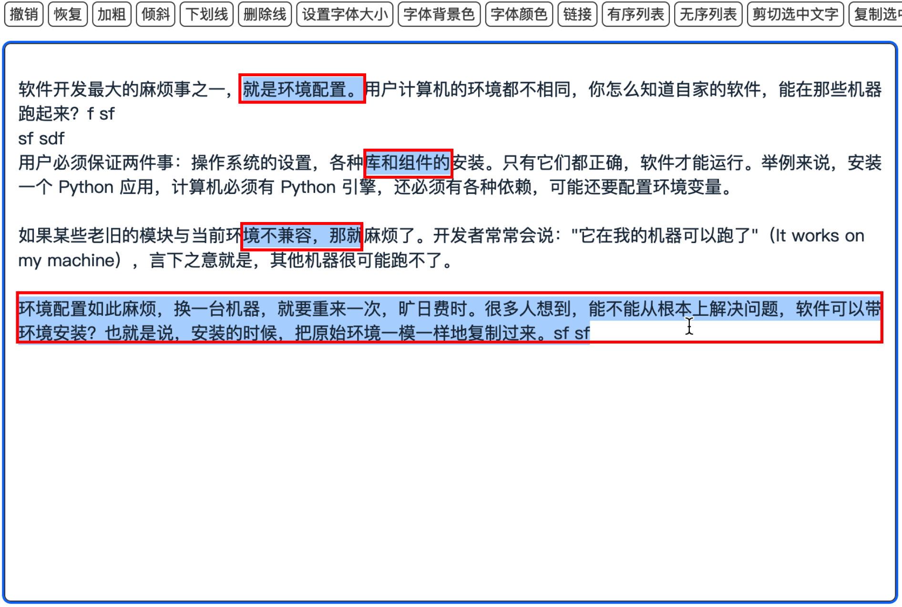
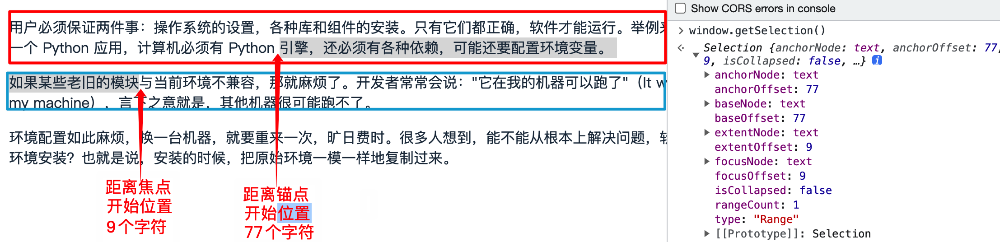
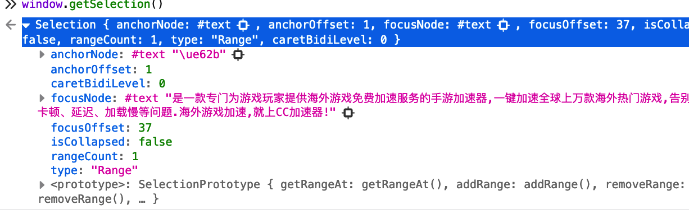
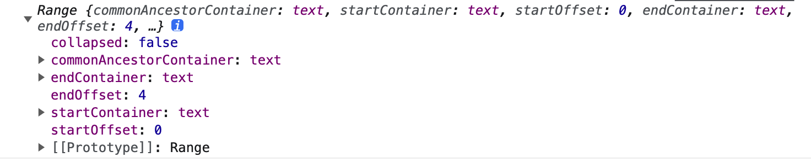
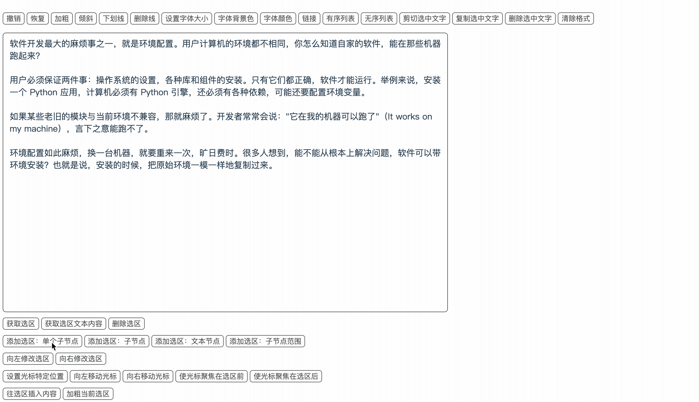
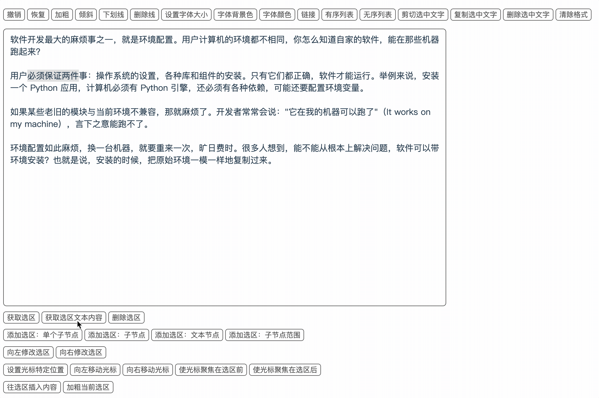
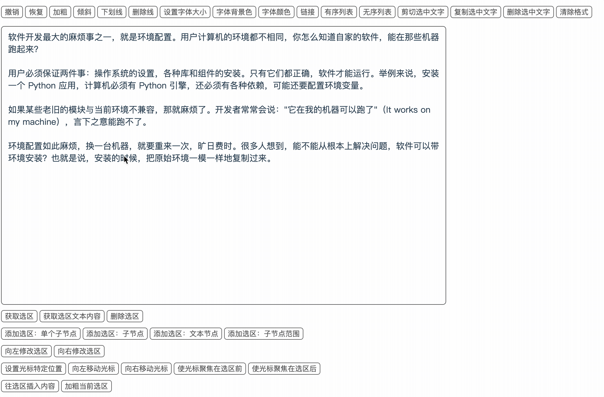

## 前言

最近有个需求，一个纯文本的评论功能，但是评论中需要实现 `@ 功能`，类似于 antd 的 [Mentions](https://www.antdv.com/components/mentions-cn)组件，不过在样式上有特定的要求。实质就是在一段纯文本中，添加一些 html 片段。

首先想到的是引入一个富文本编辑器，类似 wangEditor、quill 等，但是一个这么小的功能好像并没有必要，一是麻烦二是增加包的体积。于是就用 `contenteditable='true'` 生成一个可编辑 div 来完成。

为此学习了 [document.execCommand](https://developer.mozilla.org/zh-CN/docs/Web/API/Document/execCommand) 以及用于操作选区的 [Selection](https://developer.mozilla.org/zh-CN/docs/Web/API/Selection) 和 [Range](https://developer.mozilla.org/zh-CN/docs/Web/API/Range) API。

## document.execCommand

document.execCommand 可以说是富文本编辑器的核心 API，尽管 document.execCommand 已经被 MDN 给废弃了。

通过 document.execCommand 可以实现对可编辑文档执行预定义的命令，例如：

```javascript
// 加粗
document.execCommand('bold')
// 斜体
document.execCommand('italic')
// 字体
document.execCommand('fontSize', true, 10)
```

关于 document.execCommand 的更多功能可查看[MDN](https://developer.mozilla.org/zh-CN/docs/Web/API/Document/execCommand)。

下面我们可以来一个实际的案例看看：

```js
<!DOCTYPE html>
<html lang="en">
  <head>
    <meta charset="UTF-8" />
    <meta name="viewport" content="width=device-width, initial-scale=1.0" />
    <title>Document</title>
    <style type="text/css">
      .btn-group {
        margin: 15px 0;
      }

      .btn {
        color: #494949;
        background-color: #fff;
        border: 1px solid #494949;
        border-radius: 5px;
        cursor: pointer;
        margin-top: 10px;
      }

      .editor {
        border: 1px solid #424242;
        width: 800px;
        height: 500px;
        padding: 8px 12px;
        border-radius: 6px;
      }
      a {
        cursor: pointer;
        text-decoration: none;
      }
    </style>
  </head>
  <body>
    <div class="btn-group">
      <input class="btn" type="button" value="撤销" data-commandid="undo" />
      <input class="btn" type="button" value="恢复" data-commandid="redo" />
      <input class="btn" type="button" value="加粗" data-commandid="bold" />
      <input class="btn" type="button" value="倾斜" data-commandid="italic" />
      <input class="btn" type="button" value="下划线" data-commandid="underline" />
      <input class="btn" type="button" value="删除线" data-commandid="strikeThrough" />

      <input class="btn" type="button" value="设置字体大小" data-commandid="fontSize" data-value="22" />
      <input class="btn" type="button" value="字体背景色" data-commandid="backColor" data-value="#FFFF02" />
      <input class="btn" type="button" value="字体颜色" data-commandid="foreColor" data-value="#FF0000"  />

      <input class="btn" type="button" value="链接" data-commandid="createLink" data-value="https://www.baidu.com/"/>
      <input class="btn" type="button" value="有序列表" data-commandid="insertOrderedList" />
      <input class="btn" type="button" value="无序列表" data-commandid="insertUnorderedList" />

      <input class="btn" type="button" value="剪切选中文字" data-commandid="cut" />
      <input class="btn" type="button" value="复制选中文字" data-commandid="copy" />
      <input class="btn" type="button" value="删除选中文字" data-commandid="delete" />

      <input class="btn" type="button" value="清除格式" data-commandid="removeFormat" />
    </div>
    <div class="editor" contenteditable="true" width="800px" height="500px"></div>
    <script type="text/javascript">
      window.onload = () => {
        const handleClick = (event) => {
          const target = event.target
          const { commandid, value } = target.dataset
          document.execCommand(commandid, false, value)
        }
        const btnGroup = document.querySelector('.btn-group')
        // 事件代理，给按钮父级绑定点击事件
        btnGroup.addEventListener('click', handleClick, false)
      }
    </script>
  </body>
</html>
```

[👉🏻 预览地址](https://codepen.io/wang1xiang/pen/qBLpRVJ)

通过体验上面的 Demo 之后，或许你会发现一个问题？那就是**每次点完功能按钮后文本框失焦，需要再次点击使其聚焦**。

这点就比较恶心了，难不成要我每次点击文本框才行 😔。

那么使用什么方法能够在点击编辑器外部功能按钮时继续让编辑器获取焦点呢？

好办，只需要在点击按钮执行 execCommand 命令的同时调用 [focus](https://developer.mozilla.org/en-US/docs/Web/API/HTMLElement/focus) 方法即可。

```js
const handleClick = (item: ToolType) => {
  const { commandId, value } = item
  editorRef.value?.focus()
  document.execCommand(commandId, false, value)
}
```

那么除了 focus 之外，还有其他的方法吗？带着问题，我们来学习一下 [Selection](https://developer.mozilla.org/zh-CN/docs/Web/API/Selection)（选区）和[Range](https://developer.mozilla.org/zh-CN/docs/Web/API/Range)（范围）这两个家伙。

## 选区 & 范围

### 是什么



上面是我在 Firefox 浏览器中的 demo，**范围指的就是页面上的每一个选中节点或节点部分文字**，即上图中的每个红框内的内容（只有 Firefox 可以选择多个范围，其他浏览器只能选择单个范围），每个都有起始位置和终止位置，**选区指的就是所有范围的集合**。

我们再来看下 MDN 中的介绍：

#### Range 范围

- 范围指的是文档中连续的一部分。一个范围包括整个节点，也可以包含节点的一部分，例如文本节点的一部分；
- 通常只能选择一个范围，但在 Firefox 浏览器中可以选择多个范围；
- Range 对象也能通过 DOM 创建、增加、删减。

#### Selection 选区

- 表示用户选择的文本范围或光标的当前位置，**光标也是一种特殊的选区**；
- 代表页面中的文本选区，可能横跨多个元素；
- **选择的起点 anchorNode 被称为锚点（anchor），终点 focusNode 被称为焦点（focus）**

### 如何获取

#### 获取选区

通过`window.getSelection()`即可获取到 Selection 对象，如下（第一张为 Chrome 浏览器，第二张为 Firefox 浏览器）：

**Chrome**



**Firefox**



可以看到 Chrome 浏览器和 Firefox 返回的结构略有差异，baseNode 和 extentNode 仅在 Chrome 浏览器中有，并且相关的定义在 MDN 中并不能查到。

通过[这个回答](https://stackoverflow.com/questions/27241281/what-is-anchornode-basenode-extentnode-and-focusnode-in-the-object-returned)了解到：**baseNode 和 extentNode 分别是 anchorNode 和 focusNode 的别名**。

Selection 数据格式如下：

- [anchorNode](https://developer.mozilla.org/docs/Web/API/Selection/anchorNode): 选区开始位置所属的节点元素；
- [anchorOffset](https://developer.mozilla.org/docs/Web/API/Selection/anchorOffset): 代表选区起点在 anchorNode 中的偏移量，例如选区从 anchorNode 的第一个字符开始，则返回 0；
- [focusNode](https://developer.mozilla.org/docs/Web/API/Selection/focusNode): 选区结束位置所属的节点元素；
- [focusOffset](https://developer.mozilla.org/docs/Web/API/Selection/focusOffset): 代表选区终点在 focusNode 中的偏移量，例如选区在 focusNode 的第一个字符前结束，则返回 0；
- [isCollapsed](https://developer.mozilla.org/docs/Web/API/Selection/isCollapsed): 未选择任何内容（空范围）或不存在的选取为 true，例如光标的 isCollapsed 为 true；
- [rangeCount](https://developer.mozilla.org/docs/Web/API/Selection/rangeCount): 返回选取中范围的数量，默认是 1，Firefox 浏览器返回可能大于 1；
- [type](https://developer.mozilla.org/docs/Web/API/Selection/type): 当前选择类型：
  - None: 当前没有选择
  - Caret: 选区已折叠（即 光标在字符之间，并未处于选中状态）
  - Range: 选择的是一个范围。

#### 获取范围

我们在上面说了选区是所有范围的集合，那么选区 Selection 一定是提供了获取 Range 的相关方法，[🫵 来查我呀](https://developer.mozilla.org/zh-CN/docs/Web/API/Selection#%E6%96%B9%E6%B3%95)。

[selection.getRangeAt](https://developer.mozilla.org/zh-CN/docs/Web/API/Selection/getRangeAt) ：用于获取当前选区内的 Range 对象，传入一个索引，表示需要获取选区中的第几个范围，一般传 0 即可，只有在 Firefox 浏览器中才会有多个范围。

```js
const range = selection?.getRangeAt(0)
```


Range 对象在 Chrome 浏览器和 Firefox 浏览器的输出结果一致，都包含一下对象：

- [collapsed](https://developer.mozilla.org/zh-CN/docs/Web/API/Range/collapsed)：表示 Range 的起始位置和终止位置是否相同，如光标为 true；
- [commonAncestorContainer](https://developer.mozilla.org/zh-CN/docs/Web/API/Range/commonAncestorContainer)：表示范围内的所有节点它们最近的共同祖先节点；
- [endContainer](https://developer.mozilla.org/zh-CN/docs/Web/API/Range/endContainer)：表示包含 Range 终点的节点；
- [endOffset](https://developer.mozilla.org/zh-CN/docs/Web/API/Range/endOffset)：表示 Range 终点在 endContainer 中的位置的偏移;
- [startContainer](https://developer.mozilla.org/zh-CN/docs/Web/API/Range/startContainer)：表示包含 Range 开始的节点；
- [startOffset](https://developer.mozilla.org/zh-CN/docs/Web/API/Range/startOffset)：表示 Range 在 startContainer 中的位置的偏移。

### 常用操作

因为 Range 和 Seleciton 相关的 API 很多，这里我们只需要记住一些常用的即可，其他的等用到的时候再去查文档即可。

[👉🏻 本文代码地址](https://github.com/wang1xiang/simple-editor)

在继续往下学习之前，请先打开[👉🏻 在线体验地址](https://wang1xiang.github.io/simple-editor/)，搭配使用，效果更佳哦 😯

#### 获取当前选区内容

[selection.toString](https://developer.mozilla.org/zh-CN/docs/Web/API/Selection/toString) 返回当前选区的纯文本内容，[range.toString](https://developer.mozilla.org/en-US/docs/Web/API/Range/toString) 返回某个范围的纯文本内容。

```js
selection?.toString()
// 或者
selection?.getRangeAt(0).toString()
```

#### 删除当前选区

[selection.removeRange](https://developer.mozilla.org/zh-CN/docs/Web/API/Selection/removeRange) 和 [selection.removeAllRanges](https://developer.mozilla.org/zh-CN/docs/Web/API/Selection/removeAllRanges) 都可以用于删除选区，不同的是 removeRange 删除时需要指定第几个范围，下面两种方法实现的效果一致。

```js
const count = selection?.rangeCount || 0
for (let i = 0; i< count; i++) {
  const range = selection?.getRangeAt(0) as Range
  selection?.removeRange(range)
}
// or
selection?.removeAllRanges()
```

**在一些操作前都需要先删除选区**，直接使用 removeAllRanges 即可。

#### 添加选区

[selection.addRange](https://developer.mozilla.org/zh-CN/docs/Web/API/Selection/addRange) 方法可以将一个新的 range 添加到选区中。步骤如下：

1. 使用 document.createRange 方法创建一个 Range 对象，也可以使用 new Range 创建；
2. 将指定范围添加到选区中；

   指定范围：**即选区的起始范围和终止范围**，有多种方法可以实现：

   - 使用 [range.selectNode](https://developer.mozilla.org/zh-CN/docs/Web/API/Range/selectNode) 或 [range.selectNodeContents](https://developer.mozilla.org/zh-CN/docs/Web/API/Range/selectNodeContents) 方法将 DOM 节点添加到 Range 中，这样选中的就是传入的 DOM 元素；
   - 使用 [range.setStart](https://developer.mozilla.org/zh-CN/docs/Web/API/Range/setStart) 和 [range.setEnd](https://developer.mozilla.org/zh-CN/docs/Web/API/Range/setEnd) 添加范围的边界；
   - 使用 [range.setStartBefore](https://developer.mozilla.org/zh-CN/docs/Web/API/Range/setStartBefore)/[srange.etEndBefore](https://developer.mozilla.org/en-US/docs/Web/API/Range/setEndBefore) 或 [range.setStartAfter](https://developer.mozilla.org/en-US/docs/Web/API/Range/setStartAfter)/[range.setEndAfter](https://developer.mozilla.org/en-US/docs/Web/API/Range/setEndAfter) 来添加范围的边界。

3. 移除已有选区，通过尝试，**如果不移除当前选区的话，除 Firefox 外的所有浏览器都将忽略新范围**；
4. 最后将 range 范围添加到选区中。

下面这个 Demo 分别用 selectNode、setStart 和 setStartBefore 这几种方法实现。

```js
const editor = document.querySelector('.editor')!
const range = document.createRange()
// 1. selectNode 选中第n个子节点
// const sizeStr = window.prompt('选择第几个子节点', '1') || '1'
// const size = parseInt(sizeStr)
// if (isNaN(size)) return
// range.selectNode(editor.childNodes[size])

// 2. setStart/setEnd 选中第n个子节点到第m个子节点
// const startOffsetStr = window.prompt('从第几个子节点开始', '1') || '1'
// const endOffsetStr = window.prompt('到第几个子节点结束', '5') || '1'
// const startOffset = parseInt(startOffsetStr)
// const endOffset = parseInt(endOffsetStr)
// if (isNaN(startOffset) || isNaN(endOffset)) return
// range.setStart(editor, startOffset)
// range.setEnd(editor, endOffset)

// 3. setStart/setEnd 选中第n个子节点的开始到结束范围
// const n = 1
// const startOffsetStr = window.prompt('从第一个子节点的第几个位置开始', '1') || '1'
// const endOffsetStr = window.prompt('到第一个子节点的第几个位置结束', '5') || '1'
// const startOffset = parseInt(startOffsetStr)
// const endOffset = parseInt(endOffsetStr)
// if (isNaN(startOffset) || isNaN(endOffset)) return
// range.setStart(editor.childNodes[n], startOffset)
// range.setEnd(editor.childNodes[n], endOffset)

// 4. setStartBefore/setEndBefore 选中第n个子节点到第m个子节点
const startOffsetStr = window.prompt('从第几个子节点前开始', '1') || '1'
const endOffsetStr = window.prompt('到第几个子节点末尾结束', '5') || '1'
const startOffset = parseInt(startOffsetStr)
const endOffset = parseInt(endOffsetStr)
if (isNaN(startOffset) || isNaN(endOffset)) return
range.setStartBefore(editor.childNodes[startOffset])
range.setEndBefore(editor.childNodes[endOffset])

selection?.removeAllRanges()
selection?.addRange(range)
```

在上面代码中，setStart/setEnd 有两种不同的效果:

1. **作用于元素节点时**（上述 2. setStart/setEnd 选中第 n 个子节点到第 m 个子节点）

   此时 node 设置为 editor，即整个富文本，那么此时设定的 offset 就是就是子元素的位置。

2. **作用于文本节点时**（上述 3. setStart/setEnd 选中第 n 个子节点的开始到结束范围）

   此时 node 设置为 `editor.childNodes[1]`, 即第一段话，那么此时设定的 offset 是其文本中的位置。

MDN 上是这样解释的：

> 如果起始节点类型是 Text、Comment 或 CDATASection 之一，那么 startOffset 指的是从起始节点算起字符的偏移量。对于其他 Node 类型节点，startOffset 是指从起始结点开始算起子节点的偏移量。



#### 修改选区

[selection.modify](https://developer.mozilla.org/zh-CN/docs/Web/API/Selection/modify)：可以用来修改选区，通过指定 `left` 或 `rigth` 来向左或向右修改选区，范围可以指定为一个字符、单词、段落、行等等。

```js
// 向左添加一个字符到选区
selection?.modify('extend', 'left', 'character')
// 向右添加一个单词到选区
selection?.modify('extend', 'right', 'word')
```



#### 设置光标位置

光标位置的设置可以有以下几种方法实现：

1. 单纯使用 range.setStart，即给定起始范围，不给结束范围，那么此时光标就会聚焦在 range.setStart 设置的范围前；
2. 使用 [selection.collapse](https://developer.mozilla.org/zh-CN/docs/Web/API/Selection/collapse)，传入光标需要落在的目标节点，以及落在节点的偏移量。

```js
// 1. 使用setStart/setStart实现
const editor = document.querySelector('.editor')!
const range = document.createRange()
// range.setStart(editor.childNodes[1], 1)
// selection?.removeAllRanges()
// selection?.addRange(range)
// 2. 使用selection.collapse实现
selection?.collapse(editor.childNodes[1], 12)
```

##### 移动光标位置

如果只是移动当前已有光标的位置，那么也可以使用上面提到的 selection.modify ，只需将第一个参数 `extend` 改为 `move` 即可。

```js
//向左移动光标
selection?.modify('move', 'left', 'character')
// 向右移动光标
selection?.modify('move', 'right', 'word')
```

##### 将光标聚焦到选区前后

如果已有选区的情况下，还有可以针对已有选区进行光标位置设置的方法：

[range.collapse](https://developer.mozilla.org/en-US/docs/Web/API/Range/collapse) —— 此方法会将选中范围向边界点（前/后）进行折叠，传入 true 折叠到 Range 开始的节点，false 折叠到 Range 终点的节点；
[selection.collapseToStart](https://developer.mozilla.org/zh-CN/docs/Web/API/Selection/collapseToStart) —— 折叠到选区起点
[selection.collapseToEnd](https://developer.mozilla.org/zh-CN/docs/Web/API/Selection/collapseToEnd) —— 折叠到选区终点

```js
// range?.collapse(false);
// 1. 使用collapseToStart
// selection?.collapseToStart()
// 2. 使用collapseToEnd
selection?.collapseToEnd()
```



#### 添加/替换选区内容

往富文本中插入/替换内容，在我们日常开发中应该应该会有所接触，那么你是怎么做的呢？

一种是使用 document.insertHTML 来实现，比如前面提到的 @ 功能，我一开始也是使用 document.insertHTML 来实现，但是遇到了问题，类似[这个问题](https://stackoverflow.com/questions/25941559/is-there-a-way-to-keep-execcommandinserthtml-from-removing-attributes-in-chr)；看评论说可以使用 [range.insertNode](https://developer.mozilla.org/en-US/docs/Web/API/Range/insertNode) 来实现。

具体的实现步骤如下：

1. 获取当前选区，没有选区没法添加；
2. 创建需要添加到选区中的元素 node；
3. 如果需要替换选区内容，则需要执行 [range.deleteContents](https://developer.mozilla.org/zh-CN/docs/Web/API/Range/deleteContents)；
4. 通过 range.insertNode 将 node 添加到选区；
5. 需要执行 range.setStartAfter 将光标移动到插入的元素之后（默认是选中插入元素）；
6. 恢复选区位置。

```js
const editor = document.querySelector('.editor') as HTMLElement
const range = selection?.getRangeAt(0)
const mark = document.createElement('mark')
mark.innerText = `@xxx`
mark.contentEditable = 'false'
mark.className = 'comment-mentions-label'
range?.deleteContents()
range?.insertNode(mark)
range?.setStartAfter(mark)
editor.focus()
```

像我们还可能会遇到加粗、斜体等等，可以使用 [range.surroundContents](https://developer.mozilla.org/zh-CN/docs/Web/API/Range/surroundContents) 来实现，surroundContents 方法将 Range 对象的内容移动到一个新的节点，并将新节点放到这个范围的起始处，简单来说：就是使用传入的节点包裹当前选取，例如实现加粗功能：

```js
const strong = document.createElement('strong')
range?.surroundContents(strong)
```

**注意：通过 range 添加/替换选区内容后，无法使用 Ctrl+Z 撤消**

### 实现最初的需求：记录选区并恢复

如果了解了以上知识，那此时我们要实现恢复选区的方法，只需要**在编辑器失焦前记录选区，在点击功能按钮完成后恢复选区**即可，如下（为了方便，封装成一个 hooks）：

```js
import { Ref, onBeforeMount, onMounted } from 'vue'

const useRestoreSelection = (inputRef: Ref<HTMLDivElement | undefined>) => {
  let saveRange: Range | null = null
  const saveSelection = () => {
    const sel = window.getSelection()!
    if (sel.getRangeAt && sel.rangeCount) {
      saveRange = sel.getRangeAt(0)
    }
  }

  const restoreSelection = () => {
    if (!saveRange) return
    const sel = window.getSelection()!
    sel.removeAllRanges()
    sel.addRange(saveRange)
  }
  onMounted(() => {
    const editorDOM = inputRef.value
    editorDOM?.addEventListener('blur', saveSelection)
  })
  onBeforeMount(() => {
    const editorDOM = inputRef.value
    editorDOM?.removeEventListener('blur', saveSelection)
  })
  return {
    restoreSelection,
  }
}

export default useRestoreSelection
```

可以将上面的 `editorRef.value?.focus()` 替换为 `saveSelection` 方法。

```js
const handleClick = (item: ToolType) => {
  const { commandId, value } = item
  restoreSelection()
  document.execCommand(commandId, false, value)
}
```

## 总结

其实很早之前就有用到这两个 API，但一直认为用处不大，所有没有深入研究，每次有需要的时候就百度查一查，现在终于肯花时间来搞清楚，以后遇到这种问题也就不会感到棘手了。

希望大家遇到不会的东西时，静下心来花时间去研究透它，这样就不至于每次遇到都去百度一遍。