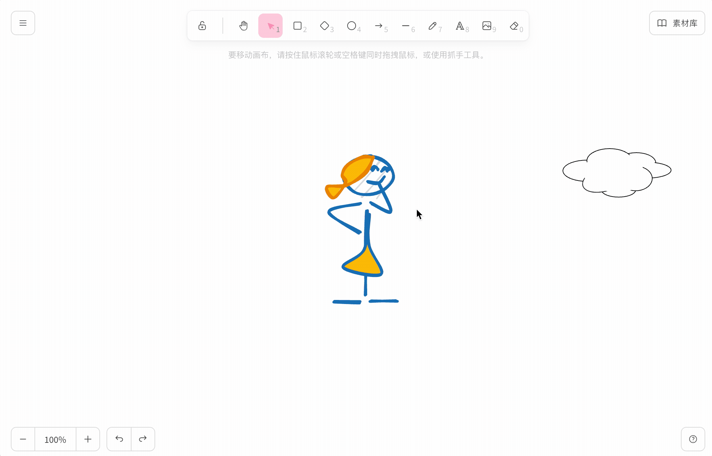
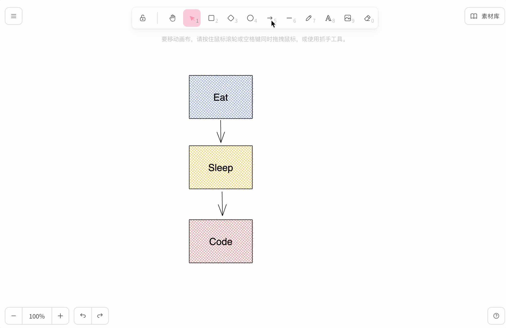
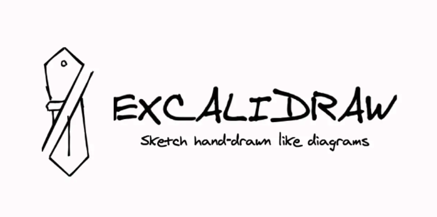
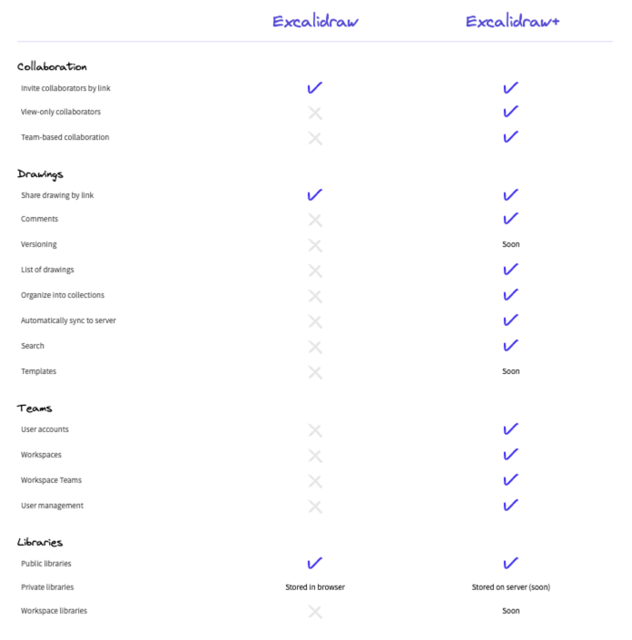
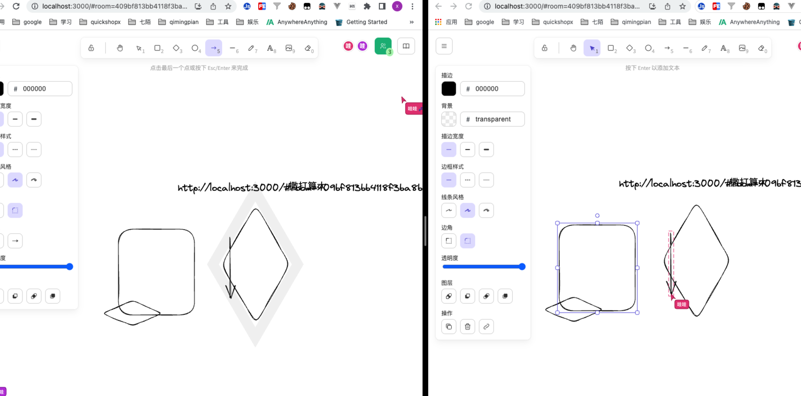
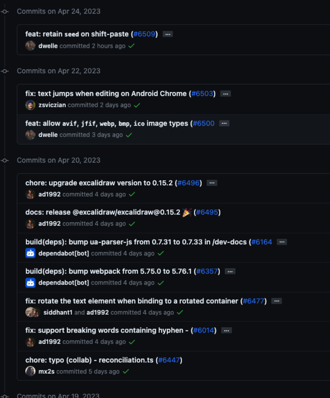
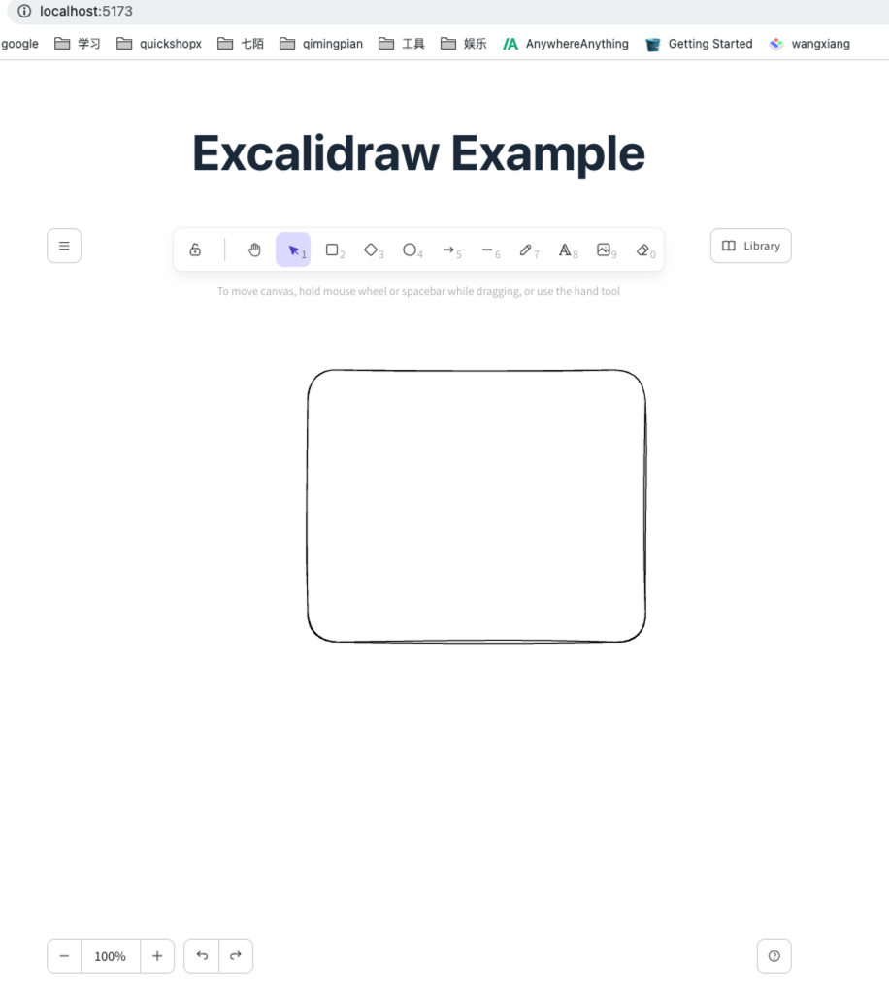
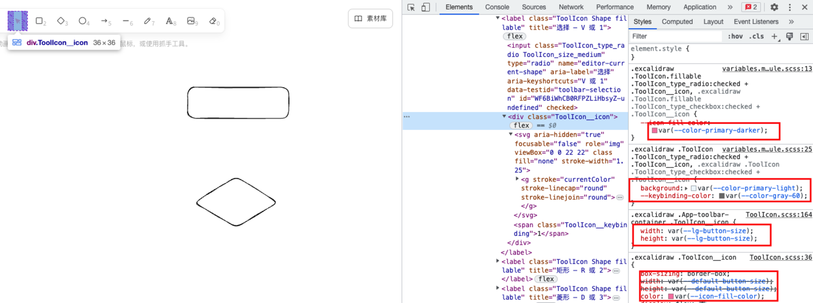
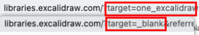

在我们工作中，流程图、思维导图这类工具，只要是一个程序员，那么你肯定用过其中的不止一款产品。

可能你之前看到各种非常漂亮的白板，比如谷歌的[画布](https://canvas.apps.chrome/) ，[figjam](https://www.figma.com/file/o7ekFKPe01QCYrozrD1WWj/Untitled?type=whiteboard&node-id=0-1&t=zxemFEkRYTxDaffT-0)、语雀的[画板](https://www.yuque.com/g/xiangzi-j7eli/kb/qkx1cqmo1uzftqgr/collaborator/join?token=5QzUvbxVumOmrIxz#)，还有像 mac 自带的无边际 app，在我看来都是很好用的白板工具，我会经常使用它们记录画一点东西、比如贴图啊各种的。

在我看来它们的最大特点就是：**自由，就是一张白纸**，你可以在这张白纸上表达你的各种想法，随心所欲，完全不受束缚。相比于 process-on 和 drawio 这类约定俗成的流程图来看，白板可以最大程度的体现你的想象力和表达力。

**那要在项目中实现一个这样的白板应该怎么做呢？**

强烈推荐[excalidraw](https://excalidraw.com/)，开始之前，我们先来看看 Excalidraw 可以做什么？

产品经理：这玩意可以画草图吗？
你：那我画个给你看看。



白板中是有很多种图形可供选择创建。对于每个形状，都可以调整以下元素：

- 颜色
- 填充
- 描边宽度
- 描边样式
- 边框
- 边角
- 不透明度
- 等等

开发：这玩意可以画流程图吗？
你：这样算不算，其实可以更复杂。比如用素材库里的 uml 图。



如果想创建一个自由方向的线条和箭头，那么只需要一步步单击你要的落点位置即可，最后再微调角度。

老板：这玩意可以弄出漂亮的图表吗？
你：老板，这漂亮吗？


创建图表需要数据，白板支持从 Excel 文件或者纯逗号分隔的文本复制数据，并粘贴到白板中创建图表。比如，复制下表数据然后粘贴到白板中。

当然还有更多功能，等着你自己的发现！

## Excalidraw 起源



作者是 facebook 的成员，所以只有 react 的版本，可以看 github 地址：[https://github.com/excalidraw](https://github.com/excalidraw/)。excalidraw 有很多项目，包含[excalidraw](https://github.com/excalidraw/excalidraw)基础画板功能、[excalidraw-room(collaboration server) ](https://github.com/excalidraw/excalidraw-room)Excalidraw 协作服务器、[excalidraw-libraries](https://github.com/excalidraw/excalidraw-libraries)等等

## 功能点

[文档](https://docs.excalidraw.com/docs/@excalidraw/excalidraw/integration)
[模版](https://libraries.excalidraw.com/?theme=light&sort=default)

- 基本图形元素：画笔、文字、矩形、圆形、菱形、箭头等等
- 新增组件：画框工具、网页嵌入
- 属性设置：背景、填充、风格、圆角、透明等
- 浅色和深色模式两种
- 可定制样式等
- 支持图片、表情
- 支持保存文件到本地
- 查看/编辑状态
- 前进/后退、放大/缩小、橡皮擦等
- 支持保存为图片
- 支持保存为素材库
- 丰富的素材库
- 丰富的快捷键
- i18n
- 适配移动端
- 等等

[使用技巧](https://mp.weixin.qq.com/s/h-V93CQSH-MPXLReQqvmzQ)

## 接入方式

Excalidraw 支持多种方式使用:

1. 使用源码
2. 使用 npm 包
3. Docker 部署
4. plus 商用版本 6$/人/月



## 使用源码

- 克隆 excalidraw 项目

  ```bash
  # 克隆excalidraw项目
  git clone https://github.com/excalidraw/excalidraw.git
  yarn
  yarn start
  ```

- 克隆 excalidraw-room 多人协作项目

  ```bash
  git clone https://github.com/excalidraw/excalidraw-room.git
  yarn
  yarn start
  ```

打开[http://localhost:3000/](http://localhost:3000/)，就可以看到可协作的白板项目。


好处是可以直接修改源码，哪部分想替换成自己的东西就改哪。坏处是一旦改了源码，那么官方更新之后对比起来太麻烦了，而且目前看官方代码更新挺频繁的。


## 使用 npm 包

### 创建项目并安装 excalidraw 包

需要在 react 项目中使用，使用 vite 初始化一个 react 项目并通过 npm 安装 excalidraw：

```bash
# 安装@excalidraw/excalidraw包
yarn add @excalidraw/excalidraw
```

excalidraw 占用父元素 100% 宽度和高度，因此需要确保在其中呈现 excalidraw 的容器具有非零尺寸：

```tsx
import { Excalidraw } from '@excalidraw/excalidraw'
function App() {
  return (
    <>
      <h1 style={{ textAlign: 'center' }}>Excalidraw Example</h1>
      <div style={{ height: 800, width: 800 }}>
        <Excalidraw />
      </div>
    </>
  )
}
```

一个功能完善的 excalidraw 项目就已经可以直接用了：


### 如何自定义样式

使用[CSS 变量](https://developer.mozilla.org/zh-CN/docs/Web/CSS/Using_CSS_custom_properties)，通过修改 excalidraw 所提供的 CSS 变量达到修改样式的效果，如顶部按钮背景色、鼠标 hover 状态等。



我们可以通过审查找到对应的元素，然后看元素对应的样式，只要是使用变量的这些我们都可以改。

```tsx
<div style={{ height: 800, width: 800 }} className="one-excalidraw">
  <Excalidraw />
</div>
```

```css
.one-excalidraw .excalidraw {
  --color-primary: #faa2c1;
  --color-primary-darker: #f783ac;
  --color-primary-darkest: #e64980;
  --color-primary-light: #fcc2d7;
}
```

### Props: 传递 Excalidraw 的参数

[可选的 Props](https://docs.excalidraw.com/docs/@excalidraw/excalidraw/api/props/)

Excalidraw 提供的 Props 很多，都是可选的。我们可以用来设置白板初始值、语言、一些操作的默认显示/隐藏状态等

- initialData

  用于加载 Excalidraw 画板的初始数据，接受一个对象，包含 elements、appState、files 等参数。
  通过 appState 我们可以修改默认的一些样式，如 theme、background 等，我整理了一些配置如下：

  ```ts
  export enum RoughnessEnum {
    /** 直线 */
    architect,
    /** 艺术 */
    artist,
    /** 漫画家 */
    cartoonist,
  }
  /** 边角风格 */
  export enum RoundnessEnum {
    /** 直角 */
    sharp = 'sharp',
    /** 圆角 */
    round = 'round',
  }
  /** 字体风格 */
  export enum FontFamilyEnum {
    /** 艺术 */
    'hand-drawn' = 1,
    /** 普通 */
    normal,
    /** 代码 */
    code,
  }
  ```

- ref

  如果我们需要访问某些 Excalidraw API 时，可以通过传递一个 ref 来获取 Excalidraw 的实例，然后就可以在当前组件中去调用 [Excalidraw 的 API](https://docs.excalidraw.com/docs/@excalidraw/excalidraw/api/props/ref)，比如 `current.refresh()`、`current.resetScene()`等

- langCode

  Excalidraw 默认是英文的，需要设置为中文`langCode='zh-CN'`，所有支持的语言[看这里](https://github.com/excalidraw/excalidraw/blob/master/src/i18n.ts#L14)

- viewModeEnabled

  是否是观察模式，即不可编辑，优先级高于`intialData.appState.viewModeEnabled`。类似的还有 zenModeEnabled 禅模式、gridModeEnabled 显示网格

- libraryReturnUrl

  用于指定安装模板的地址，默认为 `window.location.origin + window.location.pathname`；需要设置`window.name=任何字母数字字符串`，如果未设置时会打开新的选项卡。

  设置`window.name`和不设置时，跳到模板界面的 url 的不同，不设置时 target 为`_blank`，看到`_blank`就会联想到 a 标签的`_blank`，新页签打开
  
  [excalidraw 源码](https://github.com/excalidraw/excalidraw/blob/HEAD/src/components/LibraryMenuBrowseButton.tsx#L20)
  [excalidraw-library 源码](https://github.com/excalidraw/excalidraw-libraries/blob/HEAD/script.js#L223)

  而想要正常的加载模板，还需要搭配[useHandleLibrary](https://docs.excalidraw.com/docs/@excalidraw/excalidraw/api/utils#usehandlelibrary)来使用，否则添加模板不成功。

- Render Props

  可以用来自定义 UI，如`renderTopRightUI`用于自定义右上角的 UI，`renderCustomStats`用于自定义统计信息，`renderSidebar`用于自定义侧边栏
  [更多参考](https://docs.excalidraw.com/docs/@excalidraw/excalidraw/api/props/render-props)

- UIOptions

  主要用于自定义 Excalidraw 默认画布，如`canvasActions`用于控制菜单内画布操作的可见性，通过设置`canvasActions.toggleTheme`即可将切换主题的按钮去掉，`exportOpts`用于自定义导出对话框，`dockedSidebarBreakpoint`用于控制"侧边栏常驻"按钮是否显示，如果设置`dockedSidebarBreakpoint`数值小于 Excalidraw 的容器宽度时，显示此按钮，否则隐藏。

- onChange

  每次 Excalidraw 内容发生改变时，通过 onchange 回调函数获取最新的数据，包括 excalidrawElements（当前白板中的 excalidrawElements 数组）、appState（白板的一些状态）、files（添加到白板中的文件）。

  获取到这些数据后，就可以将数据保存到后端或选择本地存储。

- validateEmbeddable

  最新的 Excalidraw 支持 Web Embed 网页嵌入功能，可以将网页 url 复制到此组件中进行展示。默认情况下，仅支持 YouTube, Vimeo, Twitter, Excalidraw, Figma 这几个网站的 url，如果传递 true，则所有 URL 都可以支持。

### Children components: 可用于自定义 UI 的官方组件

在 Props 里，我们看到可以通过[Render Props](https://docs.excalidraw.com/docs/@excalidraw/excalidraw/api/props/render-props)来自定义内部组件，Excalidraw 官方正在将这些 Render Props 迁移到子组件类型，目前只支持以下四种：

- MainMenu 自定义左侧菜单

  用于自定义左侧首选项菜单栏，提供多种类型的子组件供我们使用

- WelcomeScreen 自定义欢迎界面

  画布为空时展示的界面，包括一些快速操作项以及解释某些 UI 按钮功能的提示，一旦用户选择了一个工具，或者在画布上创建了一个元素，此界面就会消失。

  也可以[自定义此组件](https://docs.excalidraw.com/docs/@excalidraw/excalidraw/api/children-components/welcome-screen#center)，生成自己的欢迎界面。

- Footer 自定义底部工具栏

  用于自定义底部的操作栏，可以使用 useDevice 挂钩来检查设备类型，然后显示不同的样式。

- LiveCollaborationTrigger 自定义实时协作功能

  如果需要显示实时协作功能，需要在`renderTopRightUI`props 中使用`<LiveCollaborationTrigger/>`组件来呈现。

### Utils: 工具函数及可用于导出、恢复等的实用程序

从@excalidraw/excalidraw 导出的纯函数，像前面提到的 useDevice 函数检查设备信息、usehandlelibrary 函数等

### 数据存储方案

通过调用 onChange 方法，可以获取修改后的数据，数据格式如下：

```json
{
  "excalidrawElements": [],
  "appState": {},
  "files": {}
}
```

- excalidrawElements: 画布中的每个元素，[格式](https://github.com/excalidraw/excalidraw/blob/master/src/element/types.ts#L114)，
- appState：当前画布的配置信息，[格式](https://github.com/excalidraw/excalidraw/blob/master/src/types.ts#L95)，不需要存储，
- files: 上传到白板中的文件，如：图片，以 base64 格式存储[格式](https://github.com/excalidraw/excalidraw/blob/master/src/types.ts#L64)

#### 存储方案一

实时存储在 localStorage 中，files 对应的 base64 信息需要存储在 IndexDB 中，每次页面退出时将数据同步到后端。

保存后加载时需要使用 addFiles 函数、updateLibrary 函数将文件和模板加载进来。

#### 存储方案二

保存到后端，加 debounce 处理，

**考虑：页面设置需要存储吗？如背景色、主题等**

### 缺点

npm 包目前不支持：多人协作、共享链接等，不过 Excalidraw 团队已经在规划当中，不久就会以插件的形式支持。
**如何实现协作**：https://github.com/excalidraw/excalidraw/discussions/3879

github 地址：[https://github.com/wang1xiang/excalidraw-demo](https://github.com/wang1xiang/excalidraw-demo)，求 star^\_^~

## Docker 部署

通过 docker 部署 excalidraw；

```bash
docker pull excalidraw/excalidraw
docker run --rm -dit --name excalidraw -p 5000:80 excalidraw/excalidraw:latest
```

完成后通过[http://localhost:5000/](http://localhost:5000/)即可访问，这个 docker 镜像只是 Excalidraw ，不包含 Excalidraw-room，所以创建好的实例不支持共享和协作功能。

可参考[docker 部署 excalidraw 画图工具](https://blog.csdn.net/qq_43622031/article/details/127387024)
