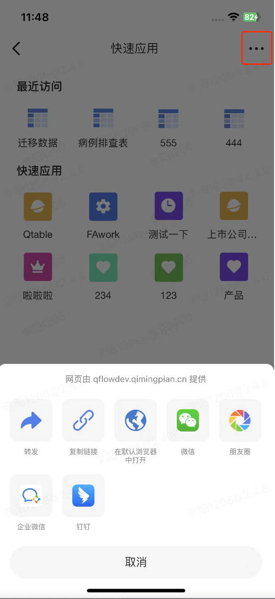
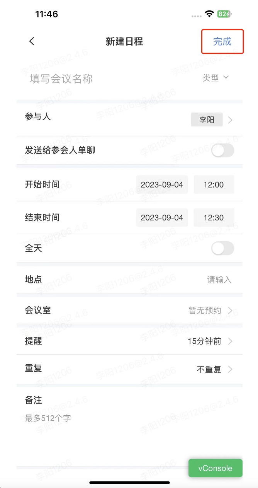

一、导航栏右侧按钮
1、App 原生导航栏右侧按钮默认为"更多"
2、如需换成"完成"、"提交"等文案，则需要 H5 在 OpenWebView 里增加参数 nav_right_menu , 当用户点击完成时，App 会调用 H5 的 jsToNativeComplete 函数，并回退到上级页面。

```js
{
    "need_nav": 1,
    "nav_right_menu": {
        "title": "完成",
        "callback_func": "jsToNativeComplete()"
    },
　"need_back_refresh": 1, // 返回刷新
    "need_to_intercept_back": {
        "title": "提醒",
        "msg": "退出日程编辑将无法保存当前内容，确定退出吗?"
    }
}
```



二、H5 获取键盘高度

如需换成"完成"、"提交"等文案，则需要 H5 在 OpenWebView 里增加参数 nav_right_menu , 当用户点击完成时，App 会调用 H5 的 jsToNativeComplete 函数，并回退到上级页面。

```js
{
    "need_nav": 1,
    "nav_right_menu": {
        "title": "完成",
        "callback_func": "jsToNativeComplete()"
    },
　"need_back_refresh": 1, // 返回刷新
    "need_to_intercept_back": {
        "title": "提醒",
        "msg": "退出日程编辑将无法保存当前内容，确定退出吗?"
    }
}
```


