## 🐛 问题复现

之前在做 html 内容导出为 pdf、图片时，我用的是 html2canvas 生成截屏，再进一步转换为 pdf 文件，感兴趣的同学可以看下这篇[一文搞定前端 html 内容转图片、pdf 和 word 等文件](https://juejin.cn/post/7220434734966571068)，截图得到的图片内容、质量都没有什么问题。

不过最近有个同事反应，他导出的图片有 bug，这我倒挺好奇的，因为这个导出功能已经用了很久，并没有人反馈过有问题（除了那个 **pdf 翻页内容被截断**的问题，求助 jym 🙏：前端有好的解决方法吗？），于是我要了他的文档，果不其然，出现了下面红框所示的问题。

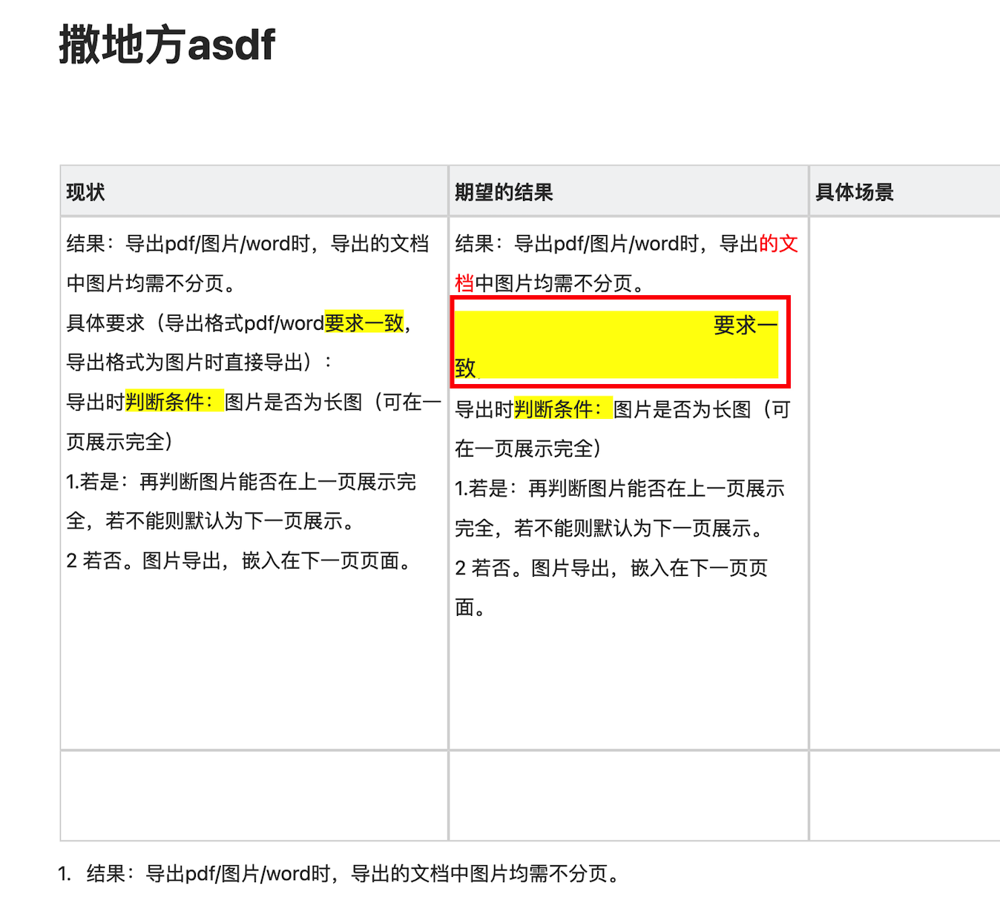

检查一下它的 DOM 结构，发现是下面这样，猜测是就是这个原因导致的。

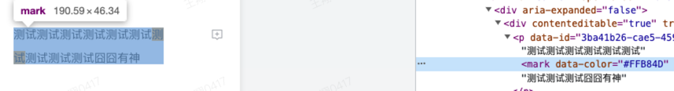

为了验证自己的猜想，浅浅调试一下 html2canvas 的源码，看下 html2canvas 是怎样一个流程，它是如何将 html 内转成 canvas 的。

## 调试开始

我们在 html2canvas 执行的地方打个断点，开始调试代码：

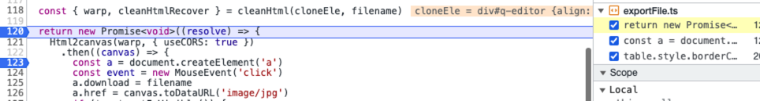

进入 html2canvas 内部，可以看到内部执行的是 renderElement 方法：

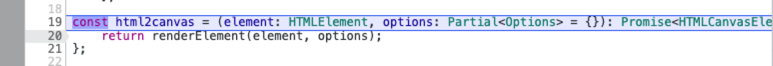

我们直接进入到 renderElement 方法内部，看下它的执行流程：

### renderElement 执行流程

#### 判断传入节点是否有效

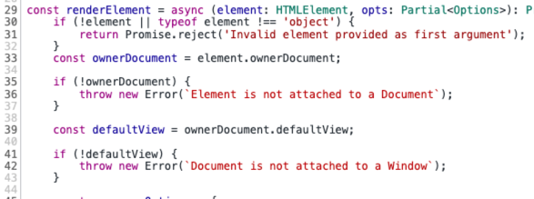

- `Node.ownerDocument`：只读属性，返回当前节点的顶层的 document 对象；
- `document.defaultView`：属性返回当前 document 对象所关联的 window 对象，如果没有，会返回 null。

这里主要判断节点，快速跳过，继续执行 👇。

#### 合并配置项

将用户传入的 options 与默认的 options 合并

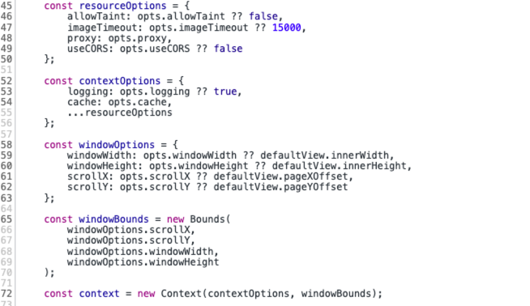

构建配置项，将传入的 `opts` 与默认配置合并，同时初始化一个 `context` 上下文对象（缓存、日志等）：

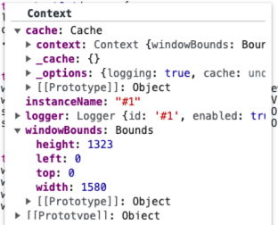

##### 缓存对象 cache

其中 `cache` 为缓存对象，主要是**避免资源重复加载**的问题。

原理如下：

如果遇到图片链接为 `blob`，在加载完成后，会添加到缓存 `_cache` 中：

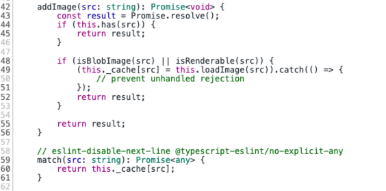

下次使用直接通过 `this._cache[src]` 从缓存中获取，不用再发送请求：

同时，`cache` 中**控制图片的加载和处理**，包括使用 `proxy` 代理和使用 `cors` 跨域资源共享这两种情况资源的处理。

继续往下执行 👇

### 克隆原始 DOM

使用 DocumentCloner 方法克隆原始 DOM，避免修改原始 DOM。

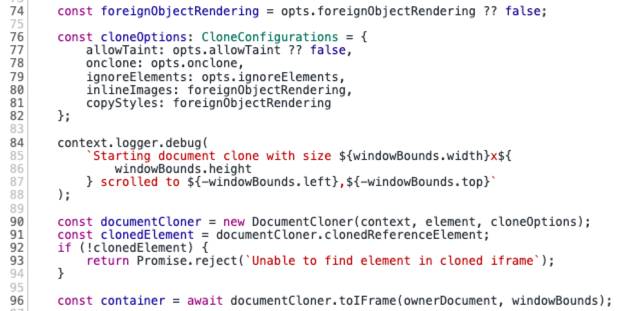

使用 clonedReferenceElement 将原始 DOM 进行克隆，并调用 toIFrame 将克隆到的 DOM 绘制到 iframe 中进行渲染，此时在 DOM 树中会出现 class 为 html2canvas-toIFrame 的 iframe 节点，通过 `window.getComputedStyle` 就可以拿到要克隆的目标节点上所有的样式了。

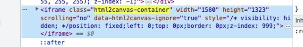

### 绘制 canvas

前面几步很简单，主要是对传入的 DOM 元素进行解析，获取目标节点的样式和内容。重点是 `toCanvas` 即将 DOM 渲染为 canvas 这个过程，html2canvas 提供了两种绘制 canvas 的方式：

1. 使用 foreignObject 方式绘制 canvas
2. 使用纯 canvas 方法绘制

咱们接着执行，当代码执行到这里时判断是否使用 foreignObject 的方式生成 canvas：

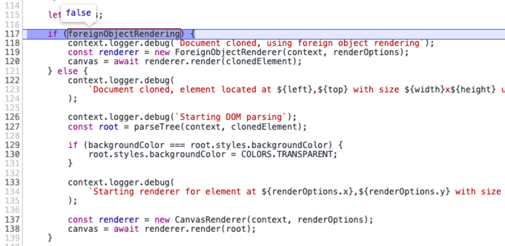

#### 使用 [foreignObject](https://developer.mozilla.org/zh-CN/docs/Web/SVG/Element/foreignObject) 方式绘制 canvas

首先了解下 foreignObject 是什么？

1. svg 中的`xmlns` 全称是“XML Namespaces”，即 XML 命名空间，正是它的存在，在浏览器中 svg 才能正常渲染（下面这段代码是在 iconfont 上随便复制的一个 icon svg 代码）；

   ```xml
    <svg t="1692613183565" class="icon" viewBox="0 0 1024 1024" version="1.1" 		xmlns="http://www.w3.org/2000/svg" p-id="20058" width="200" height="200">
   <path d="M548.571429 292.571429v182.784L731.428571 475.428571v73.142858l-182.857142-0.073143V731.428571h-73.142858V548.498286L292.571429 548.571429v-73.142858l182.857142-0.073142V292.571429h73.142858z" fill="#626B7D" p-id="20059"></path>
   </svg>
   ```

2. foreignObject 允许包含来自不同的 XML 命名空间的元素，借助 `<foreignObject>` 标签，我们可以直接将 DOM 节点作为 foreignObject 插入 SVG 节点中进行渲染，如下：

   ```xml
   <svg xmlns="http://www.w3.org/2000/svg">
    <foreignObject width="120" height="50">
        <body xmlns="http://www.w3.org/1999/xhtml">
          <div>测试测试</div>
        </body>
      </foreignObject>
   </svg>
   ```

   可以看到 `<foreignObject>` 标签里面有一个设置了 `xmlns="http://www.w3.org/1999/xhtml"` 命名空间的 `<body>` 标签，此时 `<body>` 标签及其子标签都会按照 XHTML 标准渲染，实现了 SVG 和 XHTML 的混合使用。

   这样只需要指定对应的命名空间，就可以把它嵌套到 foreignObject 中，然后结合 SVG，直接渲染。

   对于不同的命名空间，浏览器解析的方式也不一样，所以在 SVG 中嵌套 HTML，解析 SVG 的时候遇到 `http://www.w3.org/2000/svg` 转化 SVG 的解析方式，当遇到了 `http://www.w3.org/1999/xhtml` 就使用 HTML 的解析方式。

   这是为什么 SVG 中可以嵌套 HTML，并且浏览器能够正常渲染。

3. foreignObject 已经支持除 IE 外的主流浏览器

   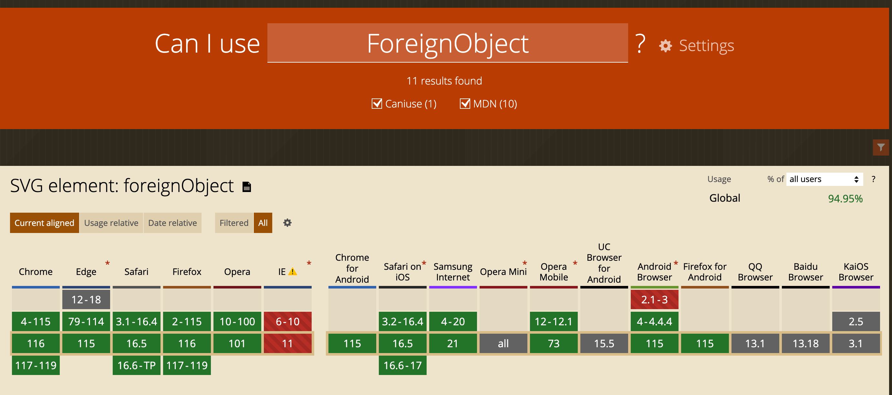

弄懂 foreignObject 后，我们尝试将 `foreignObjectRendering` 设置为 `true`，看看它是如何生成 canvas 的：

```js
Html2canvas(warp, {
  useCORS: true,
  foreignObjectRendering: true,
})
```

在此处打个断点：

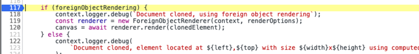

进入 ForeignObjectRenderer 类中

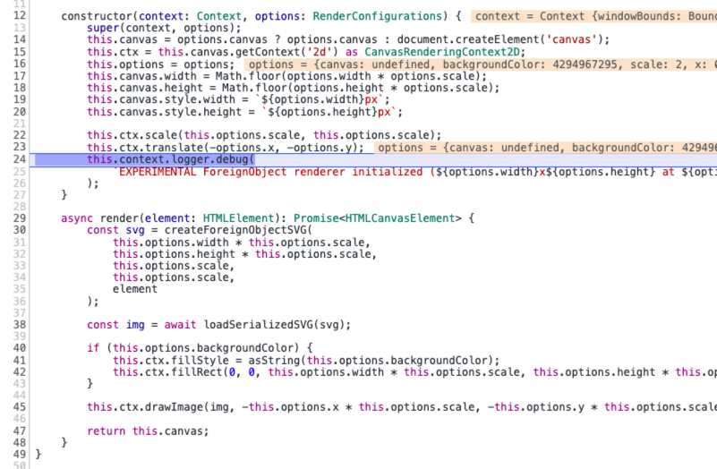

通过 ForeignObjectRenderer 实例化一个 renderer 渲染器实例，在 ForeignObjectRenderer 构造方法中初始化 `this.canvas` 对象及其上下文 `this.ctx`

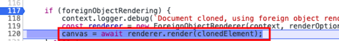

调用 render 生成 canvas，进入到 render 方法：

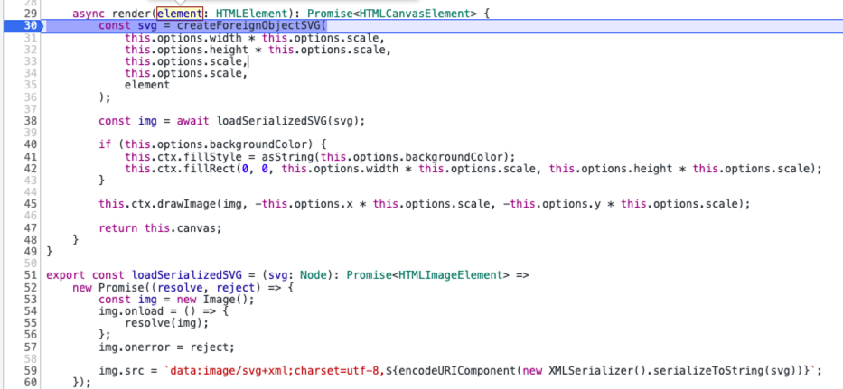

render 方法执行很简单，首先通过 createForeignObjectSVG 将 DOM 内容包装到`<foreignObject>`中生成 svg:

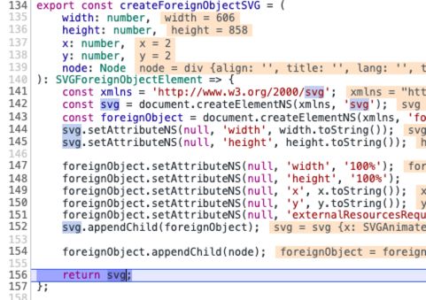

生成的 svg 如下所示：

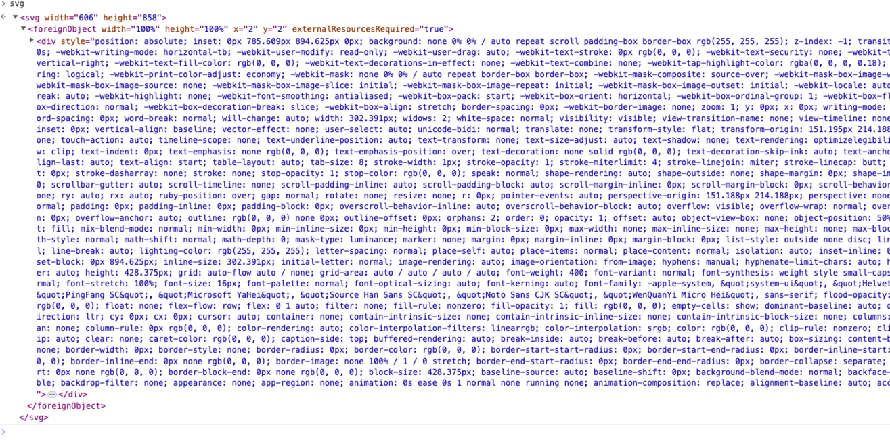

接着通过。loadSerializedSVG 将上面的 SVG 序列化成 img 的 src（SVG 直接内联），调用`this.ctx.drawImage(img, ...);` 将图片绘制到 `this.canvas` 上，返回生成好的 canvas 即可。

```js
document.body.appendChild(canvas)
```

接着点击下一步，直到回到最开始的断点处，将生成好的 canvas 挂在到 DOM 上，如下：

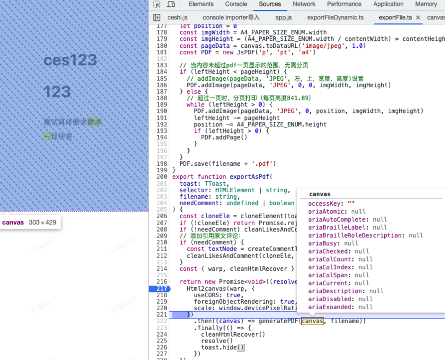

这就解决了？？？收工 🤝

NoNoNo，**为什么使用纯 canvas 绘制就有问题呢？** 作为 bug 终结者，问题必须找出来，干就完了 👊。

> 使用 foreignObject 渲染还有其他问题，后面再说。

#### foreignObject 绘制 canvas 的流程

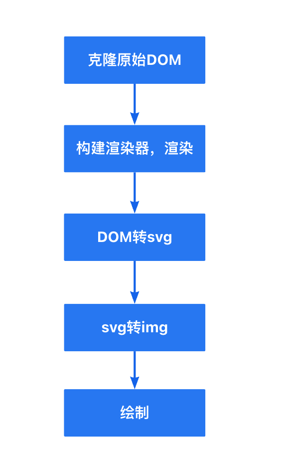

1. 首先克隆原始 DOM，并将所有样式都转为行内样式，避免修改到页面；
2. 构建 ForeignObjectRenderer 渲染器实例，调用 renderer 方法；
3. 将 DOM 内容通过 createForeignObjectSVG 转为 svg 元素；
4. 通过 loadSerializedSVG 将上面的 svg 序列化成 img 的 src；
5. 通过 drawImage 绘制图片到 canvas 上。

#### 使用纯 canvas 绘制

要想使用 canvas 绘制，那么就需要将 DOM 树转换为 canvas 可以使用的数据类型，html2canvas 使用 parseTree 方法来实现转换，我们来看下它的执行过程。

直接在调用 parseTree 方法处打断点，进入到 parseTree 方法内：

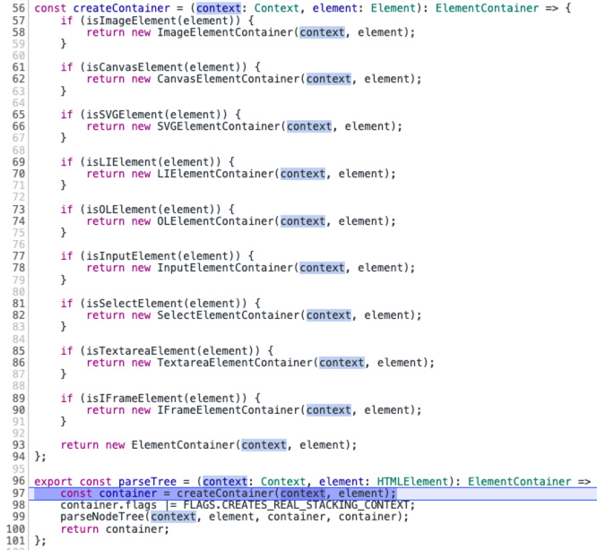

parseTree 的作用是将克隆 DOM 转换为 ElementContainer 树。

首先将根节点转换为 ElementContainer 对象，接着再调用 parseNodeTree 遍历根节点下的每一个节点，转换为 ElementContainer 对象。

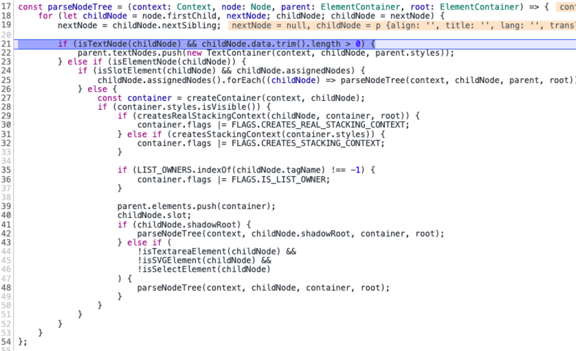

ElementContainer 对象主要包含 DOM 元素的信息：

```ts
type TextContainer = {
  // 文本内容
  text: string;
  // 位置和大小信息
  textBounds: TextBounds[];
}

export class ElementContainer {
  // 样式数据
  readonly styles: CSSParsedDeclaration;
  // 当前节点下的文本节点
  readonly textNodes: TextContainer[] = [];
  //  除文本节点外的子元素
  readonly elements: ElementContainer[] = [];
  // 位置大小信息（宽/高、横/纵坐标）
  bounds: Bounds;
  // 标志位，用来决定如何渲染的标志
  flags = 0;
  ...
}
```

ElementContainer 对象是一颗树状结构，层层递归，每个节点都包含以上字段，形成一颗 ElementContainer 树，如下：
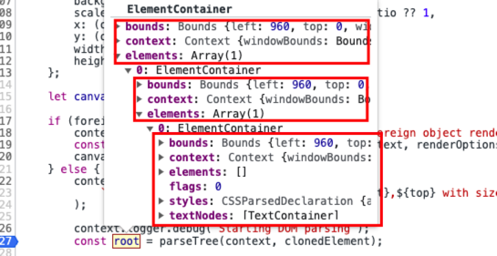

继续下一步 👇

通过 CanvasRenderer 创建一个渲染器 renderer，创建 `this.canvas`和`this.ctx`上下文对象与 ForeignObjectRenderer 类似

得到渲染器后，调用 render 方法将 parseTree 生成的 ElementContainer 树渲染成 canvas，在这里就与 ForeignObjectRenderer 的 render 方法产生差别了。

canvas 在绘制节点时需要先**计算出整个目标节点里子节点渲染时所展现的不同层级**，因为 Canvas 绘图需要根据样式计算哪些元素应该绘制在上层，哪些在下层。元素在浏览器中渲染时，根据 W3C 的标准，所有的节点层级布局，需要**遵循层叠上下文和层叠顺序的标准**。所以会先调用 parseStackingContexts 方法将 parseTree 生成的 ElementContainer 树转为层叠上下文。

##### 什么是层叠上下文

概念不懂就看 MDN：[层叠上下文](https://developer.mozilla.org/zh-CN/docs/Web/CSS/CSS_positioned_layout/Understanding_z-index/Stacking_context)

首先我们都知道 CSS 是流式布局，也就是在没有浮动（float）和定位（position）的影响下，是不会发生重叠的，从上到下、由外到内按照 DOM 树去布局。

而浮动和定位的元素会脱离文档流，形成一个层叠上下文，所以如果想正常渲染，就需要得到它们的层叠信息。

可以想象一下：在我们的视线与网页之间有一条看不见的 z 轴，层叠上下文就是一块块薄层，而这些薄层中有很多 DOM 元素，这些薄层根据层叠信息在这个 z 轴上排列，最终形成了我们看到的多彩的页面。

画个图好像更形象些：

> 白色为正常元素，黄色为 float 元素，蓝色为 position 元素

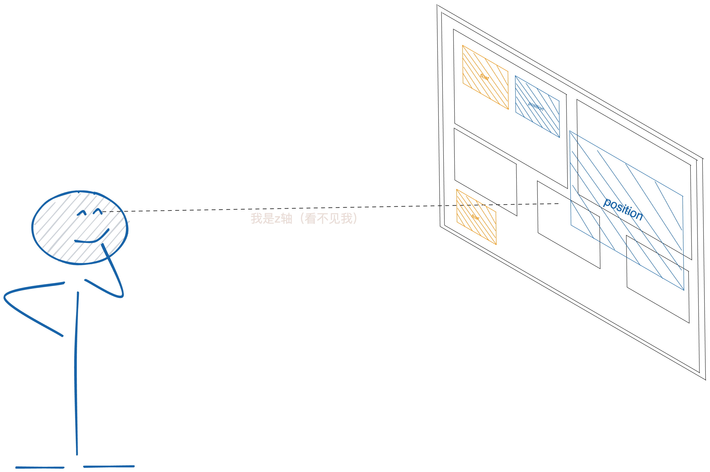

更多详细资料请阅读：[深入理解 CSS 中的层叠上下文和层叠顺序](https://www.zhangxinxu.com/wordpress/2016/01/understand-css-stacking-context-order-z-index/)

ElementContainer 树中的每一个 ElementContainer 节点都会产生一个 ElementPaint 对象，最终生成层叠上下文的 StackingContext 如下：

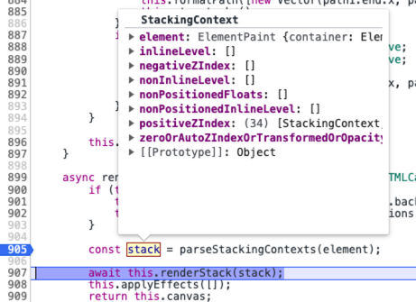

数据结构如下：

```ts
// ElementPaint 数据结构如下
ElementPaint: {
  // 当前元素的container
  container: ElementContainer
  // 当前元素的border信息
  curves: BoundCurves
}

// StackingContext 数据结构如下
{
  element: ElementPaint;
  // z-index为负的元素行测会给你的层叠上下文
  negativeZIndex: StackingContext[];
  // z-index为零或auto、transform或者opacity元素形成的层叠上下文
  zeroOrAutoZIndexOrTransformedOrOpacity: StackingContext[];
  // 定位或z-index大于等于1的元素形成的层叠上下文
  positiveZIndex: StackingContext[];
  // 非定位的浮动元素形成的层叠上下文
  nonPositionedFloats: StackingContext[];
  // 内联的非定位元素形成的层叠上下文
  nonPositionedInlineLevel: StackingContext[];
  // 内联元素
  inlineLevel: ElementPaint[];
  // 非内联元素
  nonInlineLevel: ElementPaint[];
}
```

渲染层叠内容时会根据 StackingContext 来决定渲染的顺序。

继续下一步，调用 renderStack 方法，renderStack 执行 renderStackContent 方法，我们直接进入 renderStackContent 内：

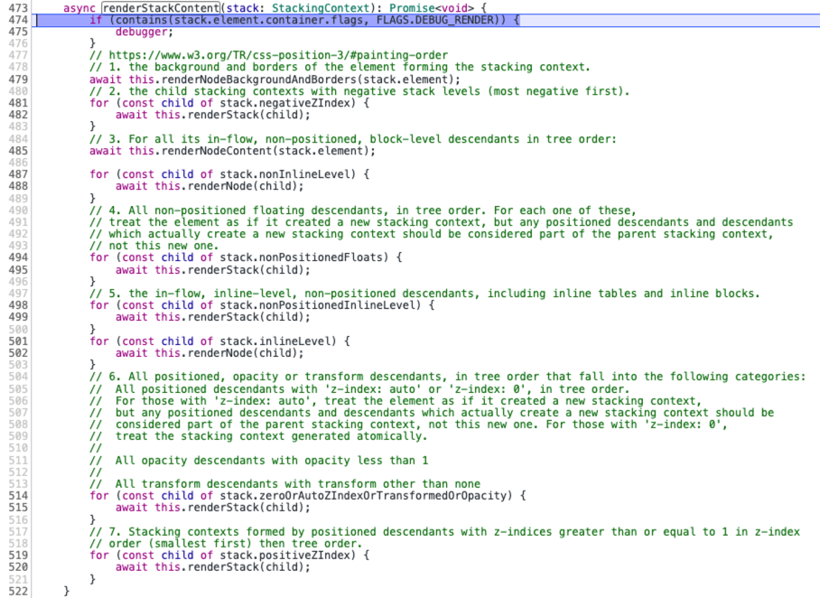

canvas 绘制时遵循 w3c 规定的渲染规则 [painting-order](https://www.w3.org/TR/css-position-3/#painting-order)，renderStackContent 是对此规则的一个代码实现，步骤如下：

此处的步骤 1-7 对应上图代码中的 1-7:

1. 渲染当前层叠上下文的元素的背景和边框；
2. 渲染具有负 z-index 级别的子层叠上下文（最负的第一个）；
3. 对于流式布局、非定位的子元素调用 renderNodeContent 和 renderNode 进行渲染：
4. 渲染所有未定位的浮动子元素，对于其中每一个，将该元素视为创建了一个新的堆栈上下文；
5. 渲染正常流式布局、内联元素、非定位的子元素；
6. 渲染 z-index 为 0 或 auto，或者 transform、opacity 等属性的子元素；
7. 渲染由 z-index 大于或等于 1 的子元素形成的层叠上下文，按 z-index 顺序（最小的在前）。

可以看到遍历时会对形成层叠上下文的子元素递归调用 renderStack，最终达到对整个层叠上下文树进行递归的目的：

而对于未形成层叠上下文的子元素，就直接调用 renderNode 或 renderNodeContent 这两个方法，两者对比，**renderNode 多了一层渲染节点的边框和背景色的方法**（renderNode 函数内部调用 renderNodeBackgroundAndBorders 和 renderNodeContent 方法）。

renderNodeContent 用于渲染一个元素节点里面的内容，分为八种类型：纯文本、图片、canvas、svg、iframe、checkbox 和 radio、input、li 和 ol。

除了 iframe 的绘制比较特殊：重新生成渲染器实例，调用 render 方法重新绘制，其他的绘制都是调用 canvas 的一些 API 来实现，比如绘制文字主要用 fillText 方法、绘制图片、canvas、svg 都是调用 drawImage 方法进行绘制。

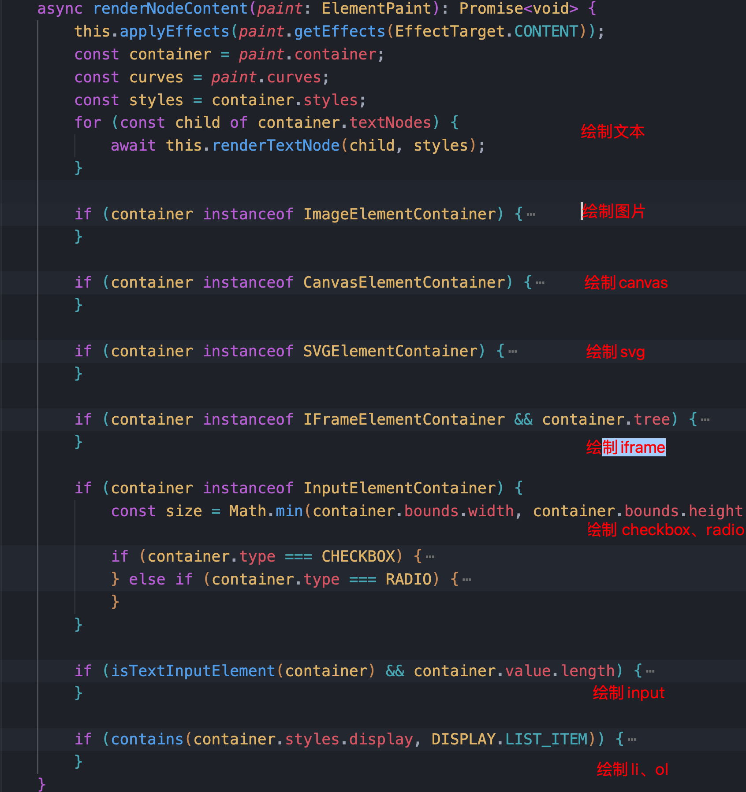

[所有可能用到的 API](https://developer.mozilla.org/zh-CN/docs/Web/API/CanvasRenderingContext2D)

最终绘制到 `this.canvas` 上返回，至此，html2canvas 的调试就结束了。 🎉🎉🎉

#### 纯 canvas 绘制流程

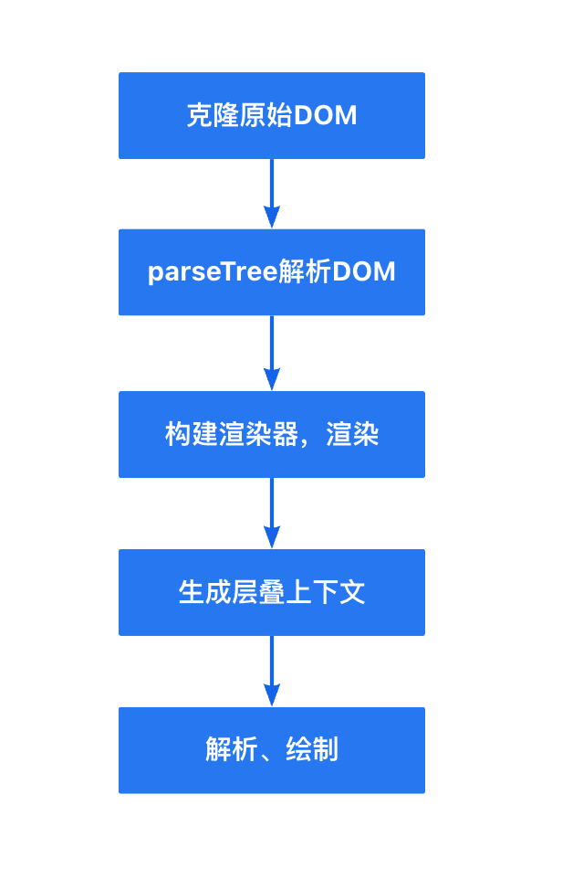

1. 首先克隆原始 DOM，避免修改到页面
2. 使用 parseTree 递归遍历 html，生成 ElementContainer 树（与原始 DOM 层级结构类似）
3. 构建 CanvasRenderer 渲染器实例，调用 renderer 方法
4. 遍历上一步生成的 ElementContainer，根据层叠规则生成层叠上下文 StackingContext（与原始 DOM 层级结构区别较大）
5. 遍历层叠上下文，递归地对层叠上下文各层中的节点和子层叠上下文进行解析并按顺序绘制在 Canvas 上，针对要绘制的每个节点，主要有以下两个过程：
6. 创建画布，根据上一步生成的层叠对象递归渲染，最终绘制到画布 canvas 上

## 针对此 Bug 分析

ok，当调试了一遍 html2canvas 的流程之后，再回到我们的问题上，很显然就是 canvas 渲染的时候的问题，也就是 renderNodeContent 方法，那我们直接在这里打个断点进行调试（为了方便我只输入一行文字进行调试），只有当是文本节点时会进入到此断点，等到 mark 标签中对应的元素进入断点时，查看：

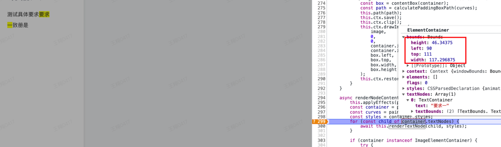

可以看到此时 width 和 height 已经是父节点的宽高，果真如此 😱。

## 解决方案

既然已经知道了问题所在，那么我们开始解决问题，有以下两种解决方案可供参考：

### foreignObjectRendering

在 html2canvas 配置中设置 `foreignObjectRendering` 为 `true`，此问题就可以解决吗？

然而现实并没有这么简单，这样又会出现引出新的问题：导出的图片内容会丢失

这是为什么呢？

通过 W3C 对[SVG 的介绍](https://svgwg.org/specs/integration/#static-image-document-mode)可知：**SVG 不允许连接外部的资源**，比如 HTML 中图片链接、CSS link 方式的资源链接等，在 SVG 中都会有限制。

解决方法：需要将图片资源转为 base64，然后再去生成截图，foreighnObject 这种方法更适合截取内容为文字内容居多的场景。

### 对包含背景色的内联标签截断处理

在对内联元素进行截断前，**如何确定 p 标签中的 mark 标签有没有换行？** 因为我们没必要对所有内联标签做处理。

如果 mark 标签的高度超过 p 标签的一半时，就说明已经换行了，然后将 `<mark>要求一</mark>` 替换为 `<mark>要</mark><mark>求</mark><mark>一</mark>` 即可，代码如下：

```ts
const handleMarkTag = (ele: HTMLElement) => {
  const markElements = ele.querySelectorAll('mark')
  for (let sel of markElements) {
    const { height } = sel.getBoundingClientRect()
    let parentElement = sel.parentElement
    while (parentElement?.tagName !== 'P') {
      parentElement = parentElement?.parentElement!
    }
    const { height: parentHeight } = (
      parentElement as unknown as HTMLElement
    ).getBoundingClientRect()
    // mark的高度没有超过p标签的一半时 则没有换行
    if (height < parentHeight / 2) continue
    // 超过一半时说明换行了
    const innerText = sel.innerText
    const outHtml = sel.outerHTML
    let newHtml = ''
    innerText.split('')?.forEach((text) => {
      newHtml += outHtml.replace(innerText, text)
    })
    sel.outerHTML = newHtml
  }
}
```

ok，再次尝试一下，完美解决，这下可以收工了。

## 总结

通过对一个 bug 的分析，尝试调试了一遍 html2canvas 的代码，弄懂了浏览器截图的原理及 html2canvas 的核心流程，并从中学到了几点新知识：

1. svg xmnls 作用以及渲染 HTML 内容的 foreignObject 标签；
2. CSS 层叠上下文的概念；；
3. 使用 foreignObject 实现快速截图的方法；
4. canvas 绘图的一些方法。。。

发现 canvas 真是一个有趣的东西，什么都能画，像我现在用于画图的工具[excalidraw](https://excalidraw.com/)、图表库[g6](https://g6.antv.antgroup.com/)、[g2](https://g2.antv.antgroup.com/)、[echarts](https://echarts.apache.org/zh/index.html)都是用的 canvas 搞的，看来得抽时间学习一下 canvas，不要等到“书到用时方恨少“。
