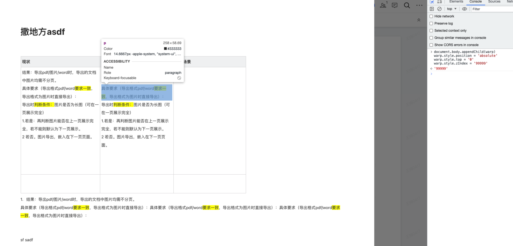

## bug 行内元素设置背景换行

检查一下它的 DOM 结构，发现是下面这样，那应该就是这个原因导致的。


为了再次验证，我们来看一看源码是怎么

首先在控制台输入以下代码，可以看到此时样式还是正常的，那肯定是 html2canvas 时出了什么问题，我们继续往下看。

```js
document.body.appendChild(warp)
warp.style.position = 'absolute'
warp.style.top = '0'
warp.style.zIndex = '99999'
```



断点跳到 canvas 生成后，在页面再次查看 canvas


出问题了，那就是 `Html2canvas` 方法造成的问题，为了彻底搞明白渲染的问题，我们先对 html2canvas 的实现原理进行剖析。

## Html2canvas 执行原理

我们在 html2canvas 执行的地方打个端点，开始调试代码：


进入 html2canvas 内容，可以看到内部执行的是 renderElement 方法


我们进入到 renderElement 方法内部，看下它的执行流程

```js
const renderElement = async (
  element: HTMLElement,
  opts: Partial<Options>
): Promise<HTMLCanvasElement> => {
  // 1. 判断传入节点是否有效
  // 2. 将用户传入的 options 与默认的 options 合并
  // 3. 克隆传入节点装载到iframe中
  // 4. 绘制canvas
}
```

### 判断传入节点是否有效


- `Node.ownerDocument`：只读属性，返回当前节点的顶层的 document 对象；
- `document.defaultView`：属性返回当前 document 对象所关联的 window 对象，如果没有，会返回 null。

这里主要判断传入节点是否有效，快速跳过。

### 将用户传入的 options 与默认的 options 合并


构建配置项，将传入的 `opts` 与默认配置合并，同时初始化一个 `context` 对象：


#### 缓存对象 cache

其中 `cache` 为缓存对象，主要是**避免资源重复加载**的问题。

如果遇到图片链接为 `blob`，在加载完成后，会添加到缓存 `_cache` 中：


下次使用直接通过 `this._cache[src]` 从缓存中获取，不用再发送请求：

同时，`cache` 中**控制图片的加载和处理**，包括使用 `proxy` 代理和使用 `cors` 跨域资源共享这两种情况资源的处理。

继续往下执行

### 使用 DocumentCloner 克隆原始 DOM


通过将上一步生成的 `context` 以及传入节点 `element` 和克隆节点配置 `cloneOptions` 传入 `DocumentCloner` 类中，实例化一个 `documentCloner`，再通过 `documentCloner.clonedReferenceElement` 拿到克隆后的目标节点。

继续执行下一步，调用 `documentCloner.toIFrame` 将克隆节点绘制到 iframe 中渲染，此时在 DOM 中就会出现 class 为 html2canvas-toIFrame 的 iframe 节点，通过 `window.getComputedStyle` 就可以拿到要克隆的目标节点上所有的样式了。


### 绘制 canvas

前面几步很简单，主要是对传入的 DOM 元素进行解析，获取目标节点的样式和内容，想要将它渲染为 canvas，html2canvas 提供了两种绘制 canvas 的方式：

1. 使用 foreignObject 方式绘制 canvas
2. 使用纯 canvas 绘制

我们继续执行，当代码执行到这里时判断是否使用 foreignObject 的方式生成 canvas：


#### 使用 [foreignObject](https://developer.mozilla.org/zh-CN/docs/Web/SVG/Element/foreignObject) 方式绘制 canvas

首先了解下 foreignObject 是什么？

通过拜读张鑫旭大佬对于 [svg-foreignobject](https://www.zhangxinxu.com/wordpress/2017/08/svg-foreignobject/) 的介绍，对 svg 有了新的认知：

1. `xmlns` 全称是“XML Namespaces”，即 XML 命名空间，正是它的存在，在浏览器中 svg 才能正常渲染（下面这段代码是在 iconfont 上随便复制的一个 icon svg 代码）；

   ```xml
    <svg t="1692613183565" class="icon" viewBox="0 0 1024 1024" version="1.1" xmlns="http://www.w3.org/2000/svg" p-id="20058" width="200" height="200">
   <path d="M548.571429 292.571429v182.784L731.428571 475.428571v73.142858l-182.857142-0.073143V731.428571h-73.142858V548.498286L292.571429 548.571429v-73.142858l182.857142-0.073142V292.571429h73.142858z" fill="#626B7D" p-id="20059"></path>
   </svg>
   ```

2. `<foreignObject>` 元素允许包含来自不同的 XML 命名空间的元素，换句话说借助 `<foreignObject>` 标签，我们可以直接将 DOM 节点作为 foreignObject 插入 SVG 节点中进行渲染，如下：

   ```xml
   <svg xmlns="http://www.w3.org/2000/svg">
    <foreignObject width="120" height="50">
        <body xmlns="http://www.w3.org/1999/xhtml">
          <p>文字。</p>
        </body>
      </foreignObject>
   </svg>
   ```

   可以看到 `<foreignObject>` 标签里面有一个设置了 `xmlns="http://www.w3.org/1999/xhtml"` 命名空间的 `<body>` 标签，此时 `<body>` 标签及其子标签都会按照 XHTML 标准渲染，实现了 SVG 和 XHTML 的混合使用。

   这样只需要指定对应的命名空间，就可以把它嵌套到 foreignObject 中，然后结合 SVG，直接渲染。

   对于不同的命名空间，浏览器解析的方式也不一样，所以在 SVG 中嵌套 HTML，解析 SVG 的时候遇到 `http://www.w3.org/2000/svg` 转化 SVG 的解析方式，当遇到了 `http://www.w3.org/1999/xhtml` 就使用 HTML 的解析方式。

   这是为什么 SVG 中可以嵌套 HTML，并且浏览器能够正常渲染。

3. 已经支持除了 IE 外的主流浏览器

   

弄懂 foreignObject 后，我们尝试将 `foreignObjectRendering` 设置为 `true`，看看它是如何生成 canvas 的：

```js
Html2canvas(warp, {
  useCORS: true,
  foreignObjectRendering: true,
})
```

在此处打个断点：


进入 `ForeignObjectRenderer` 类中


通过 `ForeignObjectRenderer` 得到一个 `renderer` 渲染器实例，在 `ForeignObjectRenderer` 构造方法中初始化 `this.canvas` 对象及其上下文 `this.ctx`

继续下一步


调用 `renderer.render(clonedElement)` 生成 canvas

进入到 render 方法


render 方法执行很简单，首先通过 createForeignObjectSVG 将 DOM 内容包装到`<foreignObject>`中生成 svg:


生成的 svg 如下所示：


接着通过。loadSerializedSVG 将上面的 SVG 序列化成 img 的 src（SVG 直接内联），调用`this.ctx.drawImage(img, ...);` 将图片绘制到 `this.canvas` 上，返回生成好的 canvas 即可。

接着点击下一步，知道回到最开始的断点处，将生成好的 canvas 挂在到 DOM 上：

```js
document.body.appendChild(canvas)
```


我去，竟然正常了，换行的背景正常展示了，本来到这里就应该结束。

可是...

**为什么使用纯 canvas 绘制就有问题呢？** 我的好奇心驱使我继续，问题必须找出来，干就完了 👊。

> 而且使用 foreignObject 渲染还有其他问题，后面再说。

#### 使用纯 canvas 绘制

首先需要将 DOM 树转换为为 canvas 可以使用的数据类型，也就是 `parseTree` 这个方法。

我们直接在调用 parseTree 方法处打断点，parseTree 接收 `context` 和 克隆的 DOM 节点，进入到 parseTree 方法内：


parseTree 首先将根节点转换为 ElementContainer 对象，接着在 parseNodeTree 中遍历根节点下的每一个节点，将其转换为 ElementContainer 对象。


最终将 DOM 节点转换为一个 ElementContainer 树，该对象主要包含 DOM 元素的信息：

- bounds - 位置信息（宽/高、横/纵坐标）
- styles - 样式数据
- textNodes - 文本节点数据
- elements - 子元素信息
- flags - 标志位，用来决定如何渲染的标志

ElementContainer 对象是一颗树状结构，层层递归，每个节点都包含以上字段：


通过 parseTree 把目标 DOM 节点转换为 ElementContainer 树之后，就需要结合 Canvas 调用渲染方法了。

首先通过 `CanvasRenderer` 创建一个渲染器 `renderer`，创建 `this.canvas`和`this.ctx`对象与 `ForeignObjectRenderer` 类似

得到渲染器后，调用 render 方法生成 canvas，在这里就与 `ForeignObjectRenderer` 的 render 方法产生差别了:

首先调用 parseStackingContexts 方法将 parseTree 生成的 ElementContainer 树来生成层叠上下文，树中的每一个 ElementContainer 节点都会产生一个 ElementPaint 对象，这个对象将会被直接作为第三阶段绘制该节点的依据。

<!--  -->


## 总结过程

1. 解析原始 DOM 为 ElementContainer（与原始 DOM 层级结构类似）
2. 解析 ElementContainer 为一组树状的层叠上下文（stackingContext，与原始 DOM 层级结构区别较大）
3. 从最上层的层叠上下文开始，递归地对层叠上下文各层中的节点和子层叠上下文进行解析并按顺序绘制在 Canvas 上，针对要绘制的每个节点，主要有以下两个过程：
   - 解析节点的”效果“（变换、剪切、透明度）并应用于 Canvas 上
   - 在 Canvas 上绘制

## 解决方案

### foreignObject 弊端

本来想着这样就算解决完了，但是又出现了新问题：图片不展示了 🐎

这是为什么呢？

通过 W3C 对[SVG 的介绍](https://svgwg.org/specs/integration/#static-image-document-mode)可知：**SVG 不允许连接外部的资源**，比如 HTML 中图片链接、CSS link 方式的资源链接等，在 SVG 中都会有限制；

SVG 的位置大小和 foreignObject 标签的位置大小不能够确定，需要计算。

#### 解决方案

在 HTML 文档中存在 img 图片标签的链接为外部资源，需要处理为 base64 资源，通过 loadAndInlineIages 函数进行处理，以下是 loadAndInlineIages 函数。

而这个在 html2canvas 中是没有进行处理的，需要我们自己进行处理。

### 标签截断

既然已经知道了问题所在，那么我们开始解决问题。

首先，**怎么确定 `<p>` 标签中的 `<mark>` 标签有没有换行？**

```ts
const handleMarkTag = (ele: HTMLElement) => {
  const markElements = ele.querySelectorAll('mark')
  for (let sel of markElements) {
    const { height } = sel.getBoundingClientRect()
    let parentElement = sel.parentElement
    while (parentElement?.tagName !== 'P') {
      parentElement = parentElement?.parentElement!
    }
    const { height: parentHeight } = (
      parentElement as unknown as HTMLElement
    ).getBoundingClientRect()
    // mark的高度没有超过p标签的一半时 则没有换行
    if (height < parentHeight / 2) continue
    // 超过一半时说明换行了 将<mark>测试文案</mark>替换为<mark>测</mark><mark>试</mark><mark>文</mark><mark>案</mark>
    const innerText = sel.innerText
    const outHtml = sel.outerHTML
    let newHtml = ''
    innerText.split('')?.forEach((text) => {
      newHtml += outHtml.replace(innerText, text)
    })
    sel.outerHTML = newHtml
  }
}
```

## 新问题

### 远程 css 加载

fetch

结果为[ReadableStream](https://developer.mozilla.org/zh-CN/docs/Web/API/ReadableStream)

### pdf 导出画面不清晰

html2canvas 的 scale 是用于控制渲染的比例，默认为浏览器的设备像素比即 window.devicePixelRatio。
如果觉得模糊，增加一倍即可，同时导出的文件大小也会同步增加

window.devicePixelRatio \* 2 解决
通过设置 html2canvas 的 scale 参数， 对 canvas 进行等比放大，可以使 canvas 生成的图片更清晰，但是放大越大生成的文件也就越大，默认像素比\*2，基本满足需求。

大致原理： 使用扩大 Canvas 画布宽高并缩放绘制内容的方式来提高图像清晰度。

具体来说，如果将 Canvas 画布宽高扩大两倍，再将绘制的图像通过 scale() 方法在水平和垂直方向同时缩小一半（context.scale(0.5, 0.5)），最终呈现的图像占用的像素相比原来没有变化，但是细节更加清晰，像素点更加紧密。

这种方式能够提高清晰度的原因是，当将 Canvas 宽高扩大时，每个像素点的密度也会相应增加，细节更加清晰。而 scale() 方法的缩小是在突出像素的细节的同时，对整个图像进行压缩，使得图像占用的像素数不变，从而在原有像素上为图像提高了清晰度。不过需要注意，如果扩大倍数过高，图像可能会出现失真等问题，这时需要调整扩大倍数和缩放比例来达到最佳效果。

## 总结

1. html 内容导出图片的流程
2. svg xmnls 的作用
3. 