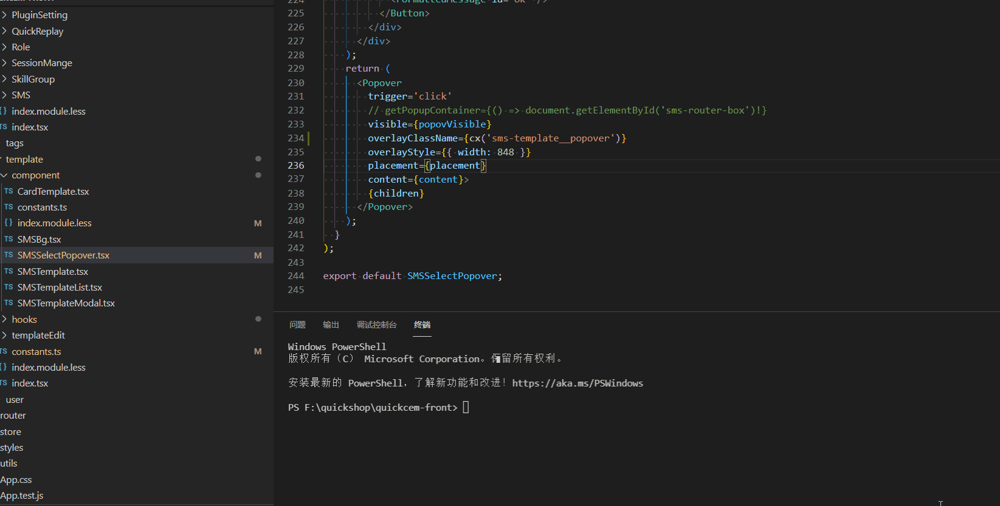

  
### 改造原因

由于目前有四种语言需要翻译--英语、韩语、日语和中文，每种都需要 copy 文件，打开 google 翻译，翻译三种语言再粘贴，不仅浪费大量时间，而且很有可能看叉行，导致翻译有问题。

### 当前国家化方案特点

1. 文件统一在 `src/locales/xx` 下，每个翻译文档名称对应，便于查找
2. 统一为`key: value`格式，一般是直接 copy 中文文档，再修改
3. 默认导出所有，并在每种语言文档中都存在`xx/index.ts`文件用于导出当前目录下所有的 ts 文件

   ```ts
   const files = (require as any).context('./', true, /\.ts$/); //批量读取模块文件

   const modules = files.keys().reduce((modules, path) => {
     const module = files(path);
     // 获取当前路径下的ts文件和当前路径下文件夹中的index.ts
     const canUsedModule = path.split('/').length < 4 ? module.default : {};
     return { ...modules, ...canUsedModule };
   }, {});

   export default modules;
   ```

4. 在对应的组件中使用`<FormattedMessage id='xxx'/>`或`intl.formatMessage({ id: xxx })`完成国际化

## 自动化脚本应该完成的功能

1. 根据传入读取对应目录下的文件
2. 将文件中的国际化相关的内容过滤出来
3. 使用[百度 API](https://fanyi-api.baidu.com/api/trans/product/desktop)翻译
4. 输出到 src/locales 对应目录下

### 读取文件

1. 首先将 node 脚本添加到 scripts 脚本中

   ```json
   "scripts": {
     ...
     "gene-i18n": "esno ./scripts/i18n"
   }
   ```

2. 执行脚本并传入第二个参数

   执行脚本`yarn gene-i18n`，并传入对应的文件路径，当前不支持多个文件国际化
   .

3. generateWord 函数提取文案

   - 原来的`intl.formatMessage()` 以这种方式替换 `const { formatMessage: f } = useIntl()`
   - 需要注意在`<FormattedMessage` 和 `f({` 必须传入 defaultMessage 属性作为中文的翻译，而且在代码中很容易查找

4. generateFile 生成文件

   - 截取输入文件路径部分作为新文件名称
   - 中文文案直接输出，其余文案使用百度翻译再输出，[参考文档](https://juejin.cn/post/6906787897811501063)
   - 生成文件统一在`xx/messages/`目录下
  
## 代码地址

[github](https://github.com/wang1xiang/gene-i18n)

## TODO

1. placeholder格式的暂不支持直接读取，需要直接写好格式

   ```ts
   f(
      {
        id: 'sms.tempalte.modal.phone',
        defaultMessage: '字符数{count}/500，预计{size}条收费',
      },
      { count, size }
    )
   ```

2. 不支持多个文件或目录生成
3. webpack-loader或npm插件
