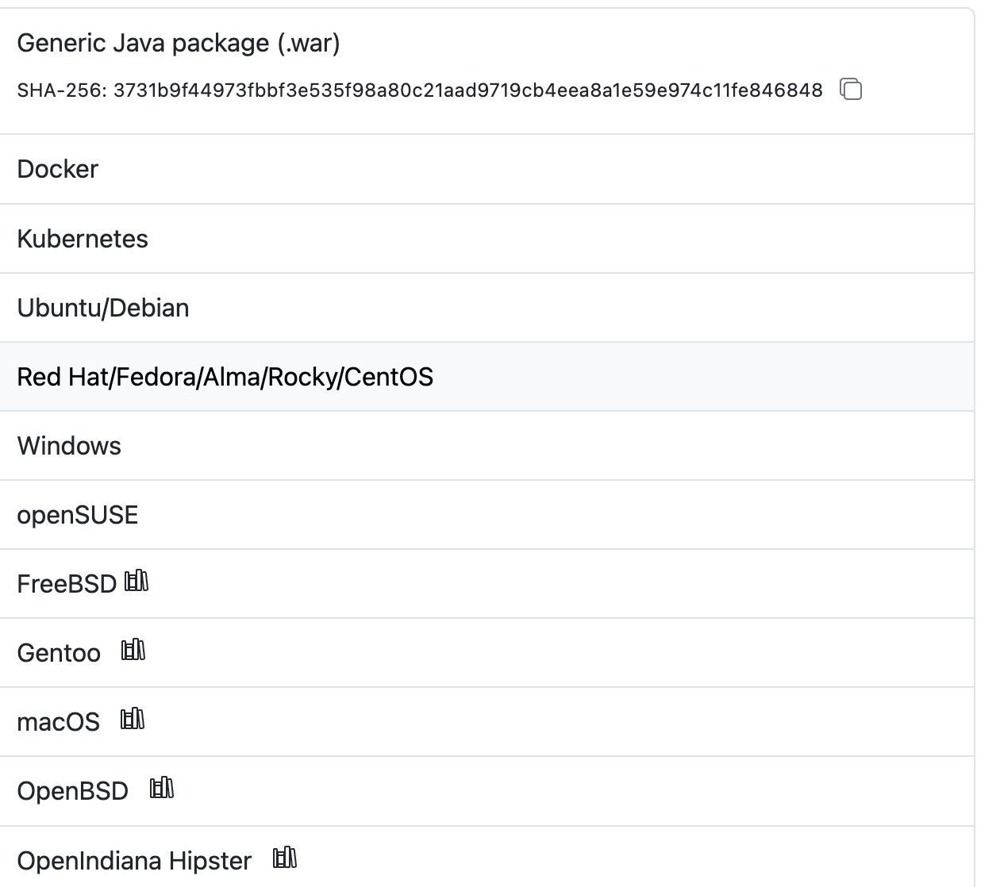

## 前言

没有运维

没有钱后端分离，就是打包将项目丢到 tomcat 的 WEBAPP 下

接着公司招了运维（但只负责管理服务器资源，不管各种项目打包之类的），也开始前后端分离，前端管自己的打包，就是将自己打包的 dist 文件丢到服务器 tomcat 的 WEBAPP 下

看一下流程：本地合并代码 --> 本地打包 --> 上传服务器

上传服务器可以分为这几个小步骤：打开 xshell --> 连接服务器 --> 进入 tomcat 目录 --> 通过 ftp 上传本地文件

为了简化，于是写了一个 node 脚本，通过`ssh2-sftp-client`将`上传服务器`这一步骤脚本化

最后只要通过执行`yarn upload`即可实现打包并上传

不过用了没多久后，运维同事部署了 jenkins 代替了我们手动打包的过程，只要我们点击部署就可以了，当时就感觉 jenkins 挺方便的，但又觉得和前端没多大关系，也就没学习。

不过也挺`烦` jenkins 的，为啥呢？

> 当时和测试说的最多的就是“我在我这试试.....我这没问题啊，你刷新一下”，趁这个时候，赶紧打包重新部署下，不过慢慢的被眼尖的测试同事发现了，找运维把服务器的密码改了，连不上去了 🙄

**为啥现在学呢？**之前公司的 jenkins 都是另一个前端同事负责，于是这个`活`就交给我了

想必有很多人都只是会用 jenkins，而并不了解它，那么接下来就随小弟我一起入门一下吧！

## Jenkins 解决了什么问题

我觉得在了解一个新事物前，应该先了解下它的出现解决了什么问题。

使用 Jenkins，可以实现一键部署发布。

## Jenkins 部署

因为公司的 Jenkins 已经是现成的东西了，想要了解它，就需要自己**动手实践**。

[Jenkins 官网](https://www.jenkins.io/download/)提供了多种安装方式：

[Jenkins 中文帮助文档](https://www.jenkins.io/zh/doc/)
