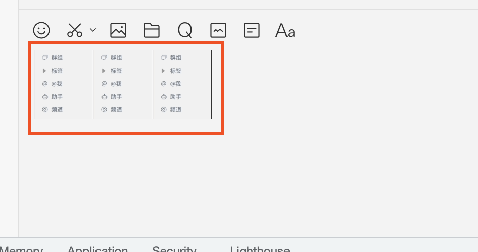
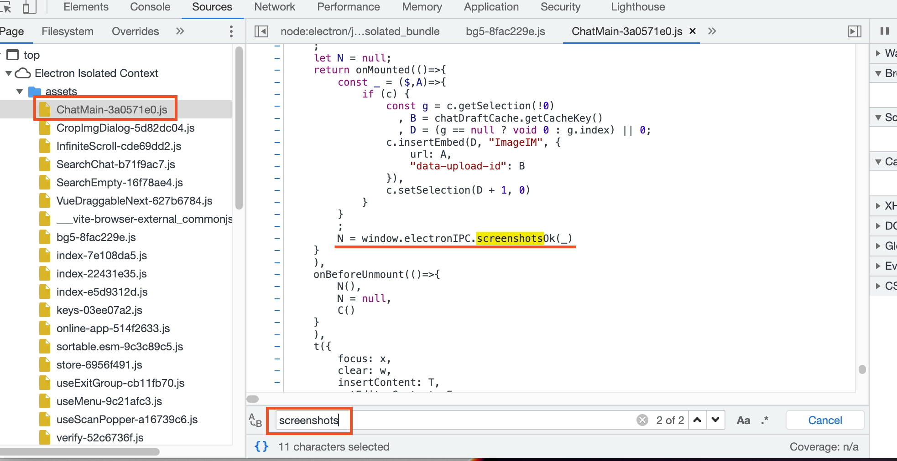
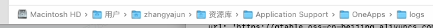
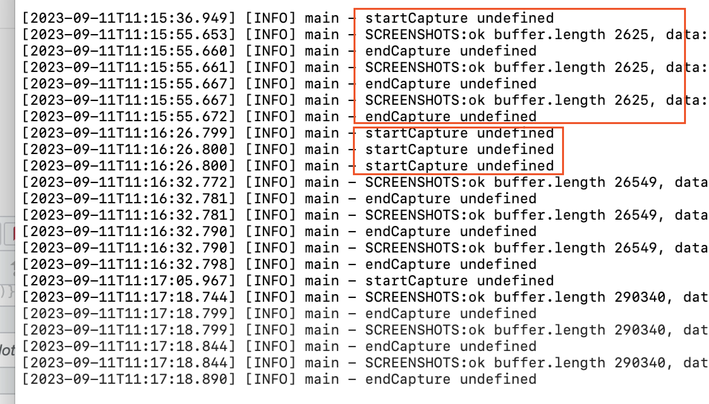
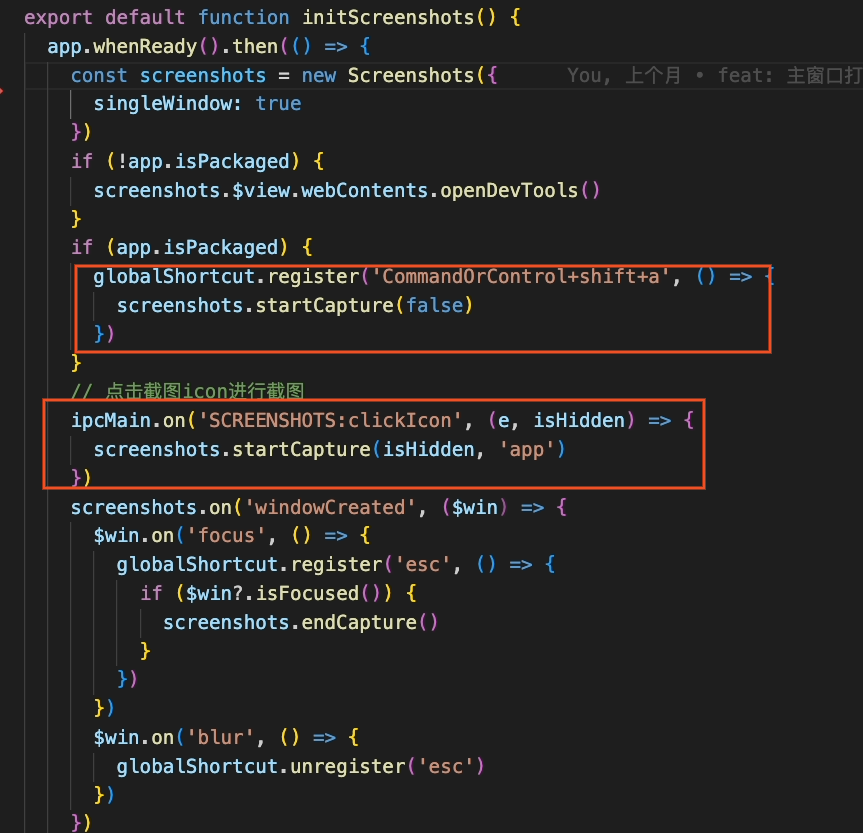
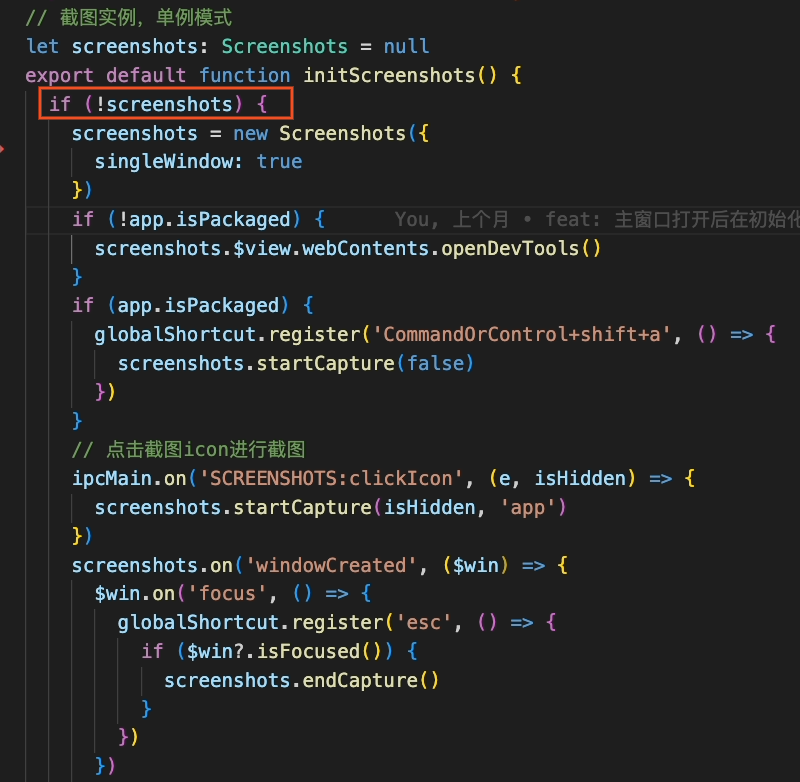
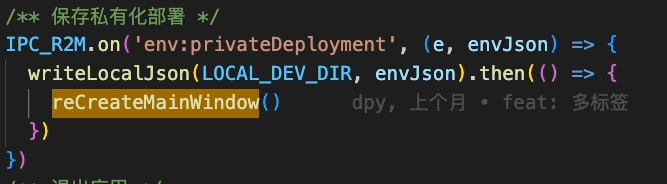

### 现象

如图所示，当用快捷键或小剪刀进行截图时，聊天框内会出现多张相同的截图

### 问题分析

根据现象，分析出现此问题有 2 种可能

- 渲染进程监听了多次截图事件，导致截图事件触发时，多次绘图到页面
- 主进程本身截图有问题，触发了多次截图事件，导致渲染进程绘图多次

### 问题定位

1. 针对第一个问题，找一些关键字，定位到具体文件，具体代码的位置（screenshotsOk 为事件绑定函数，返回值为“N”, 通过执行 N(),可进行解除绑定。在 onMounted 中进行事件绑定，onBeforeUnmount 中进行解除绑定。）

2. 在触发的绘图函数内进行 debug，点击截图，观察函数执行次数。

3. 发现这里只执行一次，可知渲染进程监听的截图事件没有问题，没有监听多次。

4. 考虑主进程是否有问题，因为主进程无法在打包后的程序里 debug，只能通过日志来定位问题

5. 日志位置

   

6. 正常情况下一次截图会打印 startCapture->screenshots:ok->endCapture 3 个 log。如图所示，下面的日志，一次截图会触法 3 次相同的事件

   

7. 根据日志，判断问题出在主进程，寻找主进程相关代码，应该是 initScreenshots 执行了多次，导致该函数中的事件注册了多次。

   

8. 问题找到，决定把该部分代码改成单例模式，避免多次初始化

   

9. 深度思考，之所以这里之前没有使用单例模式，是考虑到这块的代码只会执行一次，并不会多次执行。**经过进一步的定位，发现是体验版和私有云进行切换时，主窗口会关闭，重新创建。主窗口重新创建时，会再次触发 ready-to-show 事件，也就再次触发了 initScreenshots 初始化截图。**

   

10. 切换体验版和私有云后，该 bug 果然复现了，改成单例模式后，该 bug 没有出现，问题解决。

### 总结

1. 根据现象，分析可能出现问题的各种情况，逐一排查

2. 主进程的开发过程中，可以在关键流程进行日志记录，有利于问题的发现。

3. 主窗口并不是只有打开应该时创建一次，在切换私有云和体验版是会再次创建，后续的开发中应该注意
