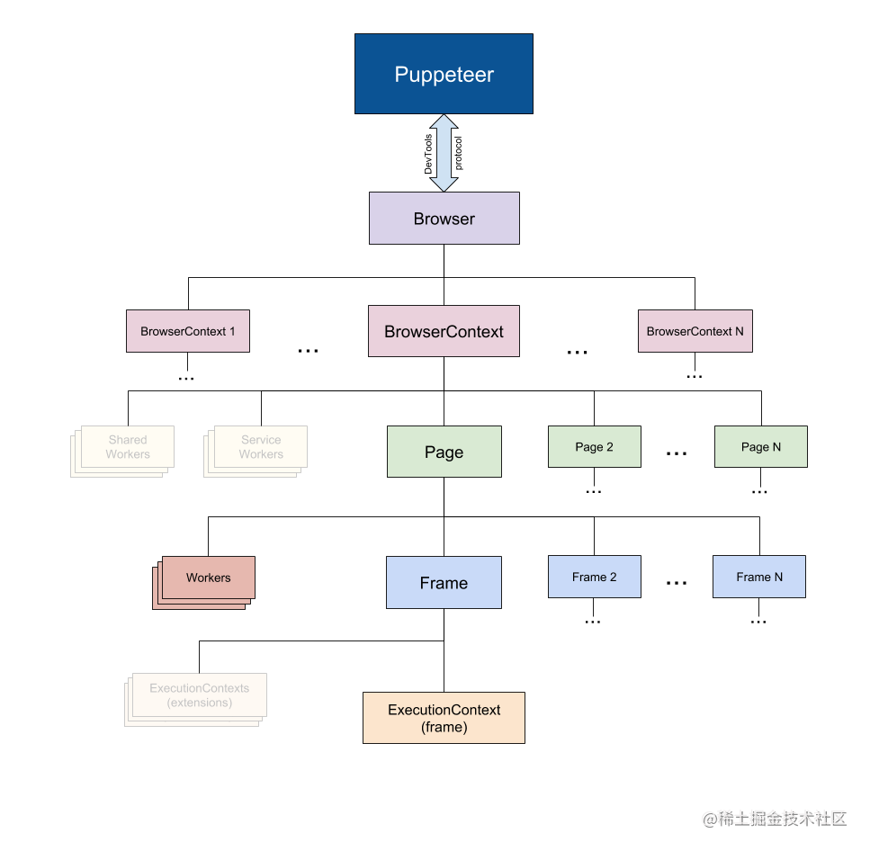
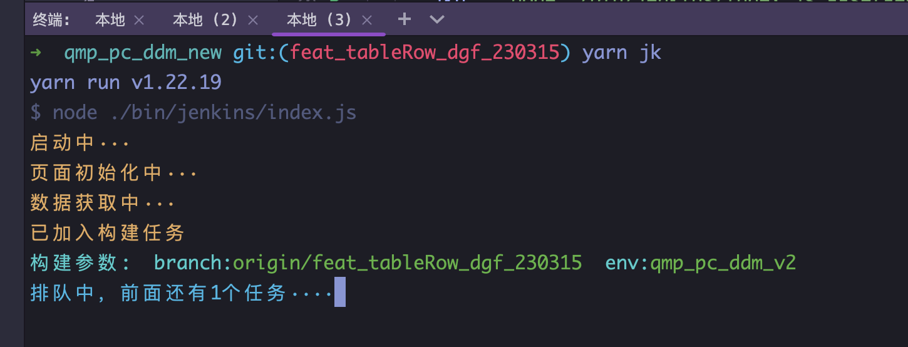
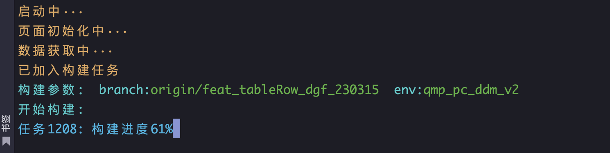
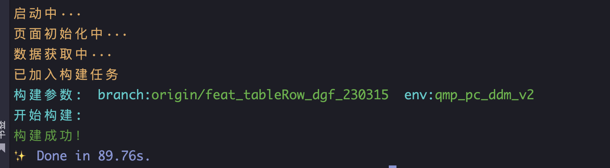

## 是什么

[Puppeteer](https://link.juejin.cn/?target=https%3A%2F%2Fgithub.com%2FGoogleChrome%2Fpuppeteer)是 Google Chrome 团队官方的无界面（Headless）Chrome 工具，也被称为是无头浏览器，它是一个 Node 库，提供了一个高级的 API 来控制 [DevTools 协议上的无头版](https://link.juejin.cn/?target=https%3A%2F%2Fchromedevtools.github.io%2Fdevtools-protocol%2F) Chrome 。也可以配置为使用完整（非无头）的 Chrome。Chrome 在浏览器中的地位不必多说，因此，Chrome Headless 必将成为 web 应用**自动化测试**的行业标杆。使用 Puppeteer，相当于同时具有 Linux 和 Chrome 双端的操作能力，应用场景非常之多，本文最后会基于 puppeteer 写一个 jenkins 控制台部署命令来进行实战演练。

## 能做什么

你可以在浏览器中手动完成的大部分事情都可以使用 Puppeteer 完成！你可以从以下几个示例开始：

创建一个最新的自动化测试环境。使用最新的 JavaScript 和浏览器功能，直接在最新版本的 Chrome 中运行测试。

## 入门示例

想要在项目中使用 Puppeteer，只需要运行如下命令安装即可；不过要注意的是：Puppeteer 至少需要 Node v6.4.0，如要使用 **async / await**，只有 Node v7.6.0 或更高版本才支持；另外，安装 Puppeteer 时，它会下载最新版本的 **Chromium**（〜71Mb Mac，〜90Mb Linux，〜110Mb Win），保证与 API 协同工作。

```bash
yarn add puppeteer
```

对于如何使用 Puppeteer，这非常之容易；如下简易的示例，即实现了：导航到 [https://example.com](https://example.com/) 并将截屏保存为 example.png；

```js
const puppeteer = require('puppeteer')
;(async () => {
  const browser = await puppeteer.launch()
  const page = await browser.newPage()
  await page.goto('https://example.com')
  await page.screenshot({ path: 'example.png' })
  await browser.close()
})()
```

## API 介绍

api 文档地址 [https://pptr.dev/api](https://pptr.dev/api)

### Puppeteer API 分层结构

Puppeteer 中的 API 分层结构基本和浏览器保持一致，下面对常使用到的几个类介绍一下：



- **Browser**： 对应一个浏览器实例，一个 Browser 可以包含多个 BrowserContext

- **BrowserContext**： 对应浏览器一个上下文会话，就像我们打开一个普通的 Chrome 之后又打开一个隐身模式的浏览器一样，BrowserContext 具有独立的 Session(cookie 和 cache 独立不共享)，一个 BrowserContext 可以包含多个 Page

- **Page**：表示一个 Tab 页面，通过 browserContext.newPage()/browser.newPage() 创建，browser.newPage() 创建页面时会使用默认的 BrowserContext，一个 Page 可以包含多个 Frame

- **Frame**: 一个框架，每个页面有一个主框架（page.MainFrame()）,也可以多个子框架，主要由 iframe 标签创建产生的

- **ExecutionContext**： 是 javascript 的执行环境，每一个 Frame 都一个默认的 javascript 执行环境

- **ElementHandle**: 对应 DOM 的一个元素节点，通过该该实例可以实现对元素的点击，填写表单等行为，我们可以通过选择器，xPath 等来获取对应的元素

- **JsHandle**：对应 DOM 中的 javascript 对象，ElementHandle 继承于 JsHandle，由于我们无法直接操作 DOM 中对象，所以封装成 JsHandle 来实现相关功能

- **CDPSession**：可以直接与原生的 CDP 进行通信，通过 session.send 函数直接发消息，通过 session.on 接收消息，可以实现 Puppeteer API 中没有涉及的功能

- **Coverage**：获取 JavaScript 和 CSS 代码覆盖率

### 如何创建一个 Browser 实例

puppeteer 提供了两种方法用于创建一个 Browser 实例：

- puppeteer.connect: 连接一个已经存在的 Chrome 实例

- puppeteer.launch: 每次都启动一个 Chrome 实例

```js
const puppeteer = require('puppeteer')
let request = require('request-promise-native')
//使用 puppeteer.launch 启动 Chrome
;(async () => {
  const browser = await puppeteer.launch({
    headless: false, //有浏览器界面启动
    slowMo: 100, //放慢浏览器执行速度，方便测试观察
    args: [
      //启动 Chrome 的参数，详见上文中的介绍
      '–no-sandbox',
      '--window-size=1280,960',
    ],
  })
  const page = await browser.newPage()
  await page.goto('https://www.baidu.com')
  await page.close()
  await browser.close()
})()
//使用 puppeteer.connect 连接一个已经存在的 Chrome 实例
;(async () => {
  //通过 9222 端口的 http 接口获取对应的 websocketUrl
  let version = await request({
    uri: 'http://127.0.0.1:9222/json/version',
    json: true,
  })
  //直接连接已经存在的 Chrome
  let browser = await puppeteer.connect({
    browserWSEndpoint: version.webSocketDebuggerUrl,
  })
  const page = await browser.newPage()
  await page.goto('https://www.baidu.com')
  await page.close()
  await browser.disconnect()
})()
```

这两种方式的对比：

- puppeteer.launch 每次都要重新启动一个 Chrome 进程，启动平均耗时 100 到 150 ms，性能欠佳

- puppeteer.connect 可以实现对于同一个 Chrome 实例的共用，减少启动关闭浏览器的时间消耗

- puppeteer.launch 启动时参数可以动态修改

- 通过 puppeteer.connect 我们可以远程连接一个 Chrome 实例，部署在不同的机器上

- puppeteer.connect 多个页面共用一个 chrome 实例，偶尔会出现 Page Crash 现象，需要进行并发控制，并定时重启 Chrome 实例

### 如何等待加载？

在实践中我们经常会遇到如何判断一个页面加载完成了，什么时机去截图，什么时机去点击某个按钮等问题，那我们到底如何去等待加载呢？

下面我们把等待加载的 API 分为三类进行介绍：

#### 加载导航页面

- page.goto：打开新页面
- page.goBack ：回退到上一个页面
- page.goForward ：前进到下一个页面
- page.reload ：重新加载页面
- page.waitForNavigation：等待页面跳转

Pupeeteer 中的基本上所有的操作都是异步的，以上几个 API 都涉及到关于打开一个页面，什么情况下才能判断这个函数执行完毕呢，这些函数都提供了两个参数 waitUtil 和 timeout，waitUtil 表示直到什么出现就算执行完毕，timeout 表示如果超过这个时间还没有结束就抛出异常。

```js
await page.goto('https://www.baidu.com', {
   timeout: 30 * 1000,
   waitUntil: [
       'load',              //等待 “load” 事件触发
       'domcontentloaded',  //等待 “domcontentloaded” 事件触发
       'networkidle0',      //在 500ms 内没有任何网络连接
       'networkidle2'       //在 500ms 内网络连接个数不超过 2 个
   ]
});
```

以上 waitUtil 有四个事件，业务可以根据需求来设置其中一个或者多个触发才以为结束，networkidle0 和 networkidle2 中的 500ms 对时间性能要求高的用户来说，还是有点长的

#### 等待元素、请求、响应

- page.waitForXPath：等待 xPath 对应的元素出现，返回对应的 ElementHandle 实例

- page.waitForSelector ：等待选择器对应的元素出现，返回对应的 ElementHandle 实例

- page.waitForResponse ：等待某个响应结束，返回 Response 实例

- page.waitForRequest：等待某个请求出现，返回 Request 实例

```js
await page.waitForXPath('//img');
await page.waitForSelector('#uniqueId');
await page.waitForResponse('https://d.youdata.netease.com/api/dash/hello');
await page.waitForRequest('https://d.youdata.netease.com/api/dash/hello');
复制代码
```

#### 自定义等待

如果上面提供的等待方式都不能满足我们的需求，puppeteer 还提供我们提供两个函数：

- page.waitForFunction：等待在页面中自定义函数的执行结果，返回 JsHandle 实例

- page.waitFor：设置等待时间，实在没办法的做法

```js
await page.goto(url, { 
    timeout: 120000, 
    waitUntil: 'networkidle2' 
});
//我们可以在页面中定义自己认为加载完的事件，在合适的时间点我们将该事件设置为 true
//以下是我们项目在触发截图时的判断逻辑，如果 renderdone 出现且为 true 那么就截图，如果是 Object，说明页面加载出错了，我们可以捕获该异常进行提示
let renderdoneHandle = await page.waitForFunction('window.renderdone', {
    polling: 120
});
const renderdone = await renderdoneHandle.jsonValue();
if (typeof renderdone === 'object') {
    console.log(`加载页面失败：报表${renderdone.componentId}出错 -- ${renderdone.message}`);
}else{
    console.log('页面加载成功');
}
```

## 基于 puppeteer 开发 jenkins 控制台部署命令

```js
const chalk = require('chalk')
const fs = require('fs')
const path = require('path')
const inquirer = require('inquirer')
const { exec } = require('child_process')
const oneLineLog = require('single-line-log').stdout
const jenkinsPageUrl = 'https://jenkins.qmpoa.com/job/BetaFE_qmp_pc_ddm_new_bjqtable/build?delay=0sec'
const configFilePath =  path.join(__dirname, './jenkins_user_config')
const configJoinChar = ' '
const envFilePath = path.join(__dirname, './jenkins_env')
const branchChangedErrorMessage = 'remote branch changed'
let browser
const autoBuild = async () => {
  try {
    console.log(chalk.yellow('启动中···'))
    browser = await require('puppeteer').launch({
      // headless: false,
      // executablePath: '/Applications/Google Chrome.app/Contents/MacOS/Google Chrome'
    })
    const page = await browser.newPage()
    console.log(chalk.yellow('页面初始化中···'))
    await page.goto(jenkinsPageUrl)
    let userConfig
    if (fs.existsSync(configFilePath)) {
      userConfig = fs.readFileSync(configFilePath, 'utf-8').replace('\r', '').replace('\n', '')
    }
    if (!userConfig) { // 没有存配置文件，或配置文件没有内容，视为第一次使用
      console.log(chalk.yellow('未检测到用户信息，请先登录'))
      userConfig = await getUserConfig()
    }
    await login(page, ...userConfig.split(configJoinChar))
    // await page.waitForNavigation()
    console.log(chalk.yellow('数据获取中···'))
    await page.waitForResponse(res => {
      return res.url().includes('mbranch')
    })
    await page.waitForTimeout(100)
    const localBranch = await getCurrentGitBranch()
    const remoteBranch = `origin/${localBranch}`
    const jenkinsPageBranches = await page.$$eval('#gitParameterSelect option', (nodes) => {
      return nodes.map(e => e.innerText)
    })
    // console.log(remoteBranch, jenkinsPageBranches)
    if (!jenkinsPageBranches.includes(remoteBranch)) {
      if (jenkinsPageBranches.length) {
        await new Promise((resolve, reject) => {
          exec(`git push origin ${localBranch} -u`, () => {
            reject({ message: branchChangedErrorMessage })
          })
        })
      }
      // console.log(chalk.yellowBright(`远程分支「${remoteBranch}」找不到，请检查！`))
      // process.exit(1)
    }
    await page.select('#gitParameterSelect', remoteBranch) // 在页面设置分支
    const buildInfo = { branch: remoteBranch }
    // 找对应的环境
    const jenkinsEnv = await getJenkinsEnv()
    const envSelector = '[value="DEPLOYPATH"] + select'
    const jenkinsPageEnvOptions = await page.$$eval(envSelector + ' option', (nodes) => {
      return nodes.map(e => e.innerText)
    })
    // console.log(jenkinsEnv, jenkinsPageEnvOptions)
    if (!jenkinsPageEnvOptions.includes(jenkinsEnv)) {
      console.log(chalk.yellowBright(`jenkins没有部署${jenkinsEnv}环境，请先部署！`))
      console.log(chalk.blue(jenkinsPageUrl))
      process.exit(1)
    }
    await page.select(envSelector, jenkinsEnv) // 在页面设置环境
    buildInfo.env = jenkinsEnv
    if (process.argv.includes('--install')) { // 重新安装依赖
      await page.click('.jenkins-checkbox')
      buildInfo.reinstall = true
    }
    const buildId = await getBuildSerialNumber(page)
    await page.click('button[name="Submit"]')
    console.log(chalk.yellow('已加入构建任务'))
    console.log(chalk.cyanBright(
      `构建参数:  ${Object.entries(buildInfo).map(([k, v]) => `${k}:${chalk.greenBright(v)}`).join('  ')}`
    ))
    await page.waitForNavigation()
    let prevStatus
    const timer = setInterval(async () => {
      const status = await handleBuildStatus(page, buildId, prevStatus)
      if (status !== 'Pending' &amp;&amp; status !== 'In progress') {
        clearInterval(timer)
        process.exit(0)
      }
      prevStatus = status
    }, 400)
  } catch (e) {
    console.log(chalk.red(e.message))
    if (e.message.includes('Cannot find module \'puppeteer\'')) {
      console.log(chalk.red('请更新依赖'))
      process.exit(1)
    } else {
      if (e.message.includes(branchChangedErrorMessage)) {
        console.log(chalk.yellow('分支已更新，正在重新加载'))
      } else {
        console.log(chalk.yellow('未知错误，正在尝试重新启动'))
      }
      if (browser) {
        await browser.close()
      }
      autoBuild()
    }
  }
}
autoBuild()
async function getCurrentGitBranch() {
  return new Promise((resolve, reject) => {
    // 高版本git使用命令 git branch --show-current
    exec('git rev-parse --abbrev-ref HEAD', (err, res) => {
      if (err) {
        reject(err)
      } else {
        resolve(res.replace('\r', '').replace('\n', ''))
      }
    })
  })
}
async function chooseEnv() {
  const { isClientEnv, branches } = require('../../branch.config')
  const devBranches = branches
    .filter(item => !isClientEnv(item.name))
    .map(item => {
      return { ...item, value: item.name }
    })
  const branch = await inquirer.prompt([
    {
      type: 'list',
      name: 'branch',
      message: '选择部署环境',
      choices: devBranches
    }
  ])
  return branch.branch
}
async function getJenkinsEnv() {
  let env
  if (process.argv.includes('--set-env')) {
    env = await chooseEnv()
  } else {
    if (fs.existsSync(envFilePath)) {
      env = fs.readFileSync(envFilePath, 'utf-8')
    }
    if (!env) {
      env = await chooseEnv()
    }
  }
  env = env.toLowerCase().replace('ddm', '').replace('\r', '').replace('\n', '')
  return `qmp_pc_ddm${env ? '_' + env : ''}`
}
async function getUserConfig() {
  const uname = (await inquirer.prompt({
    type: 'input',
    name: 'uname',
    message: '用户名：'
  })).uname
  const pwd = (await inquirer.prompt({
    type: 'password',
    name: 'pwd',
    message: '密码：'
  })).pwd
  return `${uname}${configJoinChar}${pwd}`
}
async function fillLoginForm(page, uname = '', pwd = '') {
  await page.type('[name="j_username"]', uname)
  await page.type('[name="j_password"]', pwd)
  await page.click('[name="Submit"]')
  try {
    await page.waitForResponse(res => {
      // console.log(res.url())
      return res.url().includes('loginError')
    }, { timeout: 1000 })
  } catch (e) {
    // 没捕获到该请求，说明登录通过了
    // 将用户名和密码存到配置文件里
    fs.writeFile(configFilePath, `${uname}${configJoinChar}${pwd}`, () => {})
    return true
  }
  console.log(chalk.red('登录用户名或密码错误，请重新输入!'))
  return false
}
async function login(page, uname = '', pwd = '') {
  let isPassed
  do {
    isPassed = await fillLoginForm(page, uname, pwd)
    if (!isPassed) {
      ([uname, pwd] = (await getUserConfig()).split(configJoinChar))
    }
  } while (!isPassed)
}
async function getBuildSerialNumber(page) {
  const text = await page.$eval('.build-row', e => e.innerText)
  const idNum = parseInt(text.match(/#(\d+)/)[1])
  return idNum + 1
}
let pendingTipDotCount = 0
const maxPendingTipDotCount = 6
async function handleBuildStatus(page, buildId, prevStatus) {
  // 几种情况 排队中 构建中 已取消 已失败 已成功
  let status
  try {
    const attr = await page.$eval(`a.build-status-link[href*='${buildId}']`, e => e.getAttribute('tooltip'))
    if (attr) {
      status = ['Success', 'In progress', 'Failed', 'Aborted'].find(status => attr.startsWith(status))
      if (status === 'Aborted') {
        oneLineLog.clear()
        oneLineLog('')
        console.log(chalk.gray('构建被取消！'))
      } else if (status === 'Failed') {
        oneLineLog.clear()
        oneLineLog('')
        console.log(chalk.red('构建失败！'))
      } else if (status === 'Success') {
        oneLineLog.clear()
        oneLineLog('')
        console.log(chalk.green('构建成功！'))
      } else if (status === 'In progress') {
        if (prevStatus !== status) {
          oneLineLog.clear()
          oneLineLog('')
          console.log(chalk.cyanBright('开始构建:'))
        }
        const width = await page.$eval(`.progress-bar[href*='${buildId}'] .progress-bar-done`, e => e.style.width)
        oneLineLog(chalk.blue(`任务${buildId}: 构建进度${width}`))
      }
    }
  } catch (e) {
    // 没找到是pending
    status =  'Pending'
    const pendingList = await page.$$('.svg-icon.icon-nobuilt, .svg-icon[class*="-anime"]')
    const pendingLength = pendingList.length > 1 ? pendingList.length - 1 : 0
    if (pendingLength) {
      if (pendingTipDotCount < maxPendingTipDotCount) {
        pendingTipDotCount += 1
      } else {
        pendingTipDotCount = 0
      }
      oneLineLog(chalk.blue(`排队中，前面还有${pendingLength}个任务${Array(pendingTipDotCount).fill('·').join('')}`))
    }
  }
  return status
}
```

package.json添加命令

```json
"jk": "node ./bin/jenkins/index.js",
"jki": "node ./bin/jenkins/index.js --install",
"jkn": "node ./bin/jenkins/index.js --set-env",
"jkin": "node ./bin/jenkins/index.js --install --set-env",
"jkni": "yarn jkin",
```

控制台运行：



