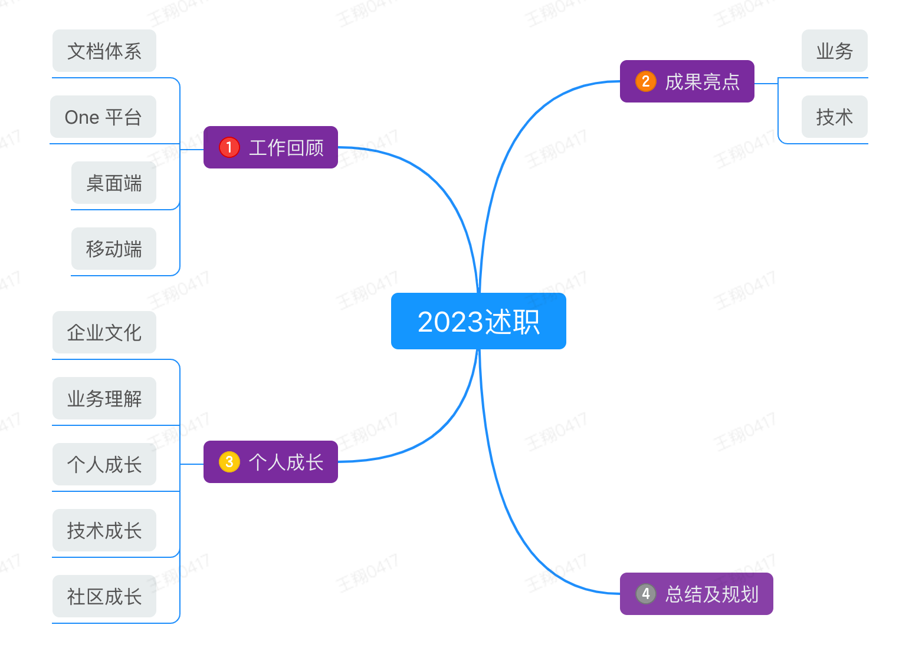

尊敬的各位领导：

大家好！我是 One 数字化平台前端工程师王翔。今年是我加入公司的第一年，在公司领导以及同事们的支持和帮助下，我较快的适应了工作，并且在思想和工作上都取得了很大的进步。

下面是我会对自己 2023 年的工作情况做出的汇报，希望得到大家的批评和建议。

## 概览

## 一、2023 工作回顾

今年是我入职公司的第一年，首先列一下量化的数据：

1. 代码量：截止 12.18，今年总共有 752 个提交，对应提交代码行数在 12w 行左右，平均每天 3 个提交；

2. 项目：参与了 8 个前端项目的开发，web、桌面端、移动端开发都有所参与；

3. 文章：发布了 25 篇 wiki，均为原创内容。

具体工作：

<table style="min-width: 938px;" class="">
	<colgroup>
		<col style="width: 473px;">
		<col style="width: 465px;">
	</colgroup>
	<tbody>
		<tr>
			<td colspan="1" rowspan="1" colwidth="473" height="38" backgroundcolor="rgb(221, 231, 254)" color="" fontsize="" fontweight="" fontstyle="" textdecoration="" verticalalign="" supfontsize="" style="height: 38px; background-color: rgb(221, 231, 254); --cell-color: ; --cell-font-size: ; --cell-font-weight: ; --cell-font-style: ; --cell-text-decoration: ; --cell-vertical-align: ; --cell-sup-font-size: " data-background-color="rgb(221, 231, 254)">
				

					

						
1. 文档体系

					

				

			</td>
			<td colspan="1" rowspan="1" colwidth="465" height="38" backgroundcolor="rgb(213, 243, 209)" color="" fontsize="" fontweight="" fontstyle="" textdecoration="" verticalalign="" supfontsize="" style="height: 38px; background-color: rgb(213, 243, 209); --cell-color: ; --cell-font-size: ; --cell-font-weight: ; --cell-font-style: ; --cell-text-decoration: ; --cell-vertical-align: ; --cell-sup-font-size: " data-background-color="rgb(213, 243, 209)">
				
2. One平台/企业端

			</td>
		</tr>
		<tr>
			<td colspan="1" rowspan="1" colwidth="473" height="38" backgroundcolor="" color="" fontsize="" fontweight="" fontstyle="" textdecoration="" verticalalign="" supfontsize="" style="height: 38px; background-color: ; --cell-color: ; --cell-font-size: ; --cell-font-weight: ; --cell-font-style: ; --cell-text-decoration: ; --cell-vertical-align: ; --cell-sup-font-size: " data-background-color="">
				

					

						
							<i class="iconfont icon-yuan"></i>
						
					

					

						
🌟 表格、列表重构

					

				

				

					

						
							<i class="iconfont icon-yuan"></i>
						
					

					

						
🌟 图片、附件优化

					

				

				

					

						
							<i class="iconfont icon-yuan"></i>
						
					

					

						
🎉 文档字数统计功能

					

				

				

					

						
							<i class="iconfont icon-yuan"></i>
						
					

					

						
🌟 文档导出功能

					

				

				

					

						
							<i class="iconfont icon-yuan"></i>
						
					

					

						
🎉 表格填充功能

					

				

				

					

						
							<i class="iconfont icon-yuan"></i>
						
					

					

						
🎉 文档互动功能

					

				

				

					

						
							<i class="iconfont icon-yuan"></i>
						
					

					

						
🎉 文档打通项目系统

					

				

				

					

						
							<i class="iconfont icon-yuan"></i>
						
					

					

						
🌟 浏览器兼容性处理

					

				

				

					

						
							<i class="iconfont icon-yuan"></i>
						
					

					

						
🌟 脑图 UI 调整 &amp; 脑图大纲模式

					

				

				

					

						
							<i class="iconfont icon-yuan"></i>
						
					

					

						
🎉 新增白板和流程图

					

				

				

					

						
							<i class="iconfont icon-yuan"></i>
						
					

					

						
🌟 日常优化、bug 维护

					

				

			</td>
			<td colspan="1" rowspan="1" colwidth="465" height="38" backgroundcolor="" color="" fontsize="" fontweight="" fontstyle="" textdecoration="" verticalalign="" supfontsize="" style="height: 38px; background-color: ; --cell-color: ; --cell-font-size: ; --cell-font-weight: ; --cell-font-style: ; --cell-text-decoration: ; --cell-vertical-align: ; --cell-sup-font-size: " data-background-color="">
				

					

						
							<i class="iconfont icon-yuan"></i>
						
					

					

						
🎉 待办

					

				

				

					

						
							<i class="iconfont icon-yuan"></i>
						
					

					

						
🎉 备忘录

					

				

				

					

						
							<i class="iconfont icon-yuan"></i>
						
					

					

						
🎉 Review

					

				

				

					

						
							<i class="iconfont icon-yuan"></i>
						
					

					

						
🌟 学城UI调整

					

				

				

					

						
							<i class="iconfont icon-yuan"></i>
						
					

					

						
🌟 文档集优化

					

				

				

					

						
							<i class="iconfont icon-yuan"></i>
						
					

					

						
🌟 快搭

					

				

				

					

						
							<i class="iconfont icon-yuan"></i>
						
					

					

						
🎉 业务流程

					

				

				

					

						
							<i class="iconfont icon-yuan"></i>
						
					

					

						
🎉 企业端/业务流程配置

					

				

			</td>
		</tr>
		<tr>
			<td colspan="1" rowspan="1" colwidth="473" height="38" backgroundcolor="rgb(253, 231, 205)" color="" fontsize="" fontweight="" fontstyle="" textdecoration="" verticalalign="" supfontsize="" style="height: 38px; background-color: rgb(253, 231, 205); --cell-color: ; --cell-font-size: ; --cell-font-weight: ; --cell-font-style: ; --cell-text-decoration: ; --cell-vertical-align: ; --cell-sup-font-size: " data-background-color="rgb(253, 231, 205)">
				
3. 桌面端

			</td>
			<td colspan="1" rowspan="1" colwidth="465" height="38" backgroundcolor="rgb(251, 222, 222)" color="" fontsize="" fontweight="" fontstyle="" textdecoration="" verticalalign="" supfontsize="" style="height: 38px; background-color: rgb(251, 222, 222); --cell-color: ; --cell-font-size: ; --cell-font-weight: ; --cell-font-style: ; --cell-text-decoration: ; --cell-vertical-align: ; --cell-sup-font-size: " data-background-color="rgb(251, 222, 222)">
				
4. 移动端

			</td>
		</tr>
		<tr>
			<td colspan="1" rowspan="1" colwidth="473" height="38" backgroundcolor="" color="" fontsize="" fontweight="" fontstyle="" textdecoration="" verticalalign="" supfontsize="" style="height: 38px; background-color: ; --cell-color: ; --cell-font-size: ; --cell-font-weight: ; --cell-font-style: ; --cell-text-decoration: ; --cell-vertical-align: ; --cell-sup-font-size: " data-background-color="">
				

					

						
							<i class="iconfont icon-yuan"></i>
						
					

					

						
🌟 im 发送日程

					

				

				

					

						
							<i class="iconfont icon-yuan"></i>
						
					

					

						
🌟 学城迁移

					

				

				

					

						
							<i class="iconfont icon-yuan"></i>
						
					

					

						
🎉 音视频会议

					

				

				

					

						
							<i class="iconfont icon-yuan"></i>
						
					

					

						
🌟 其他优化

					

				

				

					 
				

			</td>
			<td colspan="1" rowspan="1" colwidth="465" height="38" backgroundcolor="" color="" fontsize="" fontweight="" fontstyle="" textdecoration="" verticalalign="" supfontsize="" style="height: 38px; background-color: ; --cell-color: ; --cell-font-size: ; --cell-font-weight: ; --cell-font-style: ; --cell-text-decoration: ; --cell-vertical-align: ; --cell-sup-font-size: " data-background-color="">
				

					

						
							<i class="iconfont icon-yuan"></i>
						
					

					

						
🎉 补足 web 端功能

					

				

			</td>
		</tr>
	</tbody>
</table>

## 二、成果亮点

<table style="min-width: 940px;" class="">
  <colgroup>
    <col style="width: 471px;">
    <col style="width: 469px;">
  </colgroup>
  <tbody>
    <tr>
      <td colspan="1" rowspan="1" colwidth="471" height="38" backgroundcolor="rgb(221, 231, 254)" color="" fontsize="" fontweight="" fontstyle="" textdecoration="" verticalalign="" supfontsize="" style="height: 38px; background-color: rgb(221, 231, 254); --cell-color: ; --cell-font-size: ; --cell-font-weight: ; --cell-font-style: ; --cell-text-decoration: ; --cell-vertical-align: ; --cell-sup-font-size: " data-background-color="rgb(221, 231, 254)">
        
1. 业务成果

      </td>
      <td colspan="1" rowspan="1" colwidth="469" height="38" backgroundcolor="rgb(213, 243, 209)" color="" fontsize="" fontweight="" fontstyle="" textdecoration="" verticalalign="" supfontsize="" style="height: 38px; background-color: rgb(213, 243, 209); --cell-color: ; --cell-font-size: ; --cell-font-weight: ; --cell-font-style: ; --cell-text-decoration: ; --cell-vertical-align: ; --cell-sup-font-size: " data-background-color="rgb(213, 243, 209)">
        
2. 技术成果

      </td>
    </tr>
    <tr>
      <td colspan="1" rowspan="1" colwidth="471" height="38" backgroundcolor="" color="" fontsize="" fontweight="" fontstyle="" textdecoration="" verticalalign="" supfontsize="" style="height: 38px; background-color: ; --cell-color: ; --cell-font-size: ; --cell-font-weight: ; --cell-font-style: ; --cell-text-decoration: ; --cell-vertical-align: ; --cell-sup-font-size: " data-background-color="">
        
🌟 参与文档多个组件的重构、优化，以及文档日常维护工作，使得文档有了
            <mark data-color="#FCDBDB" style="background-color: #FCDBDB; color: inherit">更好的的使用体验</mark>
          ；

        
🌟 脑图 UI 改造、白板和流程图的引入，使得
            <mark data-color="#FCDBDB" style="background-color: #FCDBDB; color: inherit">文档体系更加丰富</mark>
          ；

        
🌟 封装 Quill 富文本编辑器组件，项目中使用时更好的
            <mark data-color="#FFEBEB" style="background-color: #FFEBEB; color: inherit">节省开发时间</mark>
          ；

        
🌟 
            <mark data-color="#FCDBDB" style="background-color: #FCDBDB; color: inherit">与产品、测试共同完成业务流程，获得俊鑫化工客户的认可。</mark>
          
        

      </td>
      <td colspan="1" rowspan="1" colwidth="469" height="38" backgroundcolor="" color="" fontsize="" fontweight="" fontstyle="" textdecoration="" verticalalign="" supfontsize="" style="height: 38px; background-color: ; --cell-color: ; --cell-font-size: ; --cell-font-weight: ; --cell-font-style: ; --cell-text-decoration: ; --cell-vertical-align: ; --cell-sup-font-size: " data-background-color="">
        
🌟 在文档项目中集成 husky 用于进行代码校验，规范团队的代码格式，使得团队的
            <mark data-color="#FFEBEB" style="background-color: #FFEBEB; color: inherit">代码质量得到保证</mark>
          ，减少了出现低级错误的风险；

        
🌟 搭建
            <mark data-color="#FFEBEB" style="background-color: #FFEBEB; color: inherit">企业内部 react 脚手架</mark>
          ，快速的开发 react 项目。

      </td>
    </tr>
  </tbody>
</table>

## 三、个人成长

## 个人成长

<table style="min-width: 938px;" class="">
  <colgroup>
    <col style="width: 811px;">
    <col style="width: 127px;">
  </colgroup>
  <tbody>
    <tr>
      <td colspan="2" rowspan="1" colwidth="811,127" height="40.5" backgroundcolor="rgb(221, 231, 254)" color="" fontsize="" fontweight="" fontstyle="" textdecoration="" verticalalign="" supfontsize="" style="height: 40.5px; background-color: rgb(221, 231, 254); --cell-color: ; --cell-font-size: ; --cell-font-weight: ; --cell-font-style: ; --cell-text-decoration: ; --cell-vertical-align: ; --cell-sup-font-size: " data-background-color="rgb(221, 231, 254)">
        
1. 企业文化

      </td>
    </tr>
    <tr>
      <td colspan="2" rowspan="1" colwidth="811,127" height="123.5" backgroundcolor="" color="" fontsize="" fontweight="" fontstyle="" textdecoration="" verticalalign="" supfontsize="" style="height: 123.5px; background-color: ; --cell-color: ; --cell-font-size: ; --cell-font-weight: ; --cell-font-style: ; --cell-text-decoration: ; --cell-vertical-align: ; --cell-sup-font-size: " data-background-color="">
        
通过参加公司的各项活动，使我了解了以“知行合一、实事求是、批评与自我批评”为核心的企业文化，以及“苦练基本功、讲规划做目标、趁早重点100分”为核心的工作习惯，通过在工作和生活中进行实践，个人综合素质有了新的提高。

        

        
我认为实事求是在公司内做的足够好，上到领导下到员工个人，有问题会当面直接提出来，同事间的沟通都保持开放和诚实，使得问题能够及时发现和解决。而“批评与自我批评”正是实事求是的落地，敢于面对自己可能犯错的一个事实，促进个人的成长和团队的进步，帮助我们改进工作方式，并加强自我反思和学习能力。

      </td>
    </tr>
  </tbody>
</table>

<table style="min-width: 939px;" class="">
  <colgroup>
    <col style="width: 438px;">
    <col style="width: 501px;">
  </colgroup>
  <tbody>
    <tr>
      <td colspan="2" rowspan="1" colwidth="438,501" height="38" backgroundcolor="rgb(213, 243, 209)" color="" fontsize="" fontweight="" fontstyle="" textdecoration="" verticalalign="" supfontsize="" style="height: 38px; background-color: rgb(213, 243, 209); --cell-color: ; --cell-font-size: ; --cell-font-weight: ; --cell-font-style: ; --cell-text-decoration: ; --cell-vertical-align: ; --cell-sup-font-size: " data-background-color="rgb(213, 243, 209)">
        
2. 业务理解

      </td>
    </tr>
    <tr>
      <td colspan="2" rowspan="1" colwidth="438,501" height="90" backgroundcolor="" color="" fontsize="" fontweight="" fontstyle="" textdecoration="" verticalalign="" supfontsize="" style="height: 90px; background-color: ; --cell-color: ; --cell-font-size: ; --cell-font-weight: ; --cell-font-style: ; --cell-text-decoration: ; --cell-vertical-align: ; --cell-sup-font-size: " data-background-color="">
        
目前，我们已经有了俊鑫化工这个客户，客户是我们的核心，我们要做的就是服务好客户，得到客户的认可。随着团队的共同努力，One 还会有更多的客户，要为更多企业提供数字化服务。

        

           
        

        
我们所做的事情是为传统企业升级为数字化企业提供帮助，虽然我们对标的是：钉钉、飞书、企业微信和 zohoone 这些大的企业，但我们也有信心往更深更远的大海里航行，到达他们所不能到的地方发光发热。

      </td>
    </tr>
  </tbody>
</table>

<table style="min-width: 939px;" class="">
  <colgroup>
    <col style="width: 438px;">
    <col style="width: 501px;">
  </colgroup>
  <tbody>
    <tr>
      <td colspan="2" rowspan="1" colwidth="438,501" height="38" backgroundcolor="rgb(253, 231, 205)" color="" fontsize="" fontweight="" fontstyle="" textdecoration="" verticalalign="" supfontsize="" style="height: 38px; background-color: rgb(253, 231, 205); --cell-color: ; --cell-font-size: ; --cell-font-weight: ; --cell-font-style: ; --cell-text-decoration: ; --cell-vertical-align: ; --cell-sup-font-size: " data-background-color="rgb(253, 231, 205)">
        
3. 个人成长

      </td>
    </tr>
    <tr>
      <td colspan="2" rowspan="1" colwidth="438,501" height="126" backgroundcolor="" color="" fontsize="" fontweight="" fontstyle="" textdecoration="" verticalalign="" supfontsize="" style="height: 126px; background-color: ; --cell-color: ; --cell-font-size: ; --cell-font-weight: ; --cell-font-style: ; --cell-text-decoration: ; --cell-vertical-align: ; --cell-sup-font-size: " data-background-color="">
        
今年比起往年最大的改变：

        

          

            
1. 写文章多了，并且获得不错的回报；

          

        

        

          

            
2. 看书多了，既增长了知识，又丰富了大脑；

          

        

        

          

            
3. 运动多了，身体是最重要的。

          

        

      </td>
    </tr>
  </tbody>
</table>

<table style="min-width: 939px;" class="">
  <colgroup>
    <col style="width: 438px;">
    <col style="width: 501px;">
  </colgroup>
  <tbody>
    <tr>
      <td colspan="2" rowspan="1" colwidth="438,501" height="38" backgroundcolor="#FCCE9D" color="" fontsize="" fontweight="" fontstyle="" textdecoration="" verticalalign="" supfontsize="" style="height: 38px; background-color: #FCCE9D; --cell-color: ; --cell-font-size: ; --cell-font-weight: ; --cell-font-style: ; --cell-text-decoration: ; --cell-vertical-align: ; --cell-sup-font-size: " data-background-color="#FCCE9D">
        
4. 技术成长

      </td>
    </tr>
    <tr>
      <td colspan="2" rowspan="1" colwidth="438,501" height="94" backgroundcolor="" color="" fontsize="" fontweight="" fontstyle="" textdecoration="" verticalalign="" supfontsize="" style="height: 94px; background-color: ; --cell-color: ; --cell-font-size: ; --cell-font-weight: ; --cell-font-style: ; --cell-text-decoration: ; --cell-vertical-align: ; --cell-sup-font-size: " data-background-color="">
        

          

            
1. electron 桌面端开发和移动端开发，
                <mark data-color="#FCDBDB" style="background-color: #FCDBDB; color: inherit">扩宽了自己的技术广度；</mark>
              
            

          

        

        

          

            
2. 搭建公司内部 react 脚手架工具，修改并发布到 npm，最高时每周有
                <mark data-color="#FFEBEB" style="background-color: #FFEBEB; color: inherit"> 523 </mark>
              人使用；

          

        

        

          

            
3. 入门 WebRTC，对 web 音视频技术栈有了基础的认知。

          

        

      </td>
    </tr>
  </tbody>
</table>

<table style="min-width: 939px;" class="">
  <colgroup>
    <col style="width: 438px;">
    <col style="width: 501px;">
  </colgroup>
  <tbody>
    <tr>
      <td colspan="2" rowspan="1" colwidth="438,501" height="38" backgroundcolor="#F8B7B4" color="" fontsize="" fontweight="" fontstyle="" textdecoration="" verticalalign="" supfontsize="" style="height: 38px; background-color: #F8B7B4; --cell-color: ; --cell-font-size: ; --cell-font-weight: ; --cell-font-style: ; --cell-text-decoration: ; --cell-vertical-align: ; --cell-sup-font-size: " data-background-color="#F8B7B4">
        
5. 社区成长

      </td>
    </tr>
    <tr>
      <td colspan="2" rowspan="1" colwidth="438,501" height="38.328125" backgroundcolor="" color="" fontsize="" fontweight="" fontstyle="" textdecoration="" verticalalign="" supfontsize="" style="height: 38.328125px; background-color: ; --cell-color: ; --cell-font-size: ; --cell-font-weight: ; --cell-font-style: ; --cell-text-decoration: ; --cell-vertical-align: ; --cell-sup-font-size: " data-background-color="">
        

          

            
1. 在做文档需求时，研究了 prosemirror-tables 和部分 tiptap 的源码，在修复我们 bug 的同时向 prosemirror-tables 和 tiptap 仓库提交 pr，并成为 prosemirror-tables 的
                <mark data-color="#FFEBEB" style="background-color: #FFEBEB; color: inherit"> contributor </mark>
              ；

          

        

        

          

            
2. 总结工作中遇到的问题及解决方法，输出为 wiki，同时发表在其他平台，获得掘金
                <mark data-color="#FFEBEB" style="background-color: #FFEBEB; color: inherit">优秀创作者</mark>
              称号。

          

        

      </td>
    </tr>
  </tbody>
</table>

**文档输出**

**调研文档**

富文本编辑器字数统计功能调研实现

office 在线预览功能调研

Excalidraw 白板调研文档

**教学文档**

One 白板新手教程

富文本编辑器 Tiptap 系列教程——5 分钟认识 Tiptap

富文本编辑器 Tiptap 系列教程——5 分钟搭建基于 Tiptap 的富文本编辑器

富文本编辑器 Tiptap 系列教程——Tiptap 模块 & 概念详解

富文本编辑器 Tiptap 系列教程——Tiptap 常用 API &命令详解

WebRTC 入门教程

WebRTC 实战 | 快速搭建 1 对 1 音视频通话

WebRTC 多人音视频架构 & LiveKit 使用教程

**复盘文档**

线上环境 bug 复盘——使用 husky+lint-staged 约束代码提交规范

复盘：备忘录列表切换更新问题

**技术文档**

prosemirror-tables 源码解读

使用零宽度字符解决 prosemirror-tables 单元格文字背景色问题

JS 滚动事件新成员—scrollend

富文本编辑器 html 内容转 word：html-docs-js 避坑指南

前端 html 内容转图片、pdf 和 word 等文件

还在用 try-catch 处理 async...await 异常吗？

记住这些命令，优化你的 git 使用流程

通过解决 Unexpected token type，深入 ESLint 配置项学习

「记录篇」React 脚手架搭建过程

在 Vue3 中利用 JSX+函数式组件做到更好的代码复用

html2canvas 截图原理

**非技术文档**

自我管理之「时间管理」—— 四象限法则

## 四、2023 总结

综合以上内容，我从以下五个方面总结自己在企名片的第一年：

1. **积极的情绪**

感觉这一年，我的情绪都是很积极向上的，主要因为自己比较乐观跟上进，对人对事都是如此。

2. **良好的人际关系**

跟同事、领导的关系，我自己感受都还不错，至少不会让我在这方面有什么困扰。

3. **投入**

我觉得程序员的投入，应该是一种解决难题时那种忘我的状态，但是很难做到。所以这里的投入可以说成对需求投入的精力，从需求、开发、联调到测试的参与度，推动后端联调，配合产品测试，我觉得自己这方面做的都不错。

4. **成就**

这点在前面或多或少都讲到了。整体而言，今年的成就算是中规中矩。

5. **意义**

公司对我而言，让我有了很多成长；我对公司而言，成为了不可或缺的一份子。相互成长，互相成就，这就是意义所在。

## 五、2024 规划

1. 保持对工作的上进心；

2. 坚持学习（学点后端的东西，更好的与后端同事合作）；

3. 坚持写作（今年 25 篇，24 年不能少于今年的产出）；

4. 坚持读书（今年 2 本多一点，明年想读完《理想国》）；

## 六、致谢

最后，感谢公司领导和同事们一直以来给予我的支持和信任，希望在未来能够继续与大家共同成长和进步，为公司的高质量发展贡献我们的力量！

[原文连接](./assets/2023年度述职报告-王翔.pdf)
