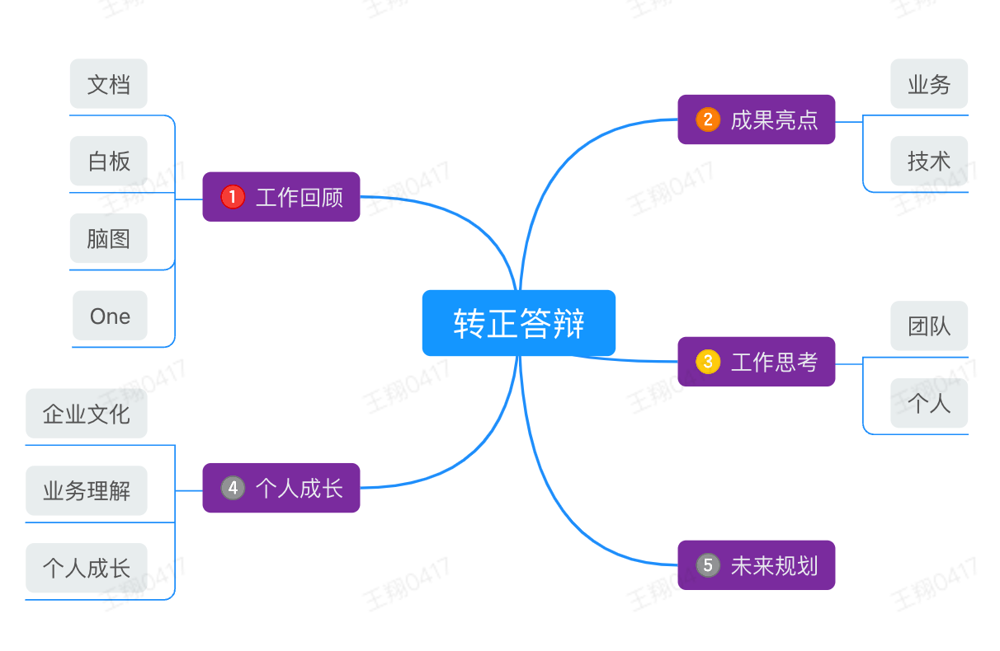

尊敬的各位领导：

大家好！我是 One 数字化平台前端工程师王翔，感谢各位领导能抽出宝贵的时间来参加我的转正述职会，我也很荣幸有这次提前转正的机会。自从 2 月 3 号进入公司以来，我主要负责文档的开发和维护工作。通过过去的三个月，我与团队成员的关系更加融洽，同时也较好的完成了自己在每个阶段的任务。

接下里，我将从以下几个方面汇报过去几个月来的工作情况，以接受大家的批评和建议。

## 概览

## 一、工作回顾

<table><colgroup><col><col></colgroup><tbody><tr><td colspan="1" rowspan="1" colwidth="473" backgroundcolor="rgb(221, 231, 254)" color="" fontsize="" fontweight="" fontstyle="" textdecoration="" verticalalign="" supfontsize="" data-background-color="rgb(221, 231, 254)">

1. 文档

</td><td colspan="1" rowspan="1" colwidth="465" backgroundcolor="rgb(213, 243, 209)" color="" fontsize="" fontweight="" fontstyle="" textdecoration="" verticalalign="" supfontsize="" data-background-color="rgb(213, 243, 209)">
2. 脑图
</td></tr><tr><td colspan="1" rowspan="1" colwidth="473" backgroundcolor="" color="" fontsize="" fontweight="" fontstyle="" textdecoration="" verticalalign="" supfontsize="" data-background-color="">

🌟 表格、图片、附件功能优化

🎉 文档字数统计功能

🌟 文档导出为文件功能完善

</td><td colspan="1" rowspan="1" colwidth="465" backgroundcolor="" color="" fontsize="" fontweight="" fontstyle="" textdecoration="" verticalalign="" supfontsize="" data-background-color="">

🌟 展示区UI改造

🎉 操作区UI改造

</td></tr><tr><td colspan="1" rowspan="1" colwidth="473" backgroundcolor="rgb(253, 231, 205)" color="" fontsize="" fontweight="" fontstyle="" textdecoration="" verticalalign="" supfontsize="" data-background-color="rgb(253, 231, 205)">
3. 白板
</td><td colspan="1" rowspan="1" colwidth="465" backgroundcolor="rgb(251, 222, 222)" color="" fontsize="" fontweight="" fontstyle="" textdecoration="" verticalalign="" supfontsize="" data-background-color="rgb(251, 222, 222)">
4. One平台
</td></tr><tr><td colspan="1" rowspan="1" colwidth="473" backgroundcolor="" color="" fontsize="" fontweight="" fontstyle="" textdecoration="" verticalalign="" supfontsize="" data-background-color="">

🎉 增加白板功能，丰富文档内容

</td><td colspan="1" rowspan="1" colwidth="465" backgroundcolor="" color="" fontsize="" fontweight="" fontstyle="" textdecoration="" verticalalign="" supfontsize="" data-background-color="">

🎉 待办

🎉 备忘录

🎉 Review

</td></tr></tbody></table>

## 二、成果亮点

<table><colgroup><col><col></colgroup><tbody><tr><td colspan="1" rowspan="1" colwidth="471" backgroundcolor="rgb(221, 231, 254)" color="" fontsize="" fontweight="" fontstyle="" textdecoration="" verticalalign="" supfontsize="" data-background-color="rgb(221, 231, 254)">
1. 业务成果
</td><td colspan="1" rowspan="1" colwidth="469" backgroundcolor="rgb(213, 243, 209)" color="" fontsize="" fontweight="" fontstyle="" textdecoration="" verticalalign="" supfontsize="" data-background-color="rgb(213, 243, 209)">
2. 技术成果
</td></tr><tr><td colspan="1" rowspan="1" colwidth="471" backgroundcolor="" color="" fontsize="" fontweight="" fontstyle="" textdecoration="" verticalalign="" supfontsize="" data-background-color="">
🌟 通过对文档表格、图片和附件的改造，<mark data-color="#FFEBEB">大幅提升了使用体验</mark>；

🌟 通过对脑图的UI改造，使得<mark data-color="#FCDBDB">脑图展示更加美观</mark>，操作更加简洁；

🌟 白板从0-1的落地，丰富文档的多样性；

🌟 封装Quill富文本编辑器组件，项目中使用时更好的<mark data-color="#FFEBEB">节省开发时间</mark>；

🌟 待办、备忘录和Review功能对数字化团队的重要。
</td><td colspan="1" rowspan="1" colwidth="469" backgroundcolor="" color="" fontsize="" fontweight="" fontstyle="" textdecoration="" verticalalign="" supfontsize="" data-background-color="">
🌟 在项目中集成husky用于进行代码校验，规范团队的代码格式，使得团队的<mark data-color="#FFEBEB">代码质量得到保证</mark>，减少了出现低级错误的风险；

🌟 曾在公司wiki发表题为“还在用try-catch处理async...await异常吗？”的文章，分享程序中<mark data-color="#FFEBEB">异常处理的最佳实践</mark>；

🌟 搭建<mark data-color="#FFEBEB">企业内部react脚手架</mark>，快速的开发react项目。
</td></tr></tbody></table>

## 三、工作思考

<table><colgroup><col><col></colgroup><tbody><tr><td colspan="1" rowspan="1" colwidth="470" backgroundcolor="#DDE7FE" color="" fontsize="" fontweight="" fontstyle="" textdecoration="" verticalalign="" supfontsize="" data-background-color="#DDE7FE">

1. 团队

</td><td colspan="1" rowspan="1" colwidth="467" backgroundcolor="#DDE7FE" color="" fontsize="" fontweight="" fontstyle="" textdecoration="" verticalalign="" supfontsize="" data-background-color="#DDE7FE"></td></tr><tr><td colspan="1" rowspan="1" colwidth="470" backgroundcolor="" color="" fontsize="" fontweight="" fontstyle="" textdecoration="" verticalalign="" supfontsize="" data-background-color="">
👍 做的好的
</td><td colspan="1" rowspan="1" colwidth="467" backgroundcolor="" color="" fontsize="" fontweight="" fontstyle="" textdecoration="" verticalalign="" supfontsize="" data-background-color="">
🎊 有待提升的
</td></tr><tr><td colspan="1" rowspan="1" colwidth="470" backgroundcolor="" color="" fontsize="" fontweight="" fontstyle="" textdecoration="" verticalalign="" supfontsize="" data-background-color="">

团队氛围好，能够坦诚面对问题，较好的体现公司实事求是的文化；

团队沟通比较顺畅，大家都能充分发表个人的观点；

各位产品经理对产品有观点、有追求，对工作有担当、有成绩；

各位开发技术水平高，代码有质量。

</td><td colspan="1" rowspan="1" colwidth="467" backgroundcolor="" color="" fontsize="" fontweight="" fontstyle="" textdecoration="" verticalalign="" supfontsize="" data-background-color="">

<mark data-color="#FFEBEB">团队分享做的不到位</mark>

wiki上的内容可以定期进行分享和讨论，每个人的理解可能存在差异，通过分享和讨论可以促进团队成员之间的理解和知识共享，进一步提升团队整体的业务水平。

</td></tr></tbody></table>

<table><colgroup><col><col></colgroup><tbody><tr><td colspan="1" rowspan="1" colwidth="470" backgroundcolor="#FDE7CD" color="" fontsize="" fontweight="" fontstyle="" textdecoration="" verticalalign="" supfontsize="" data-background-color="#FDE7CD">
2. 个人
</td><td colspan="1" rowspan="1" colwidth="467" backgroundcolor="#FDE7CD" color="" fontsize="" fontweight="" fontstyle="" textdecoration="" verticalalign="" supfontsize="" data-background-color="#FDE7CD"></td></tr><tr><td colspan="1" rowspan="1" colwidth="470" backgroundcolor="" color="" fontsize="" fontweight="" fontstyle="" textdecoration="" verticalalign="" supfontsize="" data-background-color="">
👍 做的好的
</td><td colspan="1" rowspan="1" colwidth="467" backgroundcolor="" color="" fontsize="" fontweight="" fontstyle="" textdecoration="" verticalalign="" supfontsize="" data-background-color="">
🎊 有待提升的
</td></tr><tr><td colspan="1" rowspan="1" colwidth="470" backgroundcolor="" color="" fontsize="" fontweight="" fontstyle="" textdecoration="" verticalalign="" supfontsize="" data-background-color="">

<mark data-color="#FFEBEB">合理分配任务</mark>

事情太多太杂时会通过四象限管理法来管理工作中的事情的紧急程度；

<mark data-color="#FFEBEB">定位问题能力强</mark>

帮助产品同事定位问题，偶现文档内各种弹窗失效，经过多次的试验，稳定复现了该问题，通过重点分析，最终定位到问题是锁屏导致文档实例销毁重建，但内部组件并未重建。我也总结出一套解决疑难问题的典型套路：复现问题-&gt;缩小排查方向-&gt;重点分析解决-&gt;复验。

<mark data-color="#FFEBEB">每天早到公司</mark>

学习写作、整理今日重点工作等，符合公司苦练基本功的工作习惯（看公众号文章学习写作能力）。

较好的文化沉淀，会将项目中遇到的问题或想法整理成wiki。

</td><td colspan="1" rowspan="1" colwidth="467" backgroundcolor="" color="" fontsize="" fontweight="" fontstyle="" textdecoration="" verticalalign="" supfontsize="" data-background-color="">

<mark data-color="#FFEBEB">沟通不太充足</mark>

对项目代码提交的流程优化后，没有及时通知到大家。

改进：今后做的项目上的变动需要及时与团队成员同步。

<mark data-color="#FFEBEB">业务理解欠缺</mark>

大多情况下会以开发的角度想事情，而没有站在需求提出者或使用者的角度做优化。

改进：与产品经理多交流，以更好地理解用户需求和体验，从而能够提供更多对用户友好的解决方案。

</td></tr></tbody></table>

## 四、个人成长

<table><colgroup><col><col></colgroup><tbody><tr><td colspan="2" rowspan="1" colwidth="438,500" backgroundcolor="rgb(221, 231, 254)" color="" fontsize="" fontweight="" fontstyle="" textdecoration="" verticalalign="" supfontsize="" data-background-color="rgb(221, 231, 254)">
1. 企业文化
</td></tr><tr><td colspan="2" rowspan="1" colwidth="438,500" backgroundcolor="" color="" fontsize="" fontweight="" fontstyle="" textdecoration="" verticalalign="" supfontsize="" data-background-color="">
通过参加公司的各项活动，使我了解了以“知行合一、实事求是、批评与自我批评”为核心的企业文化，以及“苦练基本功、讲规划做目标、趁早重点100分”为核心的工作习惯，通过在工作和生活中进行实践，个人综合素质有了新的提高。

我认为实事求是在公司内做的足够好，上到领导下到员工个人，有问题会当面直接提出来，同事间的沟通都保持开放和诚实，使得问题能够及时发现和解决。而“批评与自我批评”正是实事求是的落地，敢于面对自己可能犯错的一个事实，促进个人的成长和团队的进步，帮助我们改进工作方式，并加强自我反思和学习能力。
</td></tr></tbody></table>

<table><colgroup><col><col></colgroup><tbody><tr><td colspan="2" rowspan="1" colwidth="438,499" backgroundcolor="#D5F3D1" color="" fontsize="" fontweight="" fontstyle="" textdecoration="" verticalalign="" supfontsize="" data-background-color="#D5F3D1">
2. 业务理解
</td></tr><tr><td colspan="2" rowspan="1" colwidth="438,499" backgroundcolor="" color="" fontsize="" fontweight="" fontstyle="" textdecoration="" verticalalign="" supfontsize="" data-background-color="">
通过这三个月的工作，对整个One平台有了更加深入的了解。One平台一开始主要是使用无代码搭建的应用、流程，再到有了目标、会议等模块，并用文档打通各个模块，极大提升协作效率和质量，而花园、学城的出现，又满足了公司知识积累、传承，企业文化建设，有了IM后，我们便可逐步取代企业微信，作为公司内部使用。

目前One平台所做的事情是为传统企业升级为数字化企业提供帮助，虽然我们对标的是：钉钉、飞书、企业微信和zohoone这些大的企业，但我们也有信心往更深更远的大海里航行，到达他们所不能到的地方发光发热。 而我目前负责的文档在其中又扮演着重要的角色，能够为One平台的远大前程贡献自己的一份力，是感到自豪且光荣的。

并且随着团队的共同努力，我相信One平台将不断发展壮大，并为更多企业提供数字化服务。
</td></tr></tbody></table>

<table><colgroup><col><col></colgroup><tbody><tr><td colspan="2" rowspan="1" colwidth="438,500" backgroundcolor="#FDE7CD" color="" fontsize="" fontweight="" fontstyle="" textdecoration="" verticalalign="" supfontsize="" data-background-color="#FDE7CD">
3. 个人成长
</td></tr><tr><td colspan="2" rowspan="1" colwidth="438,500" backgroundcolor="" color="" fontsize="" fontweight="" fontstyle="" textdecoration="" verticalalign="" supfontsize="" data-background-color="">

1.

对阅读产生了兴趣，以前买书只会买技术方面的书，最近会去看一些有深度的书，如《被讨厌的勇气》；

2.

随着对项目的不断深入，遇到了很多之前并不熟悉的东西，拓宽了自己的技术面，并且通过学习后沉淀为文章，自己的总结和写作能力也有了很大的提升。

prosemirror-tables 源码解读

富文本编辑器字数统计功能调研实现

使用零宽度字符解决prosemirror-tables单元格文字背景色问题

JS滚动事件新成员—scrollend

线上环境bug复盘——使用husky+lint-staged约束代码提交规范

office在线预览功能调研

富文本编辑器html内容转word：html-docs-js避坑指南

前端html内容转图片、pdf和word等文件

还在用try-catch处理async...await异常吗？

Excalidraw白板调研文档

One白板新手教程

记住这些命令，优化你的git使用流程

通过解决Unexpected token type，深入ESLint配置项学习

「记录篇」React脚手架搭建过程
</td></tr></tbody></table>

## 五、未来规划

1. 专注于文档项目，解决文档中的存在的问题以及可以优化的方面，使文档的好用性得到更大的提升；

2. 加强对 tiptap 和 prosemirror 的学习和总结，沉淀相关文章，以及针对新人的阅读代码指南；

3. 关注最新的技术和趋势，增强与同事交流和学习，不断提升自己的技能水平。

## 六、致谢

最后，感谢公司领导和同事们一直以来给予我的支持和信任，希望在未来能够继续与大家共同成长和进步，为公司的高质量发展贡献我们的力量！

[原文连接](./assets/转正述职报告-王翔.pdf)