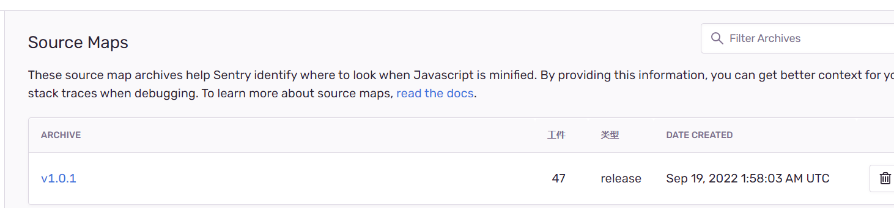
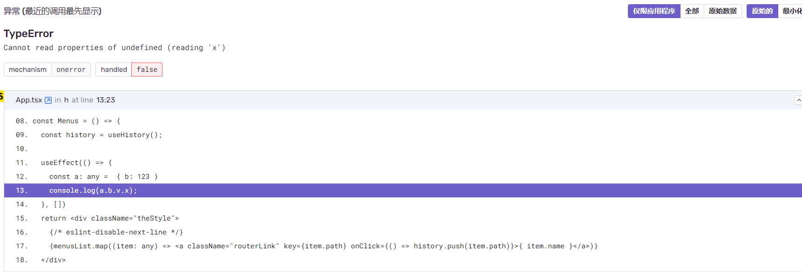

  
## Sentry介绍与使用

### 简介

Sentry 是跨平台的应用程序监控，专注于错误报告。[GitHub](https://github.com/getsentry/sentry)、[官方网站](https://sentry.io/welcome/)

Sentry 翻译过来是「哨兵」的意思，可以监控程序代码中出现的报错问题，生成issue，通过查看issue快速定位到问题发生的位置。

### 使用

1. 安装

```bash
npm install --save @sentry/react @sentry/tracing
```

2. 配置

- 在入口文件index.tsx中添加配置

  ```tsx
  /* 报错监控 */
  if (process.env.NODE_ENV === 'production') {
    Sentry.init({
      dsn: 'https://aee8343989d243d682d58a5b0cd0b4d7@sentry-monitor.quickcep.com/2',
      integrations: [new Integrations.BrowserTracing()],
      maxBreadcrumbs: 50,
      environment: env.isProd ? 'prod' : 'dev',
      tracesSampleRate: 1.0,
    });
  }
  ```

  - dsn：Data Source Name错误报告发送的地址，获取Settings -> Projects -> [Client Keys (DSN)](https://sentry-monitor.quickcep.com/settings/sentry/projects/quickcep-front/keys/)
  - integrations
  - maxBreadcrumbs：这个变量控制应该捕获的面包屑总数。默认值为 100。
  - environment：环境，在sentry中生成不同的[环境](https://sentry-monitor.quickcep.com/settings/sentry/projects/quickcep-front/environments/)
  - tracesSampleRate：0-1，控制给定事务发送到 Sentry 的概率百分比。0 表示 0%，1 表示 100%
  - [更多配置](https://docs.sentry.io/platforms/javascript/guides/electron/configuration/options/)

- 在组件中增加ErrorBoundary组件，会自动将报错信息发送到Sentry，并回退UI

  ```tsx
  import {ErrorBoundary} from '@sentry/react'

  const DefaultErrorBoundary = ({children}) => {
    return  <ErrorBoundary fallback={<><h2>请刷新页面重新操作</h2></>}>
      {children}
    </ErrorBoundary>
  }
  export default DefaultErrorBoundary;
  ```

  - fallback (React.ReactNode or Function)：当错误边界捕获错误时要呈现的 React 元素
  - beforeCapture：在将错误发送到 Sentry 之前调用的函数，允许将额外的标签或上下文添加到错误中

    ```jsx
    beforeCapture={(scope) => {
      scope.setTag('storeId', Number(ls.getItem('quick-storeId')));
      scope.setTag('userId', user?.staffInfo?.userId);
      scope.setTag('currentTime', moment().format('YYYY-MM-DD HH:mm:ss'));
      scope.setTag('pathname', window.location.pathname);
    }}
    ```

  - [更多配置](https://docs.sentry.io/platforms/javascript/guides/react/components/errorboundary/#options)

### 原理

Javascript代码发生错误后，Javascript引擎会抛出一个Error对象，并触发window.onerror事件，Sentry正是对window.onerror进行重写，实现错误监控的逻辑，并添加了很多信息帮助错误定位，并对错误进行滚跨浏览器的兼容等

- window.onerror
  
  捕获基本的js错误，但不能获取到资源加载失败的情况，必须使用window.addEventListener('error')才行

- Promise

  Promise 如果reject没被catch的话，不能被window.onerror捕获，需要使用unhandledrejection捕获

  ```js
  window.addEventListener("unhandledrejection", event => {
    console.warn(`UNHANDLED PROMISE REJECTION: ${event.reason}`);
  });
  ```

- Vue的Vue.config.errorHandler
  
  Sentry对Vue.config.errorHandler进行重写

  ```js
  function vuePlugin(Raven, Vue) {
    var _oldOnError = Vue.config.errorHandler;
    Vue.config.errorHandler = function VueErrorHandler(error, vm, info) {
      // 上报
      Raven.captureException(error, {
        extra: metaData
      });

      if (typeof _oldOnError === 'function') {
        // 为什么这么做？
        _oldOnError.call(this, error, vm, info);
      }
    };
  }
  module.exports = vuePlugin;
  ```

- React的ErrorBoundary

  ```ts
  /**
  * A ErrorBoundary component that logs errors to Sentry.
  * Requires React >= 16
  */
  declare class ErrorBoundary extends React.Component<ErrorBoundaryProps, ErrorBoundaryState> {
      state: ErrorBoundaryState;
      componentDidCatch(error: Error, { componentStack }: React.ErrorInfo): void;
      componentDidMount(): void;
      componentWillUnmount(): void;
      resetErrorBoundary: () => void;
      render(): React.ReactNode;
  }

  // 真实上报的地方
  ErrorBoundary.prototype.componentDidCatch = function (error, _a) {
    var _this = this;
    var componentStack = _a.componentStack;
    // 获取到配置的props
    var _b = this.props, beforeCapture = _b.beforeCapture, onError = _b.onError, showDialog = _b.showDialog, dialogOptions = _b.dialogOptions;
    withScope(function (scope) {
      // 上报之前做一些处理，相当于axios的请求拦截器
      if (beforeCapture) {
        beforeCapture(scope, error, componentStack);
      }
      // 上报
      var eventId = captureException(error, { contexts: { react: { componentStack: componentStack } } });
      // 开发者的回调
      if (onError) {
        onError(error, componentStack, eventId);
      }
      // 是否显示sentry的错误反馈组件（也是一种收集错误的方式）
      if (showDialog) {
        showReportDialog(__assign(__assign({}, dialogOptions), { eventId: eventId }));
      }
      // componentDidCatch is used over getDerivedStateFromError
      // so that componentStack is accessible through state.
      _this.setState({ error: error, componentStack: componentStack, eventId: eventId });
    });
  };
  ```

- 请求
  
  Sentry不能捕获异步操作、接口请求中的错误，比如404、500等，此时需要通过Sentry.caputureException()主动上报
  - XHR通过拦截send和open
  - fetch通过拦截整个方法
  - axios通过请求/响应拦截器

## [接入SourceMap](https://docs.sentry.io/platforms/javascript/guides/nextjs/manual-setup/)

使用Sentry的webpack插件配置sourceMap，在构建的时候自动上传到Sentry，如果不上传SourceMap有些问题不好定位<br />
Sentry一共提供了三种上传source map的方式

### Sentry-cli

[文档](https://docs.sentry.io/platforms/javascript/sourcemaps/#webpack)

### 使用API上传

[文档](https://docs.sentry.io/api/)

### 使用webpack plugins

1. 安装@sentry/webpack-plugin

```bash
npm install --save-dev @sentry/webpack-plugin
```

2. 项目根目录添加.sentryclirc文件

```bash
[auth]
token = ef5b031a00964f3c8f8ccbca07bb03c1d950be4b33f24ff

[defaults]
url = https://sentry-monitor.xxx.com/
org = xxx
project = xxx
```

- token：sentry的Auth Token，settings -> account -> api -> auth-tokens
- url：sentry地址
- org：组织settings -> settings/organization-slug
- project：项目名称
-

3. 配置webpack

```js
const SentryWebpackPlugin = require("@sentry/webpack-plugin");
 
module.exports = {
  // other webpack configuration
  devtool: 'source-map',
  // 将 Webpack 插件设置为最后运行的插件  否则插件收到的 source maps 可能不是最终的
  plugins: [
    new SentryWebpackPlugin({
      release:"v1.0.1",
      include: ".", 
      ignore: ["node_modules", "webpack.config.js"],
      configFile: "sentry.properties",
    }),
  ],
};
```

- release：每次上传sourcemap是一次release的过程，如果init时没有配置release属性，sentry会自动生成一个随机数作为release版本；配置的话需要init和webpack配置中的一致
- include：指定路径让sentry-cli来检测有没有.map与.js文件，如果有就会上传到sentry
- ignore: 忽略文件夹或文件不要被检测
- configFile: 用来替代第二步的.sentryclirc文件 需要有对应的文件 默认不配置即可

在sentry上就会有对应项目的 Source Map 文件；（在settings -> projects -> xxx -> Source Maps）


4. 测试
  


- @sentry/webpack-plugin原理 [源码](https://github.com/getsentry/sentry-webpack-plugin)

在webpack的afterEmit钩子（在生成文件到output目录之后执行）中获取打包后的文件，过滤出文件类型为`/\.js$|\.map$/`结尾的文件上传到对应的sentry服务器

```js
// upload sourcemaps
apply(compiler) {
  // afterEmit在生成文件到output目录之后执行
  compiler.hooks.afterEmit.tapAsync(this.name, async (compilation, callback) => {
    const files = this.getFiles(compilation);
    try {
      await this.createRelease();
      await this.uploadFiles(files);
      console.info('\n\u001b[32mUpload successfully.\u001b[39m\n');
    } catch (error) {
      // todo
    }
    callback(null);
  });
}
 // 获取需要上传的文件
 getFiles(compilation) {
   // 通过 compilation.assets 获取我们需要的文件信息，格式信息
      // compilation.assets {
      // 'bundle.js': SizeOnlySource { _size: 212 },
      // 'bundle.js.map': SizeOnlySource { _size: 162 }
      // }
  return Object.keys(compilation.assets)
    .map((name) => {
    if (this.isIncludeOrExclude(name)) {
      return { name, filePath: this.getAssetPath(compilation, name) };
    }
    return null;
  })
    .filter(Boolean);
}
 // 获取文件的绝对路径
 getAssetPath(compilation, name) {
    return path.join(compilation.getPath(compilation.compiler.outputPath), name.split('?')[0]);
 }
 // 获取文件的绝对路径
 getAssetPath(compilation, name) {
    return path.join(compilation.getPath(compilation.compiler.outputPath), name.split('?')[0]);
 }
 // 上传文件
 async uploadFile({ filePath, name }) {
   console.log(filePath);
   try {
     await request({
       url: `${this.sentryReleaseUrl()}/${this.release}/files/`, // 上传的sentry路径
       method: 'POST',
       auth: {
         bearer: this.apiKey,
       },
       headers: {},
       formData: {
         file: fs.createReadStream(filePath),
         name: this.filenameTransform(name),
       },
     });
   } catch (e) {
     console.error(`uploadFile failed ${filePath}`);
   }
 }

```

webpack钩子

- done: 编译完成后
- beforeRun: 在编译器执行前
- run: 在编译器开始读取记录前执行
- emit: 在生成文件到output目录之前执行
- afterEmit: 在生成文件到output目录之后执行
- compilation: 创建compilation后
- beforeCompile: 在编译前
- compile: 创建compilation前
- make:编译完成前

## 对比

与其他的npm下载量[对比](https://npmtrends.com/@sentry/browser-vs-airbrake-js-vs-bugsnag-vs-bugsnag-js-vs-raygun4js-vs-rollbar-vs-rollbar-browser-vs-trackjs)

- 100%开源
- 私有化部署
- 支持大多数编程语言
