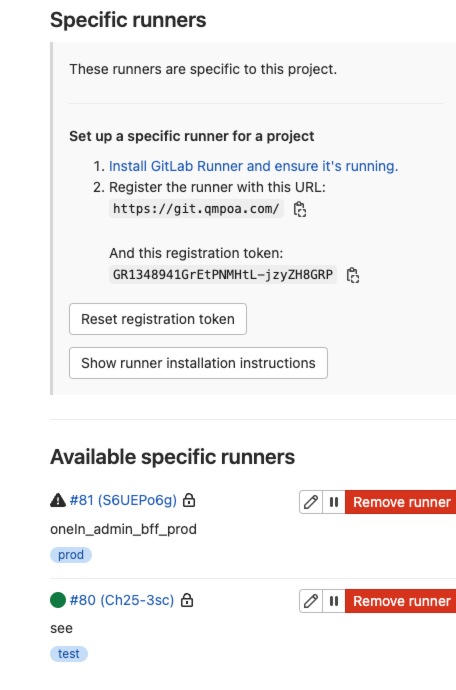
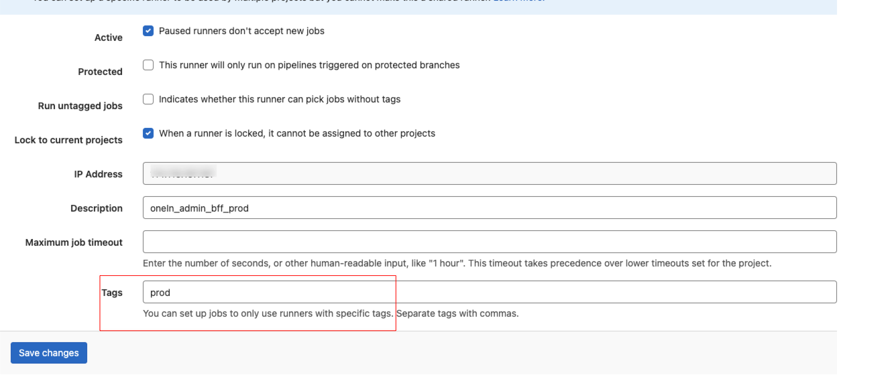
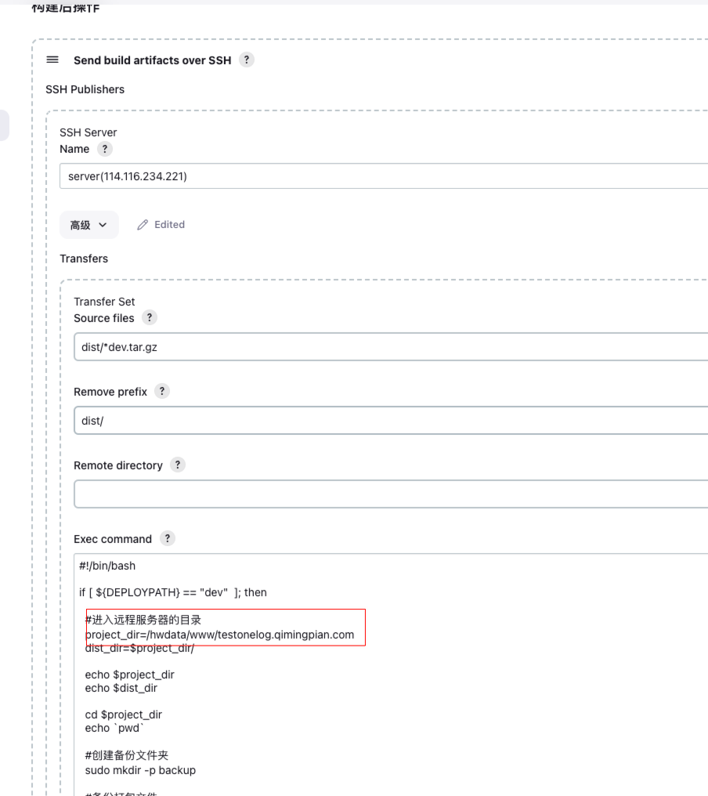

## 1. 项目中

https://git.qmpoa.com/ops/qmp_ops_dnmp/-/commits/master
/services/nginx/conf.d 添加前端 nginx 域名和 bff nginx 接口
/services/nginx/prodconf.d 添加前端 nginx 域名和 bff nginx 接口

## 2. 服务器/hwdata/service/dnmp/nginx 路径拉下最新代码，保证 conf.d 中有刚刚添加的 conf 配置

```bash
git pull origin master
```

## 3. 重启 nginx docker 部署的

```bash
#  校验语法是否正确
sudo docker exec nginx122_c nginx -t
docker exec nginx122_c nginx -s reload
```

## 4. bff 通过 CI 部署

gitlab-runner 配置

```bash
gitlab-runner register --url https://git.qmpoa.com/ --registration-token 令牌 --executor docker --docker-volumes /var/run/docker.sock:/var/run/docker.sock --docker-privileged
```

```bash
# runner重启
gitlab-runner restart
gitlab-runner status
# 配置修改
vim /etc/gitlab-runner/config.toml
```

保证https://git.qmpoa.com/fe/oneid_admin_bff/-/settings/ci_cd可用runners



### 项目对应 gitlab-ci

```yml
variables:
  VERSION: 'oneid_admin_bff'
  OLDVERSION: 'oneid_admin_bff-temporary'
  VERSION_PROD: 'oneid_admin_bff'
  OLDVERSION_PROD: 'oneid_admin_bff-temporary'

stages:
  - deploy

# image: node:16.19-slim

cache:
  paths:
    - node_modules/
    - logs/

build_image.oneid_admin_bff:
  image: docker:dind
  stage: deploy
  only:
    refs:
      - test
    # changes:
    #   - .gitlab-ci.yml
  tags:
    - test
  script:
    - echo "=====start deploy======"
    # 重命名镜像
    - >
      if [ $(docker image ls -aq --filter reference=$VERSION) ]; then
        echo "=====inline======"
        docker tag $VERSION $OLDVERSION
        docker rmi $VERSION
      fi
    # 通过Dockerfile生成镜像
    - docker build -t $VERSION .
    # 删除已经在运行的容器，优雅停止
    - >
      if [ $(docker ps -aq --filter name=oneid_admin_bff) ]; then
        docker container stop oneid_admin_bff
        docker rm oneid_admin_bff
      fi
    # 通过镜像启动容器
    - docker run -d -p 8528:8528 -e TZ=Asia/Shanghai -v /hwdata/www/oneid_admin_bff/docker-host.json:/usr/src/docker-host.json --restart=always --name oneid_admin_bff $VERSION

    # 删除老镜像
    - if [ $(docker image ls -aq --filter reference=$OLDVERSION) ]; then docker image rmi $OLDVERSION;fi

    - echo "=====end deploy======"
  # services:
  #   - docker:dind

build_image.oneid_admin_bff-prod:
  image: docker:dind
  stage: deploy
  only:
    refs:
      #- merge_requests
      - master
    # changes:
    #   - .gitlab-ci.yml
  tags:
    - prod
  script:
    - echo "=====start deploy======"
    # 重命名镜像
    - >
      if [ $(docker image ls -aq --filter reference=$VERSION_PROD) ]; then
        docker tag $VERSION_PROD $OLDVERSION_PROD
        docker rmi $VERSION_PROD
      fi
    # 通过Dockerfile生成qmp_mobile_ddm镜像
    - docker build -t $VERSION_PROD .
    # 删除已经在运行的容器，优雅停止
    - >
      if [ $(docker ps -aq --filter name=oneid_admin_bff) ]; then
        docker container stop oneid_admin_bff
        docker rm oneid_admin_bff
      fi
    # 通过镜像启动容器
    - docker run -d -p 8528:8528 -e TZ=Asia/Shanghai -v /hwdata/www/oneid_admin_bff/docker-host.json:/usr/src/docker-host.json --restart=always --name oneid_admin_bff $VERSION_PROD

    # 删除老镜像
    - if [ $(docker image ls -aq --filter reference=$OLDVERSION_PROD) ]; then docker image rmi $OLDVERSION_PROD;fi
    - echo "=====end deploy======"
  # services:
  # - docker:dind
```

### 修改配置好的 runner

tags 对应 `.gitlab-ci.yml` 的 tags



### 部署

测试提交到 test、正式提交到 mater

## 5. 前端通过 jenkins 部署

### 创建 item

复制之前的项目，修改远程目录的路径即可


