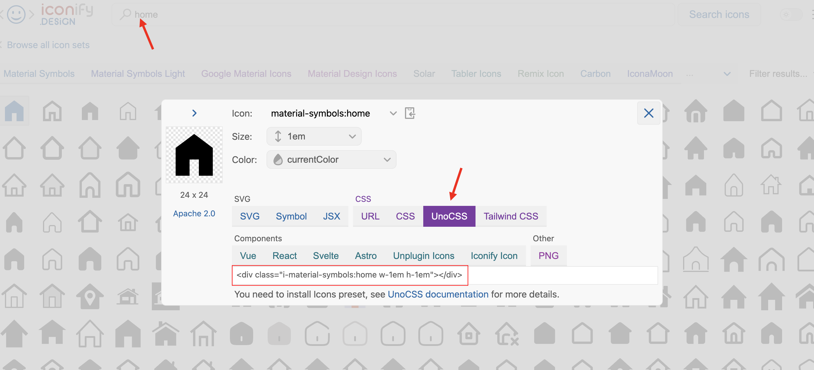
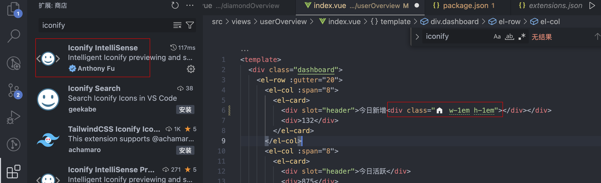

[Unocss](https://unocss.dev/) 是一个基于 Tailwind CSS 的工具 ，它通过静态分析 HTML 和 CSS 代码，自动消除未使用的样式，以减小生成的 CSS 文件大小。

[Unocss 中文网](https://unocss.nodejs.cn/config/)

## 基础安装

1. 安装 UnoCSS

   首先，我们需要安装 UnoCSS：

   ```bash
   npm install unocss
   ```

2. 配置 UnoCSS

   接下来，我们需要配置 UnoCSS。在项目根目录下创建 uno.config.js 文件，并进行如下配置：

   ```js
   // uno.config.js
   import { defineConfig } from 'unocss'

   export default defineConfig({
     // 在这里可以配置 UnoCSS 规则
     shortcuts: {
       // shortcuts to multiple utilities
       btn: 'py-2 px-4 font-semibold rounded-lg shadow-md',
       'btn-green': 'text-white bg-green-500 hover:bg-green-700',
       // single utility alias
       red: 'text-red-100',
     },
     rules: [
       ['bg-main', { background: '#409eff' }],
       ['text-white', { color: '#fff' }],
       [
         'flex-between',
         {
           display: 'flex',
           'justify-content': 'space-between',
           'align-items': 'center',
         },
       ],
       // 可以添加更多自定义规则
     ],
   })
   ```

3. 在 Vite 项目中集成 UnoCSS

   在 vite.config.js 中引入 UnoCSS 插件

   ```js
   // vite.config.js
   import { defineConfig } from 'vite'
   import UnoCSS from 'unocss/vite'

   export default defineConfig({
     plugins: [UnoCSS()...],
     ...
   })
   ```

4. main.js 中引入 UnoCSS：

   ```js
   import 'virtual:uno.css'
   ```

5. 使用 UnoCSS 编写样式

UnoCss 提供了很多样式规则，我们又没办法都记住，作者很友好的提供了一个样式规则互动工具（[unocss.dev/interactive](https://unocss.dev/interactive/)），支持通过类名和样式查找。

## 更多配置

参考[https://unocss.nodejs.cn/config/](https://unocss.nodejs.cn/config/)
UnoCSS 提供了 presets 和 transformers 来增强和扩展其功能。

### Presets

Presets 是预定义的一组规则和配置，用来快速设置和使用 UnoCSS。UnoCSS 内置了一些常用的预设，例如 Attributify 和 Icons。

在 uno.config.js 中配置 presets：

```js
// uno.config.js
import { defineConfig, presetAttributify, presetIcons, presetUno } from 'unocss'

export default defineConfig({
  presets: [
    presetUno(), // 默认预设
    presetAttributify(), // Attributify 预设
    presetIcons(), // Icons 预设
  ],
})
```

#### Attributify Preset

允许通过属性来应用样式，类似于 Vue 的 :class 绑定

```vue
 <el-aside width="200px" font="bold text="xl>
```

- text="xl" 等同于 class="text-xl"
- font="bold" 等同于 class="font-bold"

#### Icons Preset

UnoCSS 提供的一个预设，允许使用 [iconify](https://iconify.design/) 图标库中的图标作为类名来应用图标，[icons 列表](https://icon-sets.iconify.design/)



1. 搜索想要的图标
2. 点击后选择 UnoCSS
3. 复制红框内的内容到页面即可

```html
<div class="i-material-symbols:home w-1em h-1em"></div>
```

在 VSCode 中安装插件 Iconify IntelliSense，即可在代码中展示图标



不仅可以使用上面 icon 列表提供的所有图标，并且可以自定义图标，如 iconfont 上的图标

```js
// uno.config.js
import { defineConfig, presetIcons, presetUno } from 'unocss'

export default defineConfig({
  presets: [
    presetUno(),
    presetIcons({
      collections: {
        // 自定义图标库
        custom: {
          yongyan:
            '<svg t="1718267214360" class="icon" viewBox="0 0 1024 1024" version="1.1" xmlns="http://www.w3.org/2000/svg" p-id="2815" width="200" height="200"><path d="M659.655431 521.588015q23.970037-6.71161 46.022472-13.423221 19.17603-5.752809 39.310861-11.505618t33.558052-10.546816l-13.423221 50.816479q-5.752809 21.093633-10.546816 31.640449-9.588015 25.88764-22.531835 47.940075t-24.449438 38.35206q-13.423221 19.17603-27.805243 35.475655l-117.932584 35.475655 96.838951 17.258427q-19.17603 16.299625-41.228464 33.558052-19.17603 14.382022-43.625468 30.202247t-51.29588 29.243446-59.925094 13.902622-62.801498-4.314607q-34.516854-4.794007-69.033708-16.299625 10.546816-16.299625 23.011236-36.434457 10.546816-17.258427 25.40824-40.749064t31.161049-52.254682q46.022472-77.662921 89.168539-152.449438t77.662921-135.191011q39.310861-69.992509 75.745318-132.314607-45.06367 51.775281-94.921348 116.014981-43.146067 54.651685-95.88015 129.917603t-107.385768 164.434457q-11.505618 18.217228-25.88764 42.187266t-30.202247 50.816479-32.599251 55.131086-33.078652 55.131086q-38.35206 62.322097-78.621723 130.397004 0.958801-20.134831 7.670412-51.775281 5.752809-26.846442 19.17603-67.116105t38.35206-94.921348q16.299625-34.516854 24.928839-53.692884t13.423221-29.722846q4.794007-11.505618 7.670412-15.340824-4.794007-5.752809-1.917603-23.011236 1.917603-15.340824 11.026217-44.58427t31.161049-81.977528q22.052434-53.692884 58.007491-115.535581t81.018727-122.726592 97.797753-117.932584 107.865169-101.153558 110.262172-72.389513 106.906367-32.11985q0.958801 33.558052-6.71161 88.689139t-19.17603 117.932584-25.88764 127.520599-27.805243 117.453184z" p-id="2816"></path></svg>', // 自定义图标
        },
      },
    }),
  ],
})
```

上面配置中，我们定义了一个名为 custom 的图标库，并添加了图标：yongyan，接着在代码中就可以使用

```html
<div class="i-custom-yongyan w-1em h-1em"></div>
```

自定义图标集合的名称会成为类名前缀（如 `i-custom-`），需要确保命名空间唯一。

### Transformers

Transformers 是在编译过程中执行的函数，可以用来修改生成的 CSS。例如，UnoCSS 提供了 transformerDirectives 来支持 CSS 指令。

- transformerDirectives: 允许在 CSS 中使用类似 @apply 的指令来应用 UnoCSS 类。

```js
// uno.config.js
import { defineConfig } from 'unocss'
import transformerDirectives from '@unocss/transformer-directives'

export default defineConfig({
  transformers: [transformerDirectives()], // 支持 @apply 指令
})
```

在使用 UnoCSS 时，可以通过 @apply 指令将多个原子类应用到一个选择器上，这样可以更方便地管理和复用样式。

```vue
<style scoped lang="scss">
.header {
  @apply flex-between bg-main text-white p-4;
}
</style>
```

## 选择 UnoCSS 原因

1. **按需生成样式**: UnoCSS 使用静态分析技术，只生成使用到的 CSS 样式。这意味着您无需手动管理和维护大量的样式文件，而只需编写实际需要的样式代码。这简化了样式管理，减少了样式冗余，并提高了开发效率。
2. **零运行时**: UnoCSS 是在构建阶段处理的工具，不需要 JavaScript 运行时。这意味着生成的 CSS 不会增加额外的客户端计算负担，从而提高页面加载速度并改善用户体验。
3. **易于集成**：UnoCSS 可以与现有的构建工具（如 webpack、Vite 等）和前端框架（如 Vue、React 等）无缝集成。它提供了插件和配置选项，使您可以轻松地与您的项目集成，并根据您的需求进行自定义。
4. **高性能和快速**: UnoCSS 只生成使用到的样式，大大减少了 CSS 文件的大小，从而加快了页面加载速度。它还对样式表进行了优化，使其更紧凑和高效。
5. **开发者友好**: UnoCSS 提供了简洁的 API 和一致的类名命名规则，使得样式编写更加直观和易于理解。它还提供了实时预览和自动补全等功能，提升了开发效率。
