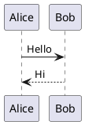
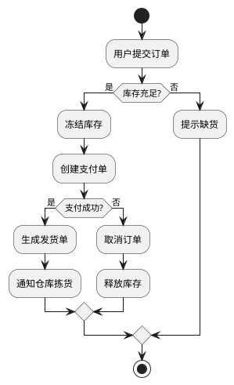
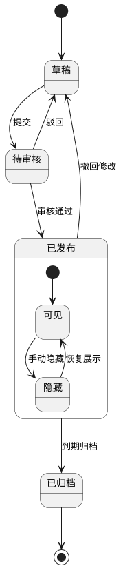
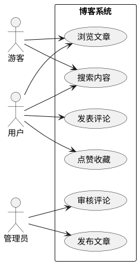
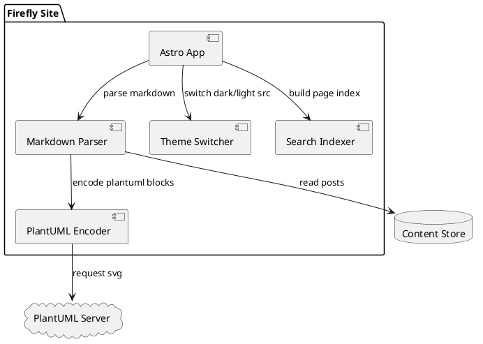
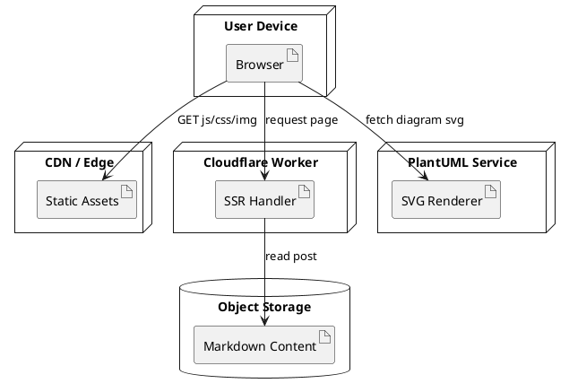
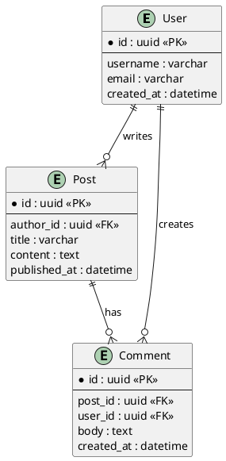
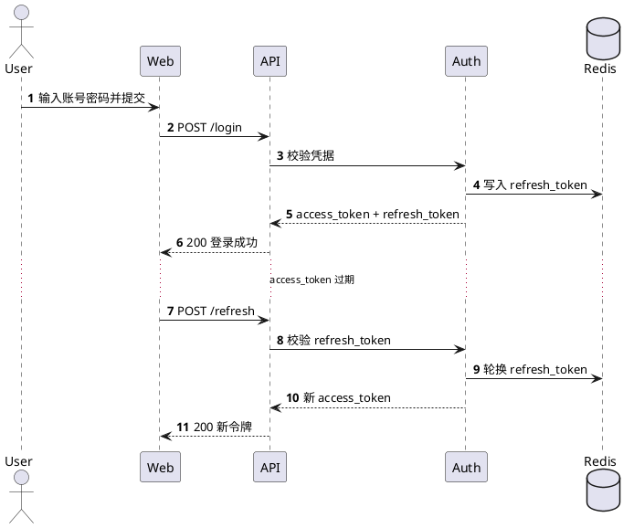

## Markdown 中 PlantUML 图表指南

PlantUML 是一种使用纯文本描述图表的工具。你只需要写一段结构化语法，就可以生成时序图、类图、用例图、活动图等常见工程图。

它特别适合写在技术博客和项目文档里：

- 图表和正文一起版本管理，便于协作与审阅
- 修改图只需要改文本，适合频繁迭代
- 能和 Markdown 无缝结合，保持文档统一

在 Firefly 中，`plantuml` 代码块会在构建阶段编码并生成服务器 SVG 地址，页面端再根据亮暗主题自动切换图源，并支持缩放、拖拽和全屏交互。

如果你想快速上手，可以记住这个最小模板：



## 活动图示例



## 状态图示例



## 用例图示例



## 组件图示例



## 部署图示例



## ER 图示例



## 时序图示例（登录与刷新令牌）



## C4 风格容器图示例

```plantuml
@startuml
!includeurl https://raw.githubusercontent.com/plantuml-stdlib/C4-PlantUML/master/C4_Container.puml

Person(user, "博客访客", "阅读文章与搜索内容")

System_Boundary(system, "Firefly Blog") {
	Container(web, "Web App", "Astro + Svelte", "渲染页面与交互")
	Container(worker, "SSR Worker", "Cloudflare Workers", "处理服务端渲染请求")
	ContainerDb(content, "Content Store", "Markdown / Object Storage", "存储文章与资源元数据")
	Container(search, "Search Index", "Pagefind", "提供全文检索")
}

System_Ext(plantuml, "PlantUML Server", "生成 SVG 图表")

Rel(user, web, "访问", "HTTPS")
Rel(web, worker, "请求 SSR 页面", "HTTPS")
Rel(worker, content, "读取文章")
Rel(web, search, "查询关键词")
Rel(web, plantuml, "请求图表 SVG")

LAYOUT_LEFT_RIGHT()
@enduml
```

