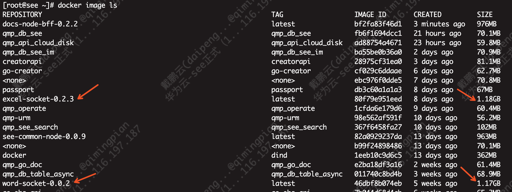
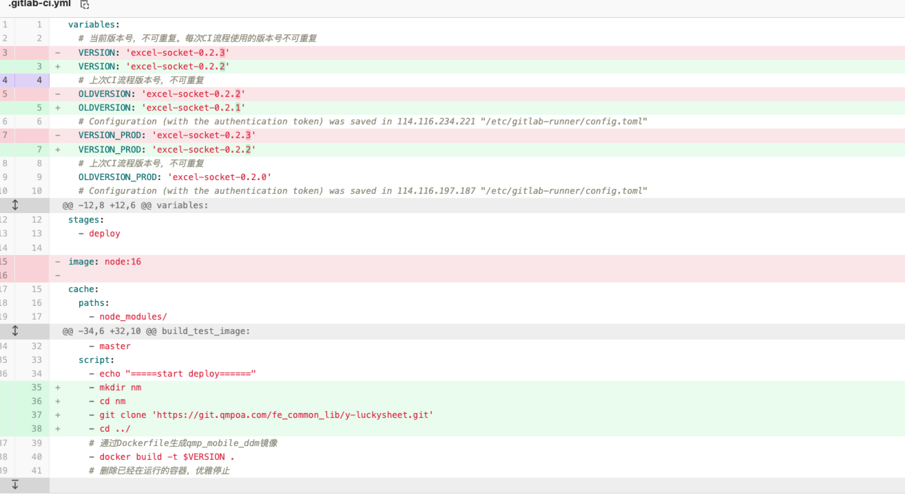
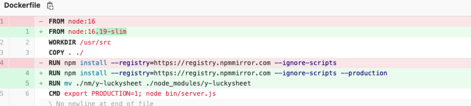
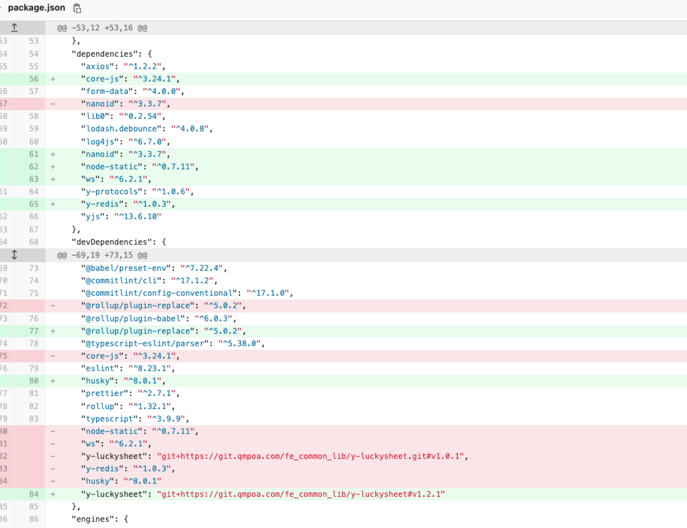
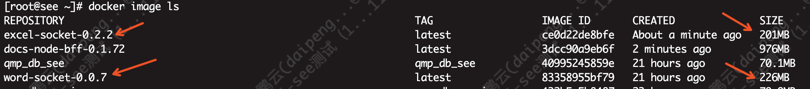

## 现状

原来 docker node:16 的镜像加上代码在 1G 左右


## 替换方法

### 常规项目

```
# Dockerfile
- FROM node:16
+ FROM node:16.19-slim
# .gitlab-ci.yml
提换  node:16  为 node:16.19-slim
```

### 引用 git+https:// 的项目

参考 [企业内部 GitLab/fe/y-websocket-excel/-/merge_requests/8/diffs](企业内部 GitLab/fe/y-websocket-excel/-/merge_requests/8/diffs)




node:16.19-slim 不认

```
"y-luckysheet": "git+企业内部 GitLab/fe_common_lib/y-luckysheet.git#v1.0.1",
```

这种语法，需要在 CI 流程中将这类依赖处理好，在 Dockerfile 中拷贝进 node_modules 下

```
# 在上一步的基础上
# .gitlab-ci.yml
  script:
    - echo "=====start deploy======"
    - mkdir nm
    - cd nm
　 # 将咱们自己的依赖以clone的方式放在一个临时目录下
    - git clone '企业内部 GitLab/fe_common_lib/y-luckysheet.git'
    - cd ../
# Dockerfile
RUN npm install --registry=https://registry.npmmirror.com --ignore-scripts --production
# 在依赖安装完成后，将临时目录下的内容移动到node_modules下
RUN mv ./nm/y-luckysheet ./node_modules/y-luckysheet
```

## 效果

